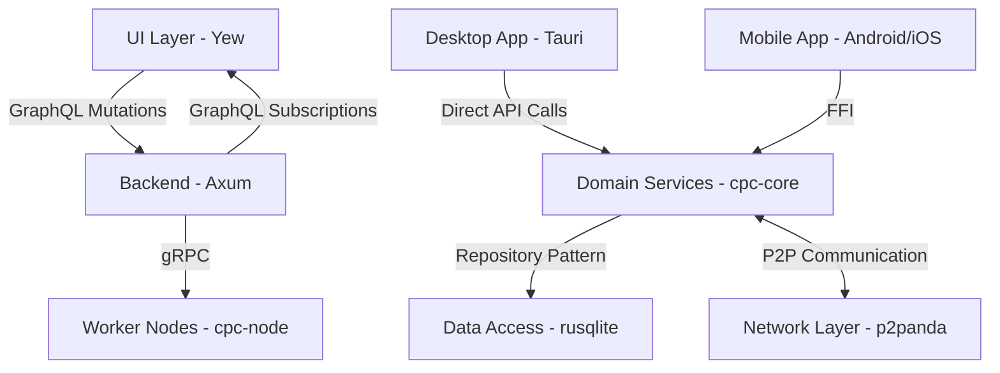

# Design Document: Android-to-Rust Port

## Overview

This design document outlines the approach for porting functionality from the legacy Android codebase (`apps/cpc-platform/android/WheresThisFrom`) to the shared Rust codebase. The port will focus on maintaining feature parity while leveraging Rust's cross-platform capabilities and the existing architecture of the target codebase. The primary goal is to create a unified codebase that enables consistent functionality across platforms while prioritizing the desktop application development.

## Architecture

### Architectural Principles

The ported system will follow these key architectural principles:

- **Hexagonal Architecture**: Ports and adapters pattern for clean separation of concerns between business logic and external dependencies
- **Screaming Architecture**: Architecture that clearly communicates the domain and intent through folder structure and naming
- **Vertical Slices**: Feature-based organization over technical layers to improve maintainability and reduce coupling

### High-Level Architecture

The ported system will follow a layered architecture with clear separation of concerns:

```
┌─────────────────────────────────────────────────────────────┐
│                      UI Layer (Yew)                         │
└───────────────────────────────┬─────────────────────────────┘
                                │
┌───────────────────────────────▼─────────────────────────────┐
│                  Application Layer (Tauri)                  │
└───────────────────────────────┬─────────────────────────────┘
                                │
┌───────────────────────────────▼─────────────────────────────┐
│                 Domain Layer (Rust - cpc-core)              │
├─────────────────────┬─────────────────────┬─────────────────┤
│     Models          │     Services        │   Repositories  │
└─────────────────────┴──────────┬──────────┴─────────────────┘
                                 │
┌────────────────────────────────▼────────────────────────────┐
│              Data Access Layer (Rust - cpc-core)            │
└─────────────────────────────────────────────────────────────┘
```

### Communication Flow



## Components and Interfaces

### 1. Core Models

The core models will be ported from the legacy Android codebase's shared models to Rust structs in the `cpc-core/src/models` directory. These models will serve as the foundation for the entire system.

#### Key Models to Port:

- **Identity Models**:
  - User
  - UserProfile
  - CooperativeScore
  - UserRelationship
  - AuthPayload

- **Social Models**:
  - Post
  - Stitch
  - Reply to post with a post
  - Comment
  - Like
  - Follow
  - Repost
  - Share
  - Favorite

- **Product Models**:
  - Product
  - ProductOrigin
  - SupplyChain
  - Review

- **Governance Models**:
  - Proposal
  - Vote
  - VoteTally

#### Example Model Implementation:

```rust
// cpc-core/src/models/identity.rs

use serde::{Deserialize, Serialize};
use chrono::{DateTime, Utc};
use uuid::Uuid;

#[derive(Debug, Clone, Serialize, Deserialize)]
pub struct User {
    pub id: Uuid,
    pub username: String,
    pub email: String,
    pub created_at: DateTime<Utc>,
    pub updated_at: DateTime<Utc>,
}

#[derive(Debug, Clone, Serialize, Deserialize)]
pub struct UserProfile {
    pub user_id: Uuid,
    pub display_name: String,
    pub bio: Option<String>,
    pub avatar_url: Option<String>,
    pub cooperative_score: CooperativeScore,
}

#[derive(Debug, Clone, Serialize, Deserialize)]
pub struct CooperativeScore {
    pub value: f64,
    pub last_updated: DateTime<Utc>,
    pub contribution_factors: Vec<ContributionFactor>,
}

#[derive(Debug, Clone, Serialize, Deserialize)]
pub struct ContributionFactor {
    pub name: String,
    pub weight: f64,
    pub value: f64,
}

#[derive(Debug, Clone, Serialize, Deserialize)]
pub enum UserRelationshipType {
    Following,
    Blocked,
    Muted,
}

#[derive(Debug, Clone, Serialize, Deserialize)]
pub struct UserRelationship {
    pub user_id: Uuid,
    pub related_user_id: Uuid,
    pub relationship_type: UserRelationshipType,
    pub created_at: DateTime<Utc>,
}
```

### 2. Repository Interfaces

The repository interfaces will be defined in the `cpc-core/src/repositories` directory. These interfaces will provide a consistent way to access data regardless of the underlying storage mechanism.

#### Key Repository Interfaces:

- **UserRepository**: Manage user data
- **RelationshipRepository**: Handle user relationships
- **ProductRepository**: Manage product data
- **SupplyChainRepository**: Handle supply chain information
- **GovernanceRepository**: Manage proposals and votes

#### Example Repository Interface:

```rust
// cpc-core/src/repositories/user_repository.rs

use async_trait::async_trait;
use uuid::Uuid;
use crate::models::identity::{User, UserProfile};
use crate::error::Error;

#[async_trait]
pub trait UserRepository: Send + Sync {
    async fn get_user_by_id(&self, id: Uuid) -> Result<Option<User>, Error>;
    async fn get_user_by_username(&self, username: &str) -> Result<Option<User>, Error>;
    async fn create_user(&self, user: User) -> Result<User, Error>;
    async fn update_user(&self, user: User) -> Result<User, Error>;
    async fn get_profile(&self, user_id: Uuid) -> Result<Option<UserProfile>, Error>;
    async fn update_profile(&self, profile: UserProfile) -> Result<UserProfile, Error>;
    async fn get_users_needing_update(&self, cutoff_time: chrono::DateTime<chrono::Utc>) -> Result<Vec<User>, Error>;
}
```

### 3. Services

The services will contain the business logic ported from the legacy Android codebase's server module. These services will be implemented in the `cpc-core/src/services` directory.

#### Key Services:

- **IdentityService**: Handle user authentication and profile management
- **RelationshipService**: Manage user relationships
- **CooperativeScoreService**: Calculate and update cooperative scores
- **ProductOriginService**: Manage product origin tracking
- **GovernanceService**: Handle proposals and voting

#### Example Service Implementation:

```rust
// cpc-core/src/services/identity_service.rs

use uuid::Uuid;
use chrono::Utc;
use crate::models::identity::{User, UserProfile, CooperativeScore};
use crate::repositories::user_repository::UserRepository;
use crate::error::Error;

pub struct IdentityService {
    user_repository: Box<dyn UserRepository>,
}

impl IdentityService {
    pub fn new(user_repository: Box<dyn UserRepository>) -> Self {
        Self { user_repository }
    }
    
    pub async fn get_user_by_id(&self, id: Uuid) -> Result<Option<User>, Error> {
        self.user_repository.get_user_by_id(id).await
    }
    
    pub async fn get_user_profile(&self, user_id: Uuid) -> Result<Option<UserProfile>, Error> {
        self.user_repository.get_profile(user_id).await
    }
    
    pub async fn update_cooperative_score(&self, user_id: Uuid, factors: Vec<(String, f64)>) -> Result<CooperativeScore, Error> {
        let profile = self.user_repository.get_profile(user_id).await?
            .ok_or_else(|| Error::NotFound(format!("User profile not found for ID: {}", user_id)))?;
        
        // Calculate new score based on factors
        let mut score = profile.cooperative_score;
        
        // Update contribution factors and recalculate score
        // Implementation details...
        
        // Update profile with new score
        let updated_profile = UserProfile {
            cooperative_score: score.clone(),
            ..profile
        };
        
        self.user_repository.update_profile(updated_profile).await?;
        
        Ok(score)
    }
}
```

### 4. GraphQL API

The GraphQL API will be implemented in the `apps/backend/src/graphql` directory, following the pattern already established in the target codebase.

#### Key GraphQL Components:

- **Schema Definitions**: Define the GraphQL schema for queries, mutations, and subscriptions
- **Resolvers**: Implement the resolvers that connect GraphQL operations to the underlying services
- **Subscription Handlers**: Manage GraphQL subscriptions for real-time updates

#### Example GraphQL Schema:

```graphql
# apps/backend/src/graphql/schema/identity.graphql

type User {
  id: ID!
  username: String!
  email: String!
  profile: UserProfile
  createdAt: DateTime!
  updatedAt: DateTime!
}

type UserProfile {
  userId: ID!
  displayName: String!
  bio: String
  avatarUrl: String
  cooperativeScore: CooperativeScore!
}

type CooperativeScore {
  value: Float!
  lastUpdated: DateTime!
  contributionFactors: [ContributionFactor!]!
}

type ContributionFactor {
  name: String!
  weight: Float!
  value: Float!
}

type Query {
  user(id: ID!): User
  userByUsername(username: String!): User
  currentUser: User
}

type Mutation {
  updateProfile(input: UpdateProfileInput!): UserProfile!
}

type Subscription {
  userProfileUpdated(userId: ID!): UserProfile!
}

input UpdateProfileInput {
  displayName: String
  bio: String
  avatarUrl: String
}
```

#### Example GraphQL Resolver:

```rust
// apps/backend/src/graphql/identity.rs

use async_graphql::{Context, Object, ID, Result, Subscription};
use futures_util::stream::{Stream, StreamExt};
use uuid::Uuid;
use cpc_core::models::identity::{User, UserProfile};
use cpc_core::services::identity_service::IdentityService;

pub struct IdentityQuery;

#[Object]
impl IdentityQuery {
    async fn user(&self, ctx: &Context<'_>, id: ID) -> Result<Option<User>> {
        let identity_service = ctx.data::<IdentityService>()?;
        let user_id = Uuid::parse_str(&id.to_string())?;
        Ok(identity_service.get_user_by_id(user_id).await?)
    }
    
    async fn user_by_username(&self, ctx: &Context<'_>, username: String) -> Result<Option<User>> {
        let identity_service = ctx.data::<IdentityService>()?;
        Ok(identity_service.get_user_by_username(&username).await?)
    }
    
    async fn current_user(&self, ctx: &Context<'_>) -> Result<Option<User>> {
        let identity_service = ctx.data::<IdentityService>()?;
        let current_user_id = ctx.data::<Option<Uuid>>()?.ok_or_else(|| "Not authenticated")?;
        Ok(identity_service.get_user_by_id(current_user_id).await?)
    }
}

pub struct IdentityMutation;

#[Object]
impl IdentityMutation {
    async fn update_profile(&self, ctx: &Context<'_>, input: UpdateProfileInput) -> Result<UserProfile> {
        let identity_service = ctx.data::<IdentityService>()?;
        let current_user_id = ctx.data::<Option<Uuid>>()?.ok_or_else(|| "Not authenticated")?;
        
        // Implementation details...
        
        Ok(updated_profile)
    }
}

pub struct IdentitySubscription;

#[Subscription]
impl IdentitySubscription {
    async fn user_profile_updated(&self, ctx: &Context<'_>, user_id: ID) -> Result<impl Stream<Item = UserProfile>> {
        // Implementation details...
    }
}
```

### 5. P2P Networking

The P2P networking functionality will be implemented using p2panda (with iroh) in the `cpc-core/src/p2p` directory.

#### Key P2P Components:

- **Network Manager**: Manage P2P connections and discovery
- **Data Synchronization**: Synchronize data between peers
- **Event System**: Handle P2P events and notifications

#### Example P2P Implementation:

```rust
// cpc-core/src/p2p/network_manager.rs

use p2panda::{
    core::transport::Transport,
    identity,
    mdns::{Mdns, MdnsConfig, MdnsEvent},
    swarm::{NetworkBehaviourEventProcess, Swarm, SwarmBuilder},
    PeerId,
};
use std::error::Error;
use tokio::sync::mpsc;

pub struct NetworkManager {
    swarm: Swarm<NetworkBehavior>,
    event_sender: mpsc::Sender<NetworkEvent>,
}

impl NetworkManager {
    pub async fn new() -> Result<(Self, mpsc::Receiver<NetworkEvent>), Box<dyn Error>> {
        let local_key = identity::Keypair::generate_ed25519();
        let local_peer_id = PeerId::from(local_key.public());
        
        // Set up transport and behavior
        // Implementation details...
        
        let (event_sender, event_receiver) = mpsc::channel(32);
        
        Ok((Self { swarm, event_sender }, event_receiver))
    }
    
    pub async fn start(&mut self) -> Result<(), Box<dyn Error>> {
        // Start the swarm
        // Implementation details...
        
        Ok(())
    }
    
    pub async fn broadcast_data(&mut self, data: Vec<u8>) -> Result<(), Box<dyn Error>> {
        // Broadcast data to peers
        // Implementation details...
        
        Ok(())
    }
}
```

## Data Models

### Core Data Models

The core data models will be defined as Rust structs with Serde serialization/deserialization support. These models will be used throughout the system and will be the foundation for data storage, API communication, and UI rendering.

### Database Schema

The database schema will be implemented using SQL migrations in the `migrations` directory. The schema will be designed to support all the data models required by the ported functionality.

#### Example Migration:

```sql
-- migrations/20250722000000_identity_tables.sql

CREATE TABLE IF NOT EXISTS users (
    id UUID PRIMARY KEY,
    username TEXT NOT NULL UNIQUE,
    email TEXT NOT NULL UNIQUE,
    password_hash TEXT NOT NULL,
    created_at TIMESTAMP WITH TIME ZONE NOT NULL DEFAULT CURRENT_TIMESTAMP,
    updated_at TIMESTAMP WITH TIME ZONE NOT NULL DEFAULT CURRENT_TIMESTAMP
);

CREATE TABLE IF NOT EXISTS user_profiles (
    user_id UUID PRIMARY KEY REFERENCES users(id) ON DELETE CASCADE,
    display_name TEXT NOT NULL,
    bio TEXT,
    avatar_url TEXT,
    cooperative_score REAL NOT NULL DEFAULT 0.0,
    score_last_updated TIMESTAMP WITH TIME ZONE NOT NULL DEFAULT CURRENT_TIMESTAMP
);

CREATE TABLE IF NOT EXISTS contribution_factors (
    id UUID PRIMARY KEY,
    user_id UUID NOT NULL REFERENCES users(id) ON DELETE CASCADE,
    name TEXT NOT NULL,
    weight REAL NOT NULL,
    value REAL NOT NULL,
    created_at TIMESTAMP WITH TIME ZONE NOT NULL DEFAULT CURRENT_TIMESTAMP
);

CREATE TABLE IF NOT EXISTS user_relationships (
    user_id UUID NOT NULL REFERENCES users(id) ON DELETE CASCADE,
    related_user_id UUID NOT NULL REFERENCES users(id) ON DELETE CASCADE,
    relationship_type TEXT NOT NULL,
    created_at TIMESTAMP WITH TIME ZONE NOT NULL DEFAULT CURRENT_TIMESTAMP,
    PRIMARY KEY (user_id, related_user_id, relationship_type)
);

CREATE INDEX IF NOT EXISTS idx_user_relationships_user_id ON user_relationships(user_id);
CREATE INDEX IF NOT EXISTS idx_user_relationships_related_user_id ON user_relationships(related_user_id);
```

## Error Handling

The error handling strategy will be consistent across the codebase, using a centralized Error type defined in `cpc-core/src/error.rs`.

```rust
// cpc-core/src/error.rs

use thiserror::Error;

#[derive(Error, Debug)]
pub enum Error {
    #[error("Entity not found: {0}")]
    NotFound(String),
    
    #[error("Authentication error: {0}")]
    Authentication(String),
    
    #[error("Authorization error: {0}")]
    Authorization(String),
    
    #[error("Validation error: {0}")]
    Validation(String),
    
    #[error("Database error: {0}")]
    Database(String),
    
    #[error("Network error: {0}")]
    Network(String),
    
    #[error("Internal error: {0}")]
    Internal(String),
}

impl From<rusqlite::Error> for Error {
    fn from(err: rusqlite::Error) -> Self {
        Error::Database(err.to_string())
    }
}

// Additional From implementations for other error types
```

## Testing Strategy

While we won't be implementing tests as part of this port, the code will be structured in a way that makes it testable. The repository pattern and dependency injection will allow for easy mocking of dependencies during testing.

## Implementation Approach

### Phase 1: Core Models and Repositories

1. Port the core data models from Kotlin to Rust
2. Implement the repository interfaces
3. Create SQLite implementations of the repositories

### Phase 2: Services and Business Logic

1. Port the service layer from the legacy codebase
2. Implement the business logic in Rust
3. Ensure proper error handling and validation

### Phase 3: GraphQL API

1. Define the GraphQL schema based on the legacy codebase
2. Implement the resolvers for queries, mutations, and subscriptions
3. Connect the resolvers to the service layer

### Phase 4: P2P Networking

1. Implement the P2P networking functionality using p2panda (with iroh)
2. Create the data synchronization mechanisms
3. Implement the event system for real-time updates

### Phase 5: UI Integration

1. Connect the Yew UI to the GraphQL API (migrating from Svelte)
2. Implement the UI components for the ported functionality
3. Ensure proper error handling and loading states in the UI

### Phase 6: Desktop-Specific Optimizations

1. Optimize the ported functionality for desktop usage
2. Implement desktop-specific features
3. Ensure proper integration with the Tauri framework

## Platform-Specific Considerations

### Desktop (Tauri)

- Use direct API calls to the service layer for better performance
- Implement desktop-specific UI optimizations
- Ensure proper integration with the operating system

### Mobile (Android)

- Use FFI to call the Rust code from Kotlin
- Implement platform-specific UI adaptations
- Ensure proper lifecycle management

## Migration Strategy

The migration from the legacy Android codebase to the shared Rust codebase will be done incrementally, with the following approach:

1. Start with core functionality that is used across multiple features
2. Gradually port feature by feature, starting with the most critical ones
3. Ignore backward compatibility during the migration, full refactor