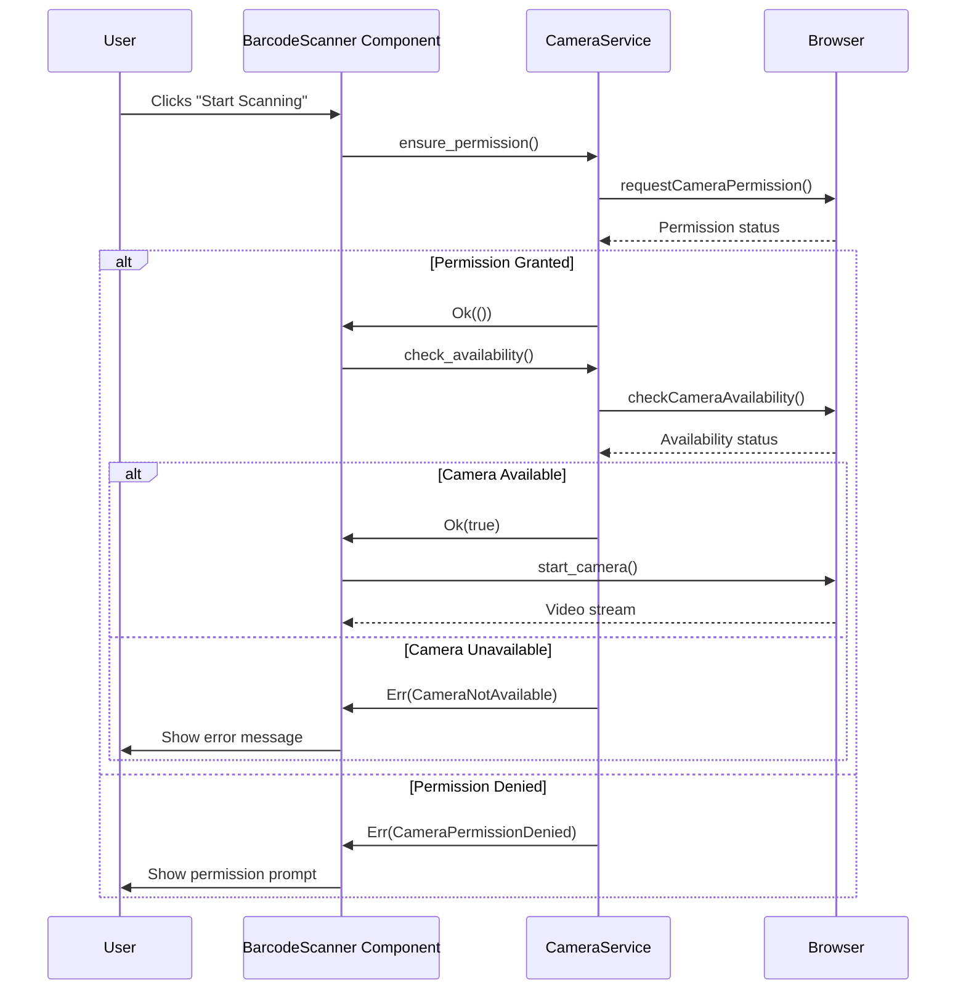

# Cooperative Product Catalog Architecture

## Error Handling System

### Error Type Hierarchy (types/product.rs)

The error handling system is built around the `BarcodeError` and `BarcodeErrorCode` enums:

```rust
pub enum BarcodeErrorCode {
    CameraError,
    CameraPermissionDenied,
    CameraNotAvailable,
    NetworkError,
    NotFound,
    DecodingError,
    PermissionDenied,
    InvalidBarcodeFormat,
    ScanTimeout,
}

pub struct BarcodeError {
    pub code: BarcodeErrorCode,
    pub message: String,
}
```

Error types cover:
- **Camera issues**: Permission denial, hardware unavailability
- **Network problems**: Connection failures, timeouts
- **Data issues**: Invalid formats, decoding failures
- **Operational constraints**: Scan timeouts

### Camera Permission Workflow



### Error Recovery Flow

The system provides multiple recovery paths:
1. **Automatic retry**: For temporary errors (network issues, timeouts)
2. **Manual entry**: When scanning fails repeatedly
3. **Permission guidance**: Directs users to enable camera access
4. **Hardware fallback**: Handles camera unavailability gracefully

Recovery is implemented in `barcode_scanner.rs` through UI states and user actions.

### JS-Rust Boundary Design

The camera integration uses a clean JS-Rust boundary:
1. **JS Interface**: `window.camera` namespace provides:
   - `start_camera(video_id)`
   - `requestCameraPermission()`
   - `checkCameraAvailability()`
   
2. **Rust Binding**: `wasm_bindgen` extern declarations:
   ```rust
   #[wasm_bindgen(js_namespace = ["window", "camera"])]
   fn start_camera(video_id: &str) -> Result<(), JsValue>;
   ```

3. **Error Handling**:
   - JS errors converted to Rust's `BarcodeError`
   - Type-safe communication through defined enums and structs
   - Asynchronous operations handled with Rust futures

This design ensures:
- Minimal JS-Rust surface area
- Clear separation of concerns
- Type safety across boundaries
- Graceful error propagation