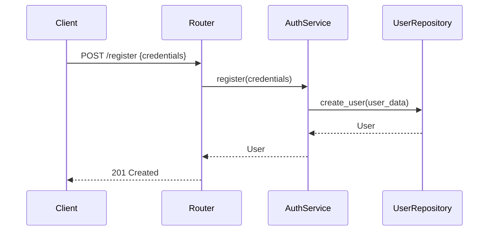
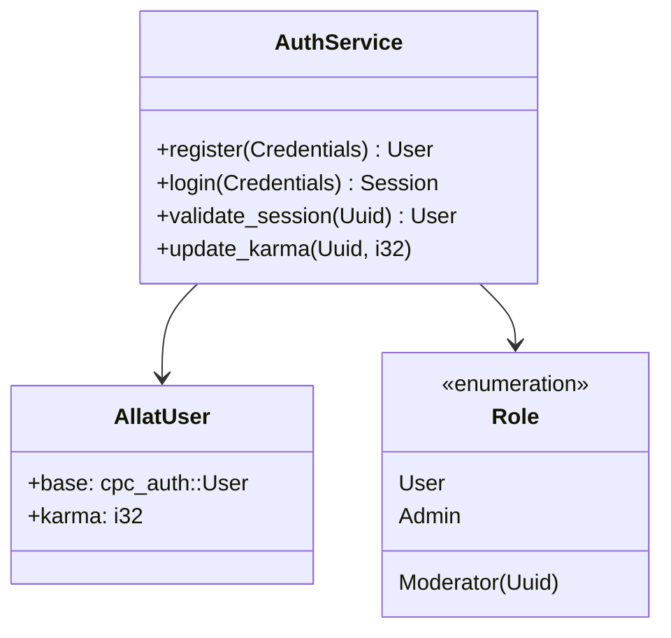

# Allat Forum Architecture

## Overview
Allat is a decentralized forum application inspired by Reddit. This document describes the high-level architecture including the new authentication integration.

## Component Diagram
```
┌───────────────────────┐       ┌───────────────────────┐
│      Presentation     │       │       Application     │
│ (Web/Desktop Clients) │───────▶        Services       │
└───────────────────────┘       └───────────────────────┘
          ▲                               ▲
          │                               │
┌───────────────────────┐       ┌───────────────────────┐
│       REST API        │       │       Domain Model     │
│ (Axum Router/Middleware) ◀─────┤ (Entities, Repositories) │
└───────────────────────┘       └───────────────────────┘
          ▲                               ▲
          │                               │
┌───────────────────────┐       ┌───────────────────────┐
│     Infrastructure    │       │      Shared Auth      │
│ (PostgreSQL, Redis)   ◀───────┤      (cpc_auth)       │
└───────────────────────┘       └───────────────────────┘
```

## Authentication Integration

### Sequence Diagram: User Registration


### Class Diagram: Authentication Components


## Key Integration Points

### 1. User Management
- Extended User model with karma field
- Custom Role enum with community-specific moderation
- UserRepository interface for persistence

### 2. Session Management
- Redis-backed session storage
- JWT-based session tokens
- Middleware for session validation

### 3. Authorization
- Community-based role checks
- Karma-based privileges
- Endpoint protection middleware

### 4. Event Integration
- Publish UserRegistered event
- Listen for Vote events to update karma
- Emit SessionCreated/SessionExpired events

### 5. Karma Update Service
- Handles vote events to update user karma
- Prevents karma overflow (max 10,000)
- Integrates with AuthService for persistence

### 6. Authorization Middleware
- Role-based access control for endpoints
- Community role validation
- Integration with AuthService for role checking

## Performance Considerations
- Redis caching for frequent session validation
- Read replicas for user queries
- Batch karma updates

## Security Considerations
- Role escalation prevention
- Karma overflow protection
- Concurrent vote processing safeguards