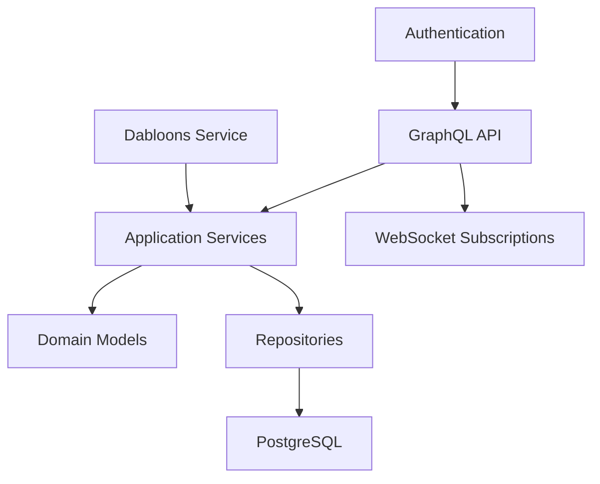

# Allat Application Architecture Overview

## Core Principles
1. **Hexagonal Architecture**: Strict separation between domain, application, and infrastructure layers
2. **Screaming Architecture**: Project structure communicates purpose through named directories
3. **Vertical Slices**: Features are implemented end-to-end in vertical slices
4. **Progressive Enhancement**: Start with MVP features and expand functionality

## Architectural Layers


### Domain Layer
Contains core business logic and models:
```
src/domain/
├── community.rs
├── post.rs
├── comment.rs
├── media_asset.rs
├── vote.rs
└── user.rs
```

### Application Layer
Implements use cases via services:
```
src/application/
├── community_service.rs
├── post_service.rs
├── comment_service.rs
├── vote_service.rs
├── moderation_service.rs
└── dabloons_service.rs
```

### Infrastructure Layer
Handles persistence and external integrations:
```
src/infrastructure/
├── repositories/
│   ├── community_repo.rs
│   ├── post_repo.rs
│   ├── comment_repo.rs
│   └── user_repo.rs
└── auth/
    └── jwt.rs
```

### API Layer
Exposes GraphQL endpoints:
```
src/api/
├── schema.rs
├── queries.rs
├── mutations.rs
└── subscriptions.rs
```

## Database Schema
The database schema follows the design in `migrations/0001_initial_schema.up.sql` with:
- Communities, Users, Posts, Comments as core entities
- MediaAssets for rich content
- Votes for karma system
- Optimized indexes for common queries

## Service Layer Design
See [Service API Design](./service_api_design.md) for detailed service interfaces and GraphQL schema.

## Feature Roadmap
### MVP Features
1. Community CRUD operations
2. Post creation with text content
3. Basic comment threading
4. Upvote/downvote system

### Phase 2
1. Media attachments (images/videos)
2. Real-time updates
3. Basic moderation tools
4. Dabloons rewards integration

### Phase 3
1. Advanced search
2. User karma leaderboards
3. Scheduled moderation tasks
4. Cross-community content discovery

## Error Handling Strategy
- Domain-specific errors handled in services
- Global error middleware for API layer
- Structured error codes for client handling
- Automatic error logging with tracing

## Security Model
1. JWT authentication for all mutations
2. Role-based access control
3. Input validation at service boundaries
4. Rate limiting on write operations