# Allat Service Layer and GraphQL API Design

## Service Layer Architecture

```mermaid
classDiagram
    class CommunityService {
        +create_community(input: CreateCommunityInput) Community
        +update_community(id: UUID, input: UpdateCommunityInput) Community
        +delete_community(id: UUID) Boolean
        +get_community(id: UUID) Community
        +search_communities(query: String) [Community]
    }

    class PostService {
        +create_post(input: CreatePostInput) Post
        +update_post(id: UUID, input: UpdatePostInput) Post
        +delete_post(id: UUID) Boolean
        +get_post(id: UUID) Post
        +get_posts_by_community(community_id: UUID) [Post]
        +search_posts(query: String) [Post]
    }

    class CommentService {
        +create_comment(input: CreateCommentInput) Comment
        +update_comment(id: UUID, input: UpdateCommentInput) Comment
        +delete_comment(id: UUID) Boolean
        +get_comment_thread(id: UUID) CommentThread
    }

    class VoteService {
        +vote_post(input: VotePostInput) Post
        +vote_comment(input: VoteCommentInput) Comment
    }

    class ModerationService {
        +moderate_post(input: ModeratePostInput) Post
        +moderate_comment(input: ModerateCommentInput) Comment
        +moderate_user(input: ModerateUserInput) User
    }

    class DabloonsService {
        +reward_user(input: RewardInput) User
        +get_balance(user_id: UUID) DabloonsBalance
    }

    CommunityService --> CommunityRepository
    PostService --> PostRepository
    CommentService --> CommentRepository
    VoteService --> VoteRepository
    ModerationService --> UserRepository
    DabloonsService --> DabloonsRepository
```


## GraphQL Schema
```graphql
type Community {
  id: ID!
  name: String!
  description: String!
  rules: [String!]!
  createdAt: DateTime!
}

type Post {
  id: ID!
  community: Community!
  author: User!
  title: String!
  content: String!
  mediaAssets: [MediaAsset!]!
  comments: [Comment!]!
  votes: Int!
  createdAt: DateTime!
  updatedAt: DateTime!
}

type Comment {
  id: ID!
  post: Post!
  author: User!
  content: String!
  parentComment: Comment
  replies: [Comment!]!
  votes: Int!
  createdAt: DateTime!
}

type MediaAsset {
  id: ID!
  url: String!
  thumbnailUrl: String
  mediaType: MediaType!
  altText: String
}

enum MediaType {
  IMAGE
  VIDEO
}

type User {
  id: ID!
  username: String!
  karma: Int!
  dabloonsBalance: Int!
}

type Query {
  community(id: ID!): Community
  communities: [Community!]!
  post(id: ID!): Post
  posts(communityId: ID!): [Post!]!
  comment(id: ID!): Comment
  commentThread(commentId: ID!): CommentThread!
  searchCommunities(query: String!): [Community!]!
  searchPosts(query: String!): [Post!]!
}

type Mutation {
  createCommunity(input: CreateCommunityInput!): Community!
  updateCommunity(id: ID!, input: UpdateCommunityInput!): Community!
  deleteCommunity(id: ID!): Boolean!
  
  createPost(input: CreatePostInput!): Post!
  updatePost(id: ID!, input: UpdatePostInput!): Post!
  deletePost(id: ID!): Boolean!
  
  createComment(input: CreateCommentInput!): Comment!
  updateComment(id: ID!, input: UpdateCommentInput!): Comment!
  deleteComment(id: ID!): Boolean!
  
  votePost(input: VotePostInput!): Post!
  voteComment(input: VoteCommentInput!): Comment!
  
  moderatePost(input: ModeratePostInput!): Post!
  moderateComment(input: ModerateCommentInput!): Comment!
  
  rewardUser(input: RewardInput!): User!
}

type Subscription {
  postCreated(communityId: ID!): Post!
  commentCreated(postId: ID!): Comment!
  postUpdated(postId: ID!): Post!
}
```

## Integration Points

### Service-Repository Integration
Services will consume repository interfaces defined in `src/infrastructure/repositories/`:
```rust
// Example service usage
pub struct CommunityServiceImpl {
    community_repo: Arc<dyn CommunityRepository>,
    user_repo: Arc<dyn UserRepository>,
}

impl CommunityService for CommunityServiceImpl {
    fn create_community(&self, input: CreateCommunityInput) -> Result<Community> {
        // Business logic validation
        validate_community_input(&input)?;
        
        // Use repository to persist
        let new_community = self.community_repo.save(input)?;
        
        // Return created entity
        Ok(new_community)
    }
}
```

### Error Handling Strategy
- **Domain Errors**: Business rule violations (e.g., karma limit exceeded)
- **Infrastructure Errors**: Database issues, network failures
- **API Errors**: Validation failures, authentication issues

Error types will be converted to GraphQL errors with appropriate codes.

### Security Considerations
1. Authentication via JWT tokens
2. Authorization rules:
   - Community owners can moderate their communities
   - Users can only modify their own content
   - Moderators have elevated privileges
3. Input validation for all mutations
4. Rate limiting for mutation operations

### Real-time Updates
- Implemented using GraphQL subscriptions
- WebSocket support through `async-graphql` and Tauri integration
- Post updates broadcast to all subscribers in the community

### Dabloons Integration
- Reward system for valuable contributions
- DabloonsService handles reward distribution
- Integrates with VoteService to reward popular content creators