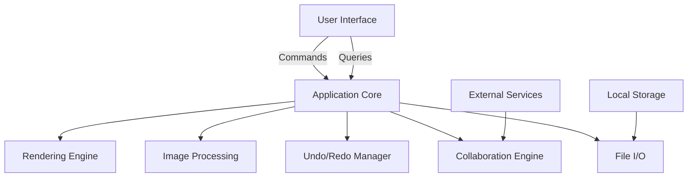

# Art App Architecture - Digital Creation Tools

## Overview
The Art application provides professional-grade digital creation tools similar to Photoshop, Krita, and Procreate. It features layer-based editing, advanced brushes, and comprehensive toolset for digital artists.

## Architectural Principles
- **Hexagonal Architecture**: Clear separation between core logic and adapters
- **Screaming Architecture**: Organization by feature domains
- **Vertical Slices**: Features implemented end-to-end (UI to storage)
- **Performance Focus**: Optimized for large canvases and real-time operations

## High-Level Component Diagram


## Module Structure
```
apps/art/
├── src/
│   ├── core/              # Domain models and business logic
│   ├── rendering/         # Bevy-based rendering pipeline
│   ├── tools/             # Editing tools implementation
│   ├── ui/                # Yew/Tauri UI components
│   ├── persistence/       # Sled storage implementation
│   ├── services/          # Image processing and external services
│   └── main.rs            # Application entry point
```

## Core Data Models

### Layer
```rust
struct Layer {
    id: Uuid,
    name: String,
    kind: LayerType,       // Raster, Vector, Text, Adjustment
    opacity: f32,
    visible: bool,
    blend_mode: BlendMode,
    metadata: Value,       // Type-specific properties
    pixels: Vec<u8>,       // Raw pixel data (for raster layers)
    bounds: Rect,          // Position and size
}
```

### Brush
```rust
struct Brush {
    id: Uuid,
    name: String,
    size: f32,
    hardness: f32,
    opacity: f32,
    spacing: f32,
    texture: Option<Texture>, // Optional texture pattern
    dynamics: BrushDynamics,  // Pressure/tilt sensitivity
}
```

### Project
```rust
struct Project {
    id: Uuid,
    name: String,
    width: u32,
    height: u32,
    color_mode: ColorMode, // RGB, CMYK, Grayscale
    resolution: f32,       // Pixels per inch
    layers: Vec<Layer>,    // Ordered layer stack
    history: Vec<Action>,  // Undo history
    metadata: Value,       // Creation date, author, etc.
}
```

## API Definitions

### Tool Operations (gRPC)
```protobuf
service ArtToolService {
    rpc SelectTool(ToolSelection) returns (ToolResponse);
    rpc BrushStroke(BrushStrokeRequest) returns (StrokeResponse);
    rpc TransformLayer(TransformRequest) returns (TransformResponse);
    rpc ApplyFilter(FilterRequest) returns (FilterResponse);
}
```

### File Operations (GraphQL)
```graphql
type Mutation {
    saveProject(project: ProjectInput!): SaveResult!
    loadProject(id: ID!): Project
    exportImage(format: ImageFormat!, options: ExportOptions): ExportResult!
}

type Query {
    recentProjects: [ProjectMeta!]!
    getBrushPresets: [Brush!]!
}
```

## Integration Points

### Collaboration Engine
- Real-time co-editing using `shared_packages/collaboration`
- Conflict resolution for concurrent edits
- Session management for collaborative projects

### Media Processing
- Image encoding/decoding via ffmpeg.wasm (AV1/WebP only)
- Integration with `shared_packages/media` for common operations

### Identity Service
- User authentication via OAuth2
- Permission management for shared projects

## Performance Optimization
1. **Canvas Tiling**: Divide large canvases into manageable tiles
2. **GPU Acceleration**: Offload rendering to GPU via Bevy
3. **Incremental Rendering**: Only redraw modified regions
4. **Memory Management**: Smart caching and resource pooling

### Tile-Based Rendering System
- Divides layers into fixed-size tiles (default 256x256)
- Only renders tiles visible in current viewport
- Tracks dirty tiles for partial updates
- Uses texture atlasing for efficient GPU utilization

### GPU Acceleration Pipeline
- Custom rendering pipeline using Bevy's GPU capabilities
- Compute shaders for layer blending
- Automatic mipmap generation
- Texture atlasing for tile management
- Quality presets (Low/Medium/High)

#### Quality Levels
| Quality | Scaling Filter | Mipmaps | Tile Updates |
|---------|----------------|---------|--------------|
| Low     | Nearest        | Off     | Full         |
| Medium  | Bilinear       | 2 levels| Partial      |
| High    | Bicubic        | Full    | Partial      |

## Implementation Roadmap

### Phase 1: Core Functionality (MVP)
1. Canvas rendering with Bevy
2. Basic brush tools
3. Layer management
4. File I/O (import/export PNG/WebP)
5. Undo/Redo system

### Phase 2: Advanced Features
1. Selection tools (rectangle, lasso, magic wand)
2. Transform operations (move, scale, rotate)
3. Text tools
4. Layer effects and blending modes
5. Brush customization

### Phase 3: Collaboration & Optimization
1. Real-time collaboration support
2. Performance tuning for large canvases
3. Advanced file formats (PSD, KRA)
4. Plugin system for filters and tools

## Dependencies
- Bevy 0.16 (rendering)
- ffmpeg.wasm 0.13.1 (image I/O)
- Sled (local storage)
- Yew 0.21.0 (web UI)
- Tauri 2.0 (desktop UI)
- collaboration_engine (shared package)