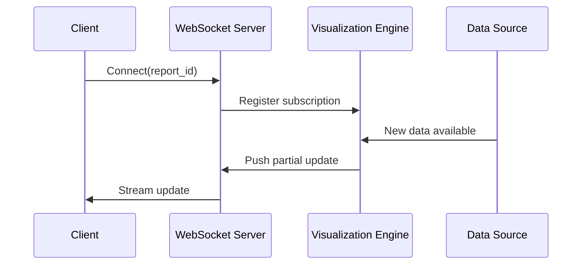
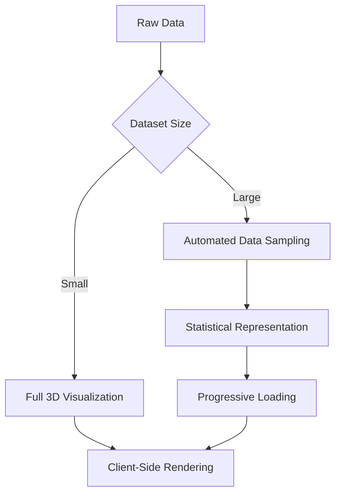

# BI Visualization Web Integration Architecture

## Overview
This document outlines the architecture for integrating Bevy-powered 3D visualizations with our web frontend. The solution provides GraphQL endpoints for visualization data, WebSocket streaming for real-time updates, and comprehensive accessibility support while maintaining performance for large datasets.

## 1. GraphQL Integration

### New Schema Definitions
```graphql
type VisualizationPayload {
  sceneData: JSON! # Serialized 3D scene data (glTF format)
  altText: String! # Accessibility description
  navigationMap: JSON! # Keyboard navigation hints
}

type Base64Image {
  imageData: String! # Base64-encoded PNG
  altText: String!
  width: Int!
  height: Int!
}

extend type Query {
  visualization3d(reportId: ID!): VisualizationPayload!
  visualizationImage(reportId: ID!, width: Int = 800, height: Int = 600): Base64Image!
}
```

### Implementation Strategy
1. **Resolver Architecture**:
   - `visualization3d` uses a headless Bevy renderer to generate scene data
   - `visualizationImage` leverages Bevy's rendering pipeline with offscreen rendering
   - Both endpoints share the same visualization core components

2. **Security Integration**:
   ```rust
   // In graphql.rs
   async fn visualization3d(
       &self,
       ctx: &Context<'_>,
       report_id: Uuid
   ) -> Result<VisualizationPayload> {
       let user = ctx.get_current_user()?;
       self.authorization_service
           .ensure_report_access(user.id, report_id)
           .await?;
       
       // Generate visualization
       let payload = self.visualization_service
           .generate_3d_visualization(report_id)
           .await?;
       
       Ok(payload)
   }
   ```

3. **Data Flow**:
   ```mermaid
   graph LR
   A[GraphQL Request] --> B{Authorization Check}
   B -->|Allowed| C[Fetch Report Data]
   C --> D[Bevy Visualization Engine]
   D --> E[Serialize Scene Data]
   E --> F[Return GraphQL Response]
   ```

## 2. WebSocket Streaming

### Architecture


### Implementation Details
1. **Endpoint Configuration** (`routes.rs`):
   ```rust
   .route("/ws/visualization", get(ws_visualization_handler))
   ```

2. **Message Protocol**:
   ```json
   {
     "type": "UPDATE",
     "report_id": "uuid",
     "delta": {
       "modified_elements": ["node-123"],
       "new_data": {...}
     },
     "accessibility_announcement": "Dataset updated with 5 new entries"
   }
   ```

3. **Backpressure Handling**:
   - Client-side throttling with `requestAnimationFrame`
   - Server-side message batching (50ms windows)
   - Priority-based message queuing (accessibility > visual updates)

## 3. Accessibility Implementation

### Multi-layered Approach
| Layer | Implementation | Example |
|-------|----------------|---------|
| **Semantic** | ARIA metadata in payloads | `"aria_role": "chart", "aria_label": "Sales performance Q3"` |
| **Navigation** | Keyboard map in payload | `{"tab_order": ["legend", "x-axis", "data-point-1"]}` |
| **Alternate** | Text description generation | `"alt_text": "Bar chart showing sales increased from $10k to $15k"` |
| **Dynamic** | WebSocket announcements | `"accessibility_announcement": "New data point added: November sales $18k"` |

### Bevy Integration
```rust
// In bevy_visualization/mod.rs
fn generate_accessibility_metadata(
    report: &Report,
    scene: &SceneData
) -> AccessibilityMetadata {
    AccessibilityMetadata {
        alt_text: format!(
            "{} showing {}",
            report.visualization_type.human_name(),
            describe_data_distribution(&report.data)
        ),
        navigation_map: generate_keyboard_map(scene),
        live_region: "polite".to_string(), // For dynamic updates
    }
}
```

## 4. Performance Considerations

### Data Handling Strategy
| Scenario | Technique | Implementation |
|----------|-----------|---------------|
| **Initial Load** | Progressive rendering | 1. Skeleton UI<br>2. Low-res image<br>3. Full 3D scene |
| **Large Datasets** | Level-of-Detail (LOD) | Dynamic point aggregation based on viewport |
| **Frequent Updates** | Delta encoding | Send only changed elements via WebSocket |
| **Mobile Devices** | Adaptive quality | Auto-downgrade to 2D image when needed |

### Optimization Pipeline


## 5. Security Model

### Access Control Flow
1. **Authentication**: JWT validation via Axum middleware
2. **Authorization**:
   - Report-level permissions check
   - Field-level data redaction (for PII)
   - WebSocket subscription validation
3. **Data Protection**:
   - All visualization payloads undergo compliance scanning
   - Automated redaction of sensitive patterns
   - Time-bound WebSocket tokens (15-minute expiration)

### Attack Mitigation
| Threat | Countermeasure |
|--------|----------------|
| DDoS via WebSocket | Per-user connection limits |
| Data leakage | Dynamic field masking |
| Visualization injection | Strict content security policies |
| Replay attacks | WebSocket message nonce validation |

## Integration Points

### Required Modifications
1. **GraphQL Layer** (`graphql.rs`):
   - Add new query implementations
   - Integrate authorization checks
   - Implement error handling specific to visualization

2. **Web Routes** (`routes.rs`):
   - Add WebSocket endpoint
   - Configure CORS for visualization resources
   - Implement rate limiting for image requests

3. **Bevy Visualization** (`bevy_visualization/mod.rs`):
   - Headless rendering capabilities
   - Accessibility metadata generation
   - WebSocket message formatting

## Deployment Considerations

### Resource Requirements
- **GPU Acceleration**: Recommended for production deployments
- **Memory**: 512MB baseline + 50MB per concurrent visualization
- **CPU**: 2 cores minimum for WebSocket handling

### Fallback Strategy
1. When Bevy rendering fails:
   - Automatic fallback to 2D image
   - Client-side error logging
   - Graceful degradation to static HTML tables

2. When WebSocket disconnects:
   - Automatic reconnection attempts (exponential backoff)
   - Snapshot-based recovery
   - Accessibility announcement of reconnection status