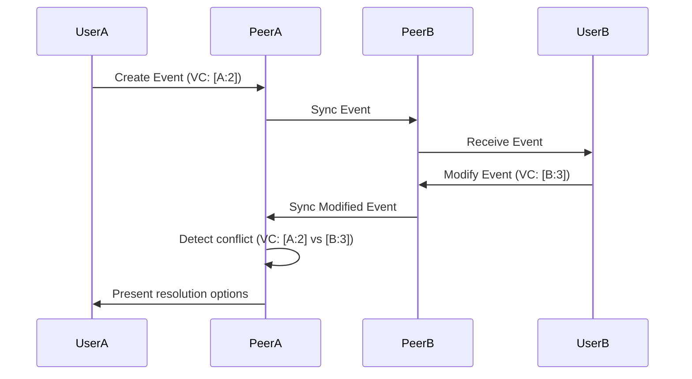
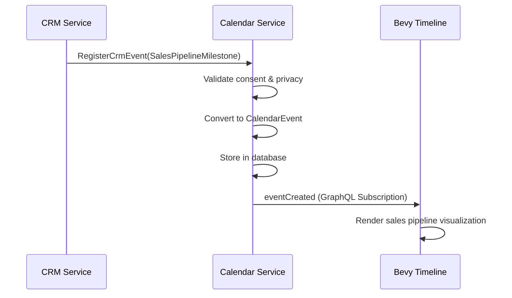
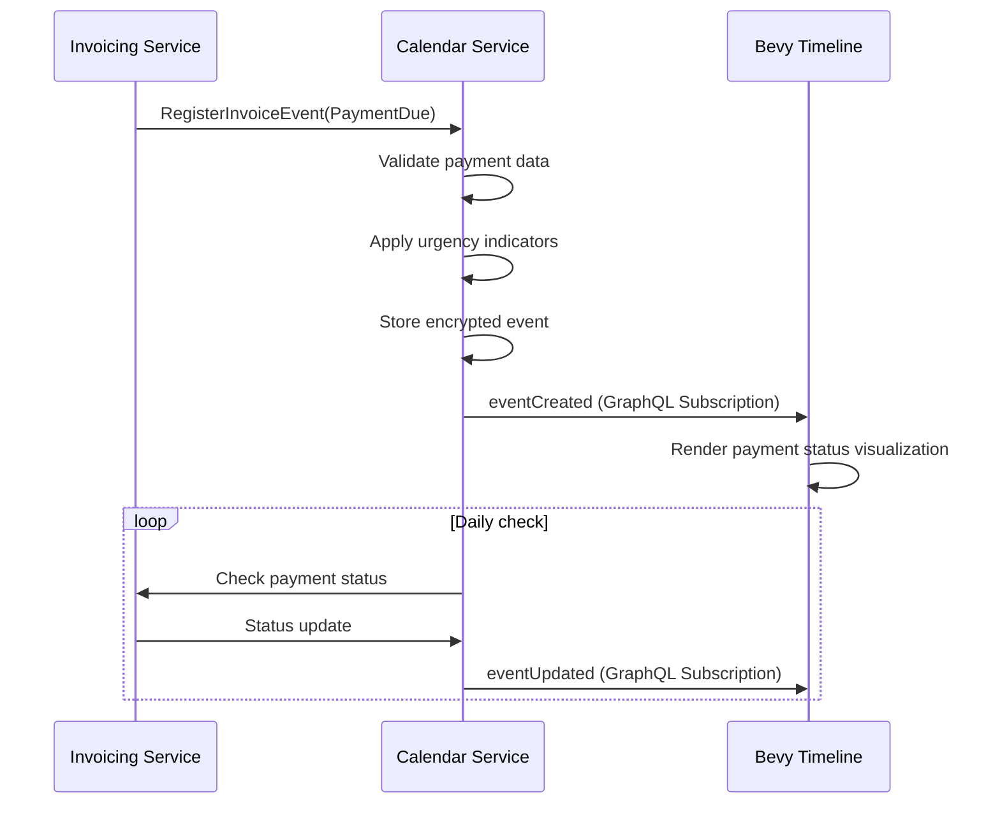

# Calendar Module Architecture

## Module Structure (Hexagonal Architecture with Vertical Slices)

The calendar module follows screaming architecture principles by implementing all functionality as a vertical slice. This structure ensures clear separation of concerns while maintaining domain integrity.

```
apps/calendar/
├── Cargo.toml
├── MIGRATION_GUIDE.md
├── README.md
└── src/
    ├── lib.rs
    ├── domain/          # Pure business logic (events, participants, shifts)
    │   ├── event.rs
    │   ├── participant.rs
    │   ├── shift.rs
    │   ├── reminder.rs
    │   ├── primitives.rs
    │   └── mod.rs
    ├── application/     # Use cases and service orchestration
    │   ├── scheduling_service.rs
    │   ├── shift_management.rs
    │   ├── sync_service.rs
    │   └── mod.rs
    ├── infrastructure/  # Concrete implementations
    │   ├── database/
    │   │   ├── models.rs
    │   │   ├── repositories.rs
    │   │   └── mod.rs
    │   ├── sync/
    │   │   ├── ics_importer.rs
    │   │   ├── external_calendar.rs
    │   │   ├── p2p_sync.rs
    │   │   └── mod.rs
    │   └── mod.rs
    └── presentation/    # UI components (Bevy, Yew)
        ├── views/
        │   ├── daily.rs
        │   ├── weekly.rs
        │   ├── monthly.rs
        │   └── agenda.rs
        └── mod.rs
```

## Domain Models

### Core Event Model
```rust
pub struct CalendarEvent {
    pub id: Uuid,
    pub user_id: Uuid,
    pub title: String,
    pub description: Option<String>,
    pub start: DateTime<Utc>,
    pub end: DateTime<Utc>,
    pub event_type: EventType,
    pub visibility: EventVisibility,
    pub recurrence: Option<RecurrenceRule>,
    pub location: Option<Location>,
    pub attachments: Vec<EventAttachment>,
    pub created_at: DateTime<Utc>,
    pub updated_at: DateTime<Utc>,
}

pub enum EventType {
    Personal,
    Business,
    Cooperative(String), // Cooperative ID for shared co-op events
    TaskDeadline(Uuid),  // References Task Manager module
    HealthAppointment,   // References Health module
}

pub enum EventVisibility {
    Private,
    Shared(Vec<Uuid>),  // User IDs with access
    Public,
    CooperativeMembers(String), // Cooperative ID
}
```

### Shift Management Model
```rust
pub struct WorkShift {
    pub id: Uuid,
    pub cooperative_id: Uuid, // For co-op shift management
    pub position: String,
    pub schedule: ShiftSchedule,
    pub coverage: ShiftCoverage,
    pub created_at: DateTime<Utc>,
}

pub enum ShiftSchedule {
    Fixed { start_time: NaiveTime, duration: Duration },
    Rotating { 
        pattern: RotationPattern,
        start_date: Date<Utc>,
        rotation_period: Duration,
    },
}

pub enum RotationPattern {
    DayOff { days: Vec<Weekday> },
    WeekOnWeekOff,
    Custom(Vec<ShiftRotation>),
}

pub struct ShiftCoverage {
    pub minimum_staff: u8,
    pub current_staff: Vec<Uuid>, // User IDs scheduled
    pub coverage_status: CoverageStatus,
}
```

### Smart Reminder System
```rust
pub struct EventReminder {
    pub id: Uuid,
    pub event_id: Uuid,
    pub user_id: Uuid,
    pub trigger_time: DateTime<Utc>,
    pub method: ReminderMethod,
    pub escalation_level: u8,
    pub status: ReminderStatus,
    pub created_at: DateTime<Utc>,
}

pub enum ReminderMethod {
    PushNotification,
    Email,
    SMS,
    InApp,
    LocationBased(String), // Geofence name
}

pub struct ReminderEscalation {
    pub base_reminder: Duration, // Initial reminder time before event
    pub escalation_steps: Vec<EscalationStep>,
}

pub struct EscalationStep {
    pub delay: Duration, // Time after previous step
    pub method: ReminderMethod,
    pub max_attempts: u8,
}
```

## Service Interfaces

### Scheduling Service
```rust
pub struct SchedulingService {
    repository: Arc<dyn EventRepository>,
    p2p_manager: Arc<P2PManager>,
    participant_service: Arc<ParticipantService>,
}

impl SchedulingService {
    pub async fn create_event(
        &self,
        user_id: Uuid,
        input: CreateEventInput,
    ) -> Result<CalendarEvent, CalendarError> {
        // Validate participant availability
        let conflicts = self.participant_service.check_availability(
            &input.participants, 
            input.start, 
            input.end
        ).await?;
        
        if !conflicts.is_empty() {
            return Err(CalendarError::SchedulingConflict(conflicts));
        }

        // Create event with proper visibility handling
        let event = CalendarEvent::new(
            user_id,
            input.title,
            input.description,
            input.start,
            input.end,
            input.event_type,
            input.visibility,
            input.recurrence,
            input.location,
        );

        // Share with participants through p2p network
        self.p2p_manager.share_event(&event, &input.participants).await?;
        self.repository.save(&event).await?;

        Ok(event)
    }
}
```

### Shift Management Service
```rust
pub struct ShiftManagementService {
    repository: Arc<dyn ShiftRepository>,
    availability_service: Arc<AvailabilityService>,
}

impl ShiftManagementService {
    pub fn generate_shift_rotation(
        &self,
        schedule: &ShiftSchedule,
        staff: &[StaffMember],
        start_date: Date<Utc>,
        end_date: Date<Utc>,
    ) -> Vec<WorkShift> {
        match &schedule {
            ShiftSchedule::Rotating { pattern, rotation_period, .. } => {
                self.apply_rotation_pattern(
                    pattern, 
                    staff, 
                    start_date, 
                    end_date,
                    *rotation_period
                )
            },
            _ => unimplemented!(),
        }
    }

    fn apply_rotation_pattern(
        &self,
        pattern: &RotationPattern,
        staff: &[StaffMember],
        start_date: Date<Utc>,
        end_date: Date<Utc>,
        rotation_period: Duration,
    ) -> Vec<WorkShift> {
        // Implementation of round-robin or custom rotation algorithm
        // Ensures coverage requirements are met while respecting availability
        // ...
    }
}
```

## GraphQL API Design

### Mutations
```graphql
input CreateEventInput {
    title: String!
    description: String
    start: DateTime!
    end: DateTime!
    eventType: EventType!
    visibility: EventVisibilityInput!
    recurrence: RecurrenceRuleInput
    location: LocationInput
    participants: [ParticipantInput!]
}

input EventVisibilityInput {
    type: VisibilityType!
    sharedWith: [ID!] # Required for Shared type
    cooperativeId: ID # Required for Cooperative type
}

enum VisibilityType {
    PRIVATE
    SHARED
    PUBLIC
    COOPERATIVE
}

type Mutation {
    createEvent(input: CreateEventInput!): CalendarEvent!
    updateEvent(id: ID!, input: UpdateEventInput!): CalendarEvent!
    deleteEvent(id: ID!): Boolean!
    generateShiftSchedule(input: ShiftScheduleInput!): [WorkShift!]!
    requestShiftSwap(shiftId: ID!, newStaffMemberId: ID!): ShiftSwapRequest!
}
```

### Queries
```graphql
type Query {
    getEvent(id: ID!): CalendarEvent
    listEvents(
        userId: ID!
        startDate: DateTime
        endDate: DateTime
        eventType: EventType
    ): [CalendarEvent!]!
    
    getWorkShift(id: ID!): WorkShift
    listWorkShifts(
        cooperativeId: ID!
        startDate: Date
        endDate: Date
        position: String
    ): [WorkShift!]!
    
    getAvailability(userId: ID!, startDate: DateTime, endDate: DateTime): Availability!
}
```

### Subscriptions
```graphql
type Subscription {
    eventCreated(userId: ID!): CalendarEvent!
    eventUpdated(userId: ID!): CalendarEvent!
    eventDeleted(userId: ID!): ID!
    shiftCoverageAlert(cooperativeId: ID!): ShiftCoverageAlert!
    smartReminderTriggered(userId: ID!): ReminderNotification!
    locationBasedEventDetected(userId: ID!): LocationEventTrigger!
}
```

## Integration Points

### 0. **Integration Principles**

All integrations follow these principles:
- **Vertical Slice Preservation**: Each module remains independently deployable
- **Data Minimization**: Only share necessary data between modules
- **Consent-First**: All cross-module data sharing requires explicit user consent
- **Privacy by Default**: Sensitive data is encrypted end-to-end
- **Event-Driven**: Modules communicate through domain events, not direct dependencies

### 1. **Task Manager Integration**
- Deadline events automatically created from tasks
- Bidirectional sync: Calendar event completion → task progress update
- GraphQL schema extension for task-calendar linking

### 2. **Notes & Memos Integration**
- Event-attached notes stored as `EventAttachment` with reference to Notes module
- Cross-module linking via shared UUID identifiers
- Unified search across calendar events and notes

### 3. **Business Health Dashboard**
- Time tracking metrics extracted from calendar events
- Productivity analytics based on business vs. personal time allocation
- Cooperative shift coverage metrics for dashboard visualization

### 4. **Health Module Integration**
- Health appointment events linked to Health module
- Location-based event suggestions using health data (e.g., "Hydration break" reminders)
- Privacy-preserving data sharing with anonymization

## p2p Synchronization Strategy

### SyncableEvent Trait

All integrated events must implement the `SyncableEvent` trait from cpc-net:

```rust
pub trait SyncableEvent {
    fn event_id(&self) -> Uuid;
    fn user_id(&self) -> Uuid;
    fn created_at(&self) -> DateTime<Utc>;
    fn updated_at(&self) -> DateTime<Utc>;
    fn vector_clock(&self) -> VectorClock;
    fn merge(&mut self, other: Self) -> MergeResult;
    fn encrypt(&self, key: &EncryptionKey) -> EncryptedEvent;
    fn decrypt(encrypted: EncryptedEvent, key: &EncryptionKey) -> Result<Self, DecryptionError>;
}

impl SyncableEvent for CalendarEvent {
    // Implementation using Double Ratchet for encryption
    // and vector clocks for conflict resolution
}
```

### Conflict Resolution
- **Vector Clocks**: Each event maintains a vector clock tracking modifications across peers
- **Last-Write-Wins with User Resolution**: For conflicting edits, the system preserves both versions and prompts user resolution
- **CRDTs for Simple Values**: Operational transformations for text descriptions and participant lists



### Bandwidth Optimization
- **Delta Encoding**: Only transmit changes since last sync
- **Event Summarization**: For historical data, store only key modifications
- **Selective Sync**: Users can choose what to sync (e.g., only business events)
- **Compression**: BLAKE3-based differential compression for recurring events

## Data Migration Strategy

### Existing Data Integration
1. **Task Manager Deadlines**
   - Convert all task deadlines to calendar events
   - Maintain backward compatibility with task module
   - Preserve original deadline metadata

2. **Legacy Calendar Data**
   - ICS import pipeline with validation
   - Conflict detection for overlapping events
   - User-controlled mapping of categories

### ICS Format Handling
```rust
pub struct IcsImporter {
    user_id: Uuid,
    timezone: Tz,
}

impl IcsImporter {
    pub fn import(&self, ics_data: &str) -> Result<Vec<CalendarEvent>, ImportError> {
        let calendar = parse_ics(ics_data)?;
        
        // Convert timezone to UTC
        let events = calendar.events.into_iter()
            .map(|e| self.convert_to_utc(e))
            .collect();
        
        // Apply business rules (e.g., max 100 events per import)
        self.validate_import(&events)?;
        
        // Map to our domain model
        Ok(events.into_iter()
            .map(|e| CalendarEvent::from_ics_event(e, self.user_id))
            .collect())
    }
}
```

## Reference Implementations

### Work Shift Rotation Algorithm
```rust
impl ShiftManagementService {
    pub fn generate_weekly_rotation(
        &self,
        staff: &[StaffMember],
        start_date: Date<Utc>,
        positions: &[String],
    ) -> Vec<WorkShift> {
        let mut shifts = Vec::new();
        let days_in_week = 7;
        
        // Create rotation pattern ensuring equal distribution
        for (day_offset, position) in positions.iter().cycle().take(days_in_week).enumerate() {
            let date = start_date + chrono::Duration::days(day_offset as i64);
            
            // Assign staff in round-robin fashion
            for i in 0..staff.len() {
                let staff_index = (i + day_offset) % staff.len();
                
                shifts.push(WorkShift::new(
                    staff[staff_index].id,
                    position.clone(),
                    date,
                ));
            }
        }
        
        shifts
    }
}
```

### Smart Reminder Escalation System
```rust
pub struct ReminderScheduler {
    repository: Arc<dyn ReminderRepository>,
    notification_service: Arc<NotificationService>,
}

impl ReminderScheduler {
    pub async fn process_reminders(&self) {
        let now = Utc::now();
        let due_reminders = self.repository.get_due_reminders(now).await;
        
        for reminder in due_reminders {
            // Apply escalation logic
            let next_step = self.determine_next_escalation_step(&reminder);
            
            // Send notification through appropriate channel
            self.notification_service.send(
                &reminder.user_id,
                &reminder.event_id,
                next_step.method,
                &reminder.message,
            ).await;
            
            // Update reminder status
            self.repository.update_status(
                reminder.id,
                ReminderStatus::Sent(next_step.escalation_level),
                now,
            ).await;
        }
    }
    
    fn determine_next_escalation_step(&self, reminder: &EventReminder) -> EscalationStep {
        // Implementation of escalation logic based on:
        // - Current escalation level
        // - Time until event
        // - User's notification preferences
        // ...
    }
}
```

## Privacy and Modularity Considerations

### Business vs Personal Data Separation
- **Separate Storage**: Business events stored with cooperative metadata
- **Granular Consent Controls**: 
  - Per-event sharing settings
  - Cross-module data access permissions
  - Business feature enable/disable toggle at user level

### Cooperative Principles Implementation
- Shared calendars for co-op shift management
- Democratic event creation (voting for meeting times)
- Transparent shift coverage metrics visible to all members

### Privacy-First Design
- **Data Minimization**: Only collect necessary location data
- **On-Device Processing**: Sensitive analysis happens locally first
- **Explicit Consent**: For each external calendar sync connection
- **Audit Trails**: Comprehensive logs for business data access

## Validation Against Architectural Principles

| Principle               | Implementation                           | Verification Method                     |
|-------------------------|------------------------------------------|-----------------------------------------|
| **True Modularity**     | Business features can be disabled        | Feature flag testing                    |
| **Screaming Architecture** | Structure reflects calendar domain     | Code review against domain requirements |
| **Hexagonal Architecture** | Clear ports for sync adapters         | Dependency analysis                     |
| **Vertical Slice**      | All calendar functionality in one crate  | File structure validation               |
| **Cooperative Values**  | Shared calendars for co-ops             | User scenario testing                   |

## Next Steps for Implementation

### CRM & Invoicing Integration Plan

#### Phase 1: Event Model Extensions
1. Extend EventType with CRM & Invoicing specific event types (completed)
2. Add wellness threshold to LeadFollowUp events
3. Implement enum conversion utilities for external modules

#### Phase 2: gRPC Integration Layer
1. Define calendar_integration.proto with following services:
   ```protobuf
   service CalendarIntegration {
       rpc RegisterCrmEvent(CrmEventRequest) returns (EventRegistrationResponse);
       rpc RegisterInvoiceEvent(InvoiceEventRequest) returns (EventRegistrationResponse);
       rpc GetIntegratedTimeline(IntegrationFilter) returns (stream TimelineEvent);
   }
   ```
2. Generate gRPC code using prost
3. Implement server-side handlers in CalendarService

#### Phase 3: CRM Integration
1. Add CalendarService dependency to LeadScoringService
2. Implement event registration in CRM services:
   - Pipeline milestones → Calendar events
   - Lead scoring thresholds → Follow-up events
   - Email campaign schedules → Timeline markers
3. Create CRM-specific visualization components:
   - Sales pipeline progress indicators
   - Lead scoring trend visualizations

#### Phase 4: Invoicing Integration
1. Add CalendarService dependency to ReminderService
2. Implement invoice event registration:
   - Payment due dates → Calendar events
   - Payment status changes → Timeline annotations
   - Reminder configurations → Notification markers
3. Create invoice-specific visualization components:
   - Payment status color coding
   - Urgency indicators (red = overdue)
   - Payment history timelines

#### Phase 5: Privacy & Compliance
1. Implement GDPR/CCPA consent checking:
   - Add consent verification to event registration
   - Implement data minimization for cross-module sharing
2. Integrate Double Ratchet encryption:
   - Key rotation strategy for calendar events
   - Secure key exchange with CRM/Invoicing modules

#### Phase 6: Testing & Documentation
1. Write integration tests for cross-module event flow
2. Update architecture documentation with integration diagrams
3. Document privacy implications in docs/privacy_integration_guidelines.md

## Integration Sequence Diagrams

### CRM → Calendar Event Registration


### Invoicing → Calendar Event Flow


## Privacy Integration Guidelines

### Consent Management
- All cross-module data sharing requires explicit user consent
- Users can manage consent at granular level (per module, per data type)
- Default: no cross-module data sharing enabled

### Data Minimization
- Only share minimum necessary data between modules
- Example: For payment due events, share only:
  - Invoice ID (for reference)
  - Due date (for calendar)
  - Amount (for visualization)
  - NOT full invoice details

### End-to-End Encryption
- All integrated events use Double Ratchet encryption
- Keys are rotated with each event update
- Decryption only occurs in the user's trusted environment

### Audit Trail
- All cross-module data access is logged
- Logs include:
  - Timestamp
  - Data type accessed
  - Purpose code (UserView, Integration, Analytics)
  - Consent verification status

## Visualization Guidelines

### CRM Events
- **Sales Pipeline Events**: Horizontal progress bar showing stage advancement
- **Lead Follow-ups**: Triangle marker with color indicating urgency (red = high score change)
- **Email Campaigns**: Timeline bar showing campaign duration with recipient count

### Invoicing Events
- **Payment Due**: Circle marker with color coding:
  - Green: Paid
  - Yellow: Due soon (3+ days)
  - Orange: Due tomorrow
  - Red: Overdue
- **Payment Status**: Vertical timeline annotations showing status transitions
- **Reminders**: Small bell icon indicating upcoming reminders

### Unified Timeline View
- Toggle to filter by module (CRM, Invoicing, Personal)
- Color-coded event categories
- Interactive tooltips showing full details
- Drag-and-drop rescheduling for user-controlled events

## Next Steps for Implementation

1. Implement core domain models with comprehensive tests
2. Build p2p synchronization layer using p2panda
3. Create GraphQL API endpoints for frontend consumption
4. Develop reference implementations of shift rotation and reminder systems
5. Implement data migration tools for existing event data

This architecture enables both individual productivity and cooperative business management through a unified calendar system while maintaining strict domain boundaries and privacy controls.