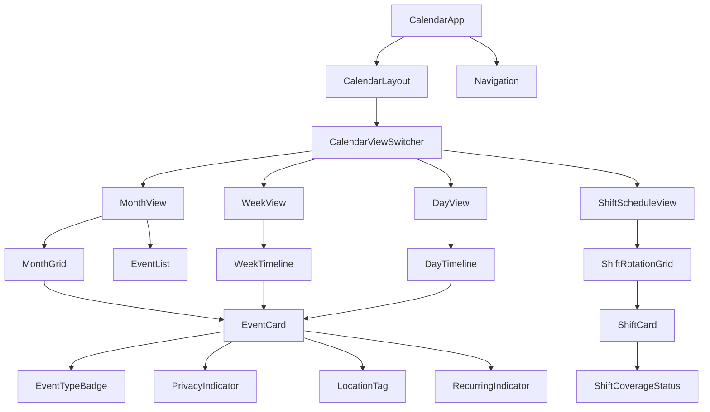
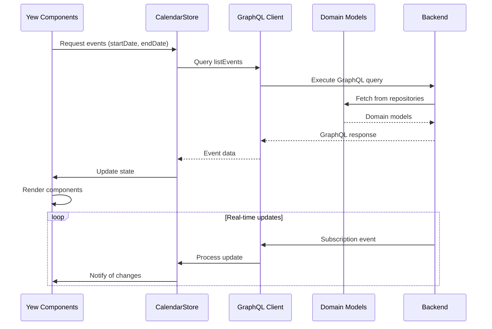
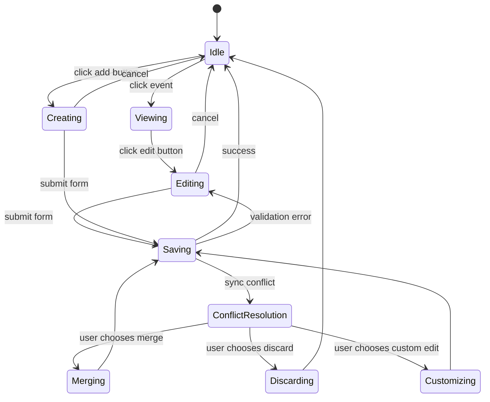

# Calendar UI Architecture

## Component Structure

### Component Hierarchy


### Core Components

#### 1. EventCard
- **Props**:
  ```rust
  pub struct EventCardProps {
      pub event: CalendarEvent,
      pub on_edit: Callback<Uuid>,
      pub on_delete: Callback<Uuid>,
      pub is_draggable: bool,
      pub is_touch_device: bool,
  }
  ```
- **Visual Elements**:
  - EventTypeBadge: Color-coded badge based on EventType
  - PrivacyIndicator: Unique icon for each EventVisibility level:
    - Private: 🔒
    - Shared: 👥
    - Public: 🌐
    - Cooperative: 🤝
  - LocationTag: Map pin icon + truncated address
  - RecurringIndicator: Circular arrow icon (only for recurring events)
  - GeofenceVisualization: Radius circle on map view when location has radius

#### 2. ShiftCard
- **Props**:
  ```rust
  pub struct ShiftCardProps {
      pub shift: WorkShift,
      pub coverage: ShiftCoverage,
      pub on_edit: Callback<Uuid>,
      pub on_swap_request: Callback<Uuid>,
      pub is_manager: bool,
  }
  ```
- **Special Features**:
  - RotationPatternIndicator: Visual representation of shift rotation type
  - CoverageStatus: Color-coded (green = full, yellow = partial, red = insufficient)

#### 3. CalendarViewSwitcher
- Manages state between Month/Week/Day/Shift views
- Handles responsive layout transitions based on screen size
- Preserves view-specific state when switching

## State Management Strategy

### Data Flow Architecture


### State Management Implementation

#### 1. CalendarStore (Yew Context API)
```rust
#[derive(Clone, PartialEq, Default)]
pub struct CalendarState {
    pub current_view: CalendarView,
    pub selected_date: DateTime<Utc>,
    pub events: Vec<CalendarEvent>,
    pub work_shifts: Vec<WorkShift>,
    pub loading: bool,
    pub error: Option<String>,
}

pub enum CalendarAction {
    SetView(CalendarView),
    SetDate(DateTime<Utc>),
    EventsFetched(Vec<CalendarEvent>),
    ShiftsFetched(Vec<WorkShift>),
    EventCreated(CalendarEvent),
    EventUpdated(CalendarEvent),
    EventDeleted(Uuid),
    Loading(bool),
    Error(String),
}

impl Reducer for CalendarState {
    type Action = CalendarAction;
    
    fn reduce(self: Rc<Self>, action: Self::Action) -> Rc<Self> {
        // Implementation handles state transitions
        // with proper handling of recurring events
    }
}
```

#### 2. GraphQL Integration

**Data Fetching Pattern**:
```rust
pub async fn fetch_events(
    user_id: Uuid,
    start: DateTime<Utc>,
    end: DateTime<Utc>,
) -> Result<Vec<CalendarEvent>, CalendarError> {
    let client = GraphQLClient::new("/api/graphql");
    let response = client.query(
        r#"
        query ListEvents($userId: ID!, $startDate: DateTime, $endDate: DateTime) {
            listEvents(
                userId: $userId,
                startDate: $startDate,
                endDate: $endDate
            ) {
                id
                title
                start
                end
                eventType
                visibility {
                    type
                    sharedWith
                    cooperativeId
                }
                location {
                    name
                    latitude
                    longitude
                    radius
                }
                recurrence {
                    frequency
                    interval
                    until
                }
            }
        }
        "#,
        variables! {
            "userId" => user_id.to_string(),
            "startDate" => start.to_rfc3339(),
            "endDate" => end.to_rfc3339(),
        }
    ).await?;
    
    // Convert GraphQL response to domain models
    response.data.list_events
        .into_iter()
        .map(CalendarEvent::try_from)
        .collect()
}
```

#### 3. Real-time Sync Handling

```rust
pub fn setup_realtime_sync(user_id: Uuid, store: Dispatch<CalendarStore>) {
    let mut subscription = GraphQLClient::new("/api/graphql")
        .subscribe(
            r#"
            subscription EventUpdates($userId: ID!) {
                eventCreated(userId: $userId) {
                    id
                    title
                    start
                    end
                    eventType
                    visibility
                    location
                }
                eventUpdated(userId: $userId) {
                    id
                    title
                    start
                    end
                    visibility
                }
                eventDeleted(userId: $userId)
            }
            "#,
            variables! { "userId" => user_id.to_string() }
        );
    
    wasm_bindgen_futures::spawn_local(async move {
        while let Some(result) = subscription.next().await {
            match result {
                Ok(data) => {
                    if let Some(created) = &data.event_created {
                        store.dispatch(CalendarAction::EventCreated(
                            CalendarEvent::try_from(created.clone()).unwrap()
                        ));
                    }
                    // Handle other event types
                }
                Err(e) => {
                    store.dispatch(CalendarAction::Error(e.to_string()));
                    // Implement reconnection logic
                }
            }
        }
    });
}
```

## Mobile-Specific Implementation

### Tauri Integration Points

1. **Geolocation Access**:
   ```rust
   #[tauri::command]
   async fn get_current_position(window: Window) -> Result<Position, String> {
       let position = window.state::<GeolocationState>()
           .get_position()
           .await
           .map_err(|e| e.to_string())?;
       
       Ok(position)
   }
   
   // Register with Tauri
   .invoke_handler(tauri::generate_handler![get_current_position])
   ```

2. **Performance Optimizations**:
   - Virtualized scrolling for event lists
   - Debounced resize handlers
   - Image lazy loading for map tiles
   - Mobile-optimized touch targets (minimum 48x48px)

3. **Touch Interaction Patterns**:
   - Long press for context menu
   - Swipe gestures for date navigation
   - Drag-and-drop with haptic feedback
   - Pinch-to-zoom for map views

### Responsive Layout Breakpoints

| Breakpoint | Layout Variant | Features |
|------------|----------------|----------|
| < 600px    | Mobile         | Single-column, swipe navigation, compact event cards, hidden sidebar |
| 600-960px  | Tablet         | Two-column layout, larger touch targets, visible navigation rail |
| > 960px    | Desktop        | Full three-column layout, detailed event cards, persistent sidebar |

## Component Interface Specifications

### EventCard Props
```rust
#[derive(Properties, PartialEq)]
pub struct EventCardProps {
    pub event: CalendarEvent,
    #[prop_or_default]
    pub is_selected: bool,
    #[prop_or_default]
    pub on_click: Callback<Uuid>,
    #[prop_or_default]
    pub on_edit: Callback<Uuid>,
    #[prop_or_default]
    pub on_delete: Callback<Uuid>,
    #[prop_or(false)]
    pub is_touch_device: bool,
}
```

### CalendarViewSwitcher Props
```rust
#[derive(Properties, PartialEq)]
pub struct CalendarViewSwitcherProps {
    pub children: Children,
    pub current_view: CalendarView,
    pub on_view_change: Callback<CalendarView>,
    pub selected_date: DateTime<Utc>,
    pub on_date_change: Callback<DateTime<Utc>>,
}
```

## State Machine for Event Editing Workflow



## Error Handling Strategy

### Sync Conflict Resolution Flow

1. **Conflict Detection**:
   - Monitor vector clocks from p2p sync
   - Detect version mismatches during save operations

2. **User Interface for Resolution**:
   ```rust
   pub enum ConflictResolutionOption {
       UseTheirs,
       UseOurs,
       MergeManually,
       SaveAsNew,
   }
   
   pub struct ConflictResolutionModalProps {
       pub original_event: CalendarEvent,
       pub current_event: CalendarEvent,
       pub server_event: CalendarEvent,
       pub on_resolve: Callback<ConflictResolutionOption>,
       pub on_cancel: Callback<()>,
   }
   ```

3. **Implementation**:
   - Visual diff view showing changes
   - Side-by-side comparison for manual merge
   - Automatic merge for non-conflicting fields

## Mobile Layout Mockups

### Compact Event Card (Mobile < 600px)
```
┌───────────────────────────────────┐
│ 🔒 Personal • 2:00-3:00 PM        │
│ Team Meeting                      │
│ 📍 Main Office (Geofenced)        │
│ ↺ Every Monday until Aug 30       │
└───────────────────────────────────┘
```

### Shift Card (Mobile)
```
┌───────────────────────────────────┐
│ 🤝 Cooperative Shift              │
│ Cashier • Mon, Wed, Fri 9-5     │
│ ▰▰▰▰▰▰▰▰▰▰ 10/12 staffed        │
│ [Request Swap]                    │
└───────────────────────────────────┘
```

### Responsive Behavior
- **Mobile**: Single-column layout, swipe navigation between days
- **Tablet**: Two-column with visible sidebar, larger touch targets
- **Desktop**: Full three-column layout with detailed event cards

## Implementation Plan

1. **Phase 1: Core Components**
   - Implement CalendarViewSwitcher and basic views
   - Create EventCard with all visualization elements
   - Set up state management with CalendarStore

2. **Phase 2: Data Integration**
   - Connect to GraphQL API for event fetching
   - Implement real-time subscriptions
   - Add conflict resolution UI

3. **Phase 3: Mobile Optimization**
   - Implement touch-friendly controls
   - Add geofencing visualization
   - Optimize performance for mobile devices

4. **Phase 4: Shift Management**
   - Implement ShiftCard and rotation visualization
   - Build shift swap interface
   - Add coverage status indicators

This architecture maintains vertical slice integrity by connecting UI components directly to domain models through well-defined GraphQL interfaces, while accounting for all specified requirements including privacy visualization, recurring events, and shift management.