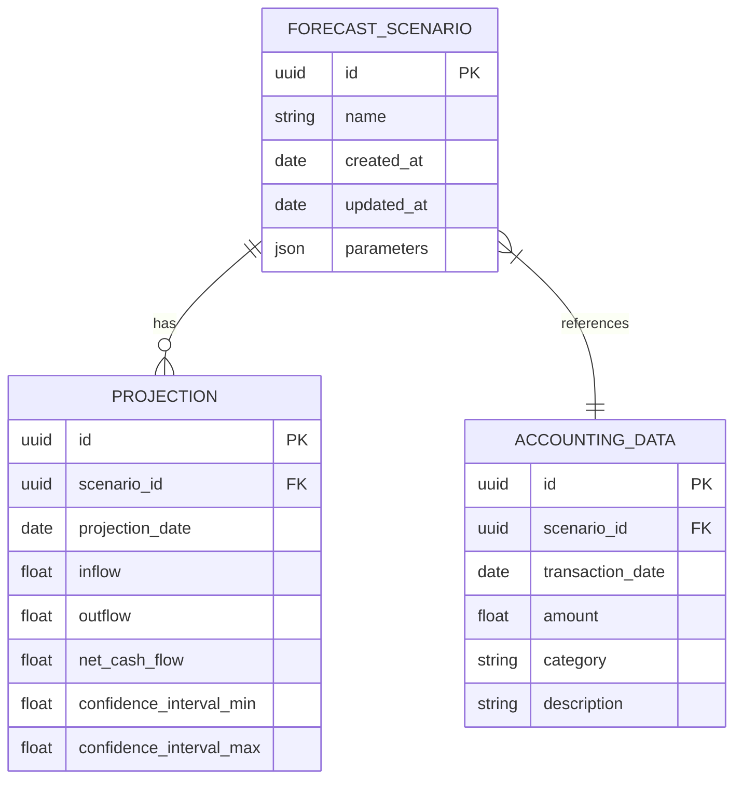
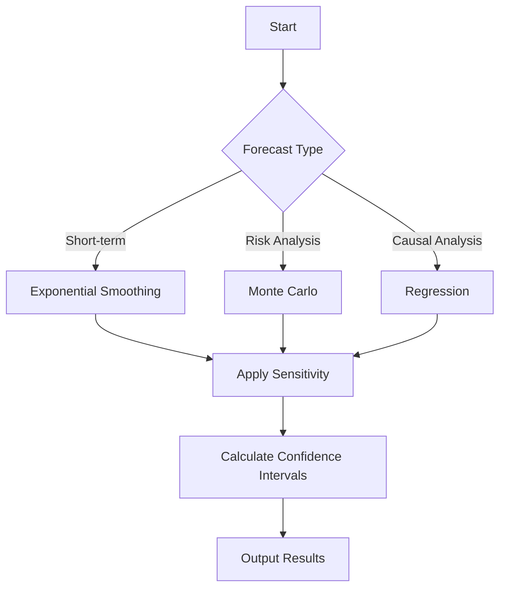
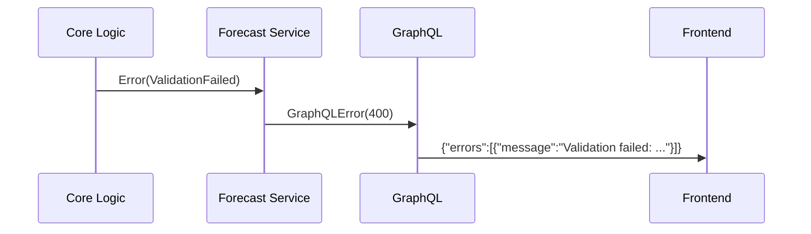
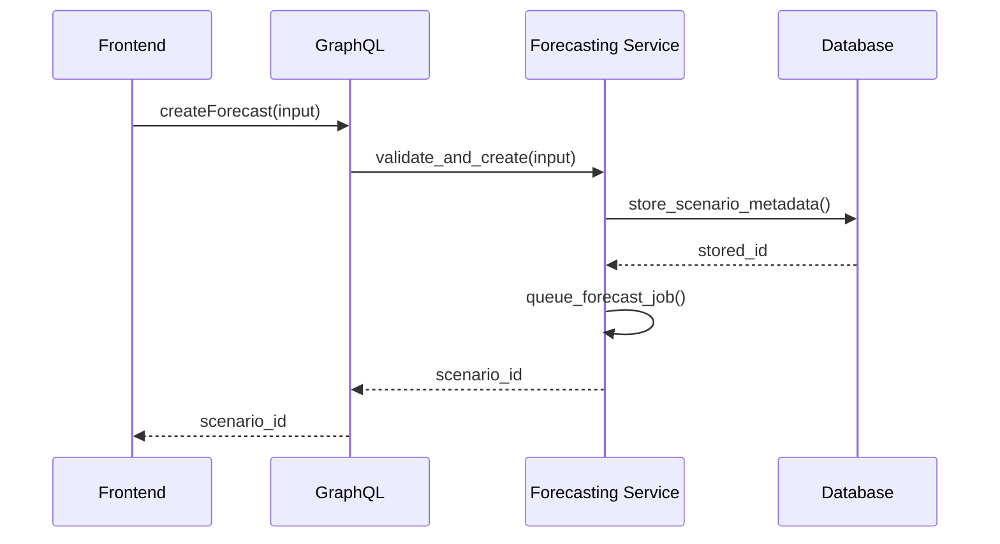
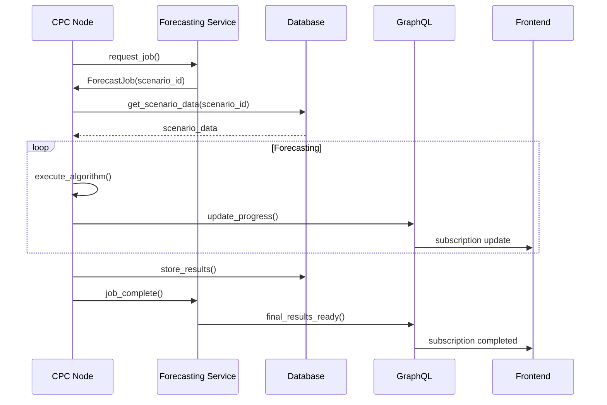

# Financial Forecasting Module

> **Status**: Implementation in progress
> **Version**: 2.0
> **Last Updated**: 2025-07-23

> **Related Modules**:
> - [Accounting Module](../accounting/accounting-module.md)
> - [Business Tools Architecture](../business-tools-architecture.md)
> - [Authentication Service](../auth/auth-service.md)

## Database Schema Design


## Enhanced Forecasting Algorithms

### Algorithm Matrix
| Algorithm | Implementation Path | Parameters | Use Case |
|-----------|---------------------|------------|----------|
| Exponential Smoothing | `cpc-core/src/algorithms/exponential_smoothing.rs` | Alpha (0-1) | Short-term forecasting |
| Monte Carlo Simulation | `cpc-core/src/algorithms/monte_carlo.rs` | Iterations (100-10,000) | Risk analysis |
| Regression Analysis | `cpc-core/src/algorithms/regression.rs` | Independent variables | Causal relationships |
| Sensitivity Analysis | `cpc-core/src/sensitivity.rs` | Parameter ranges | Scenario comparison |
| Confidence Intervals | `cpc-core/src/confidence.rs` | Z-score (1.96 for 95%) | Result reliability |

### Algorithm Selection Flow


## Error Handling Design

### Error Hierarchy
```rust
enum ForecastError {
    ScenarioNotFound,
    InsufficientData(usize),
    InvalidDateRange(Date<Utc>, Date<Utc>),
    ValidationFailed(String),
    PermissionDenied(String),
    RateLimitExceeded(String),
    ExternalServiceError(String),
}
```

### Error Propagation


## Frontend-Backend Integration

### GraphQL API Specification
```graphql
# Mutations
type Mutation {
  createForecast(input: ForecastInput!): ForecastResult!
  runForecast(scenarioId: ID!): ForecastResult!
  saveScenario(input: ScenarioInput!): Scenario!
  deleteScenario(id: ID!): Boolean!
}

# Queries
type Query {
  getScenario(id: ID!): Scenario
  listScenarios: [Scenario!]!
  getForecastResults(scenarioId: ID!): ForecastResult!
}

# Subscriptions
type Subscription {
  forecastProgress(scenarioId: ID!): ForecastProgress!
  forecastCompleted(scenarioId: ID!): ForecastResult!
}
```

### UI Component Integration
| Component | GraphQL Operations |
|-----------|---------------------|
| `FinancialForecastingDashboard` | `listScenarios`, `forecastCompleted` |
| `ForecastChart` | `getForecastResults` |
| `ScenarioEditor` | `createForecast`, `saveScenario` |

## Sequence Diagrams

### Scenario Creation Workflow


### Forecast Execution Flow


## Implementation Roadmap
1. Implement database schema migration
2. Develop algorithm modules in cpc-core
3. Enhance GraphQL API with new operations
4. Update UI components to use new API
5. Implement error handling throughout stack
6. Add comprehensive logging
7. Performance optimization

## Real-World Use Case: Manufacturing Business
1. Created 5 production scenarios
2. Compared raw material cost projections
3. Identified optimal production schedules
4. Result: 22% reduction in inventory costs