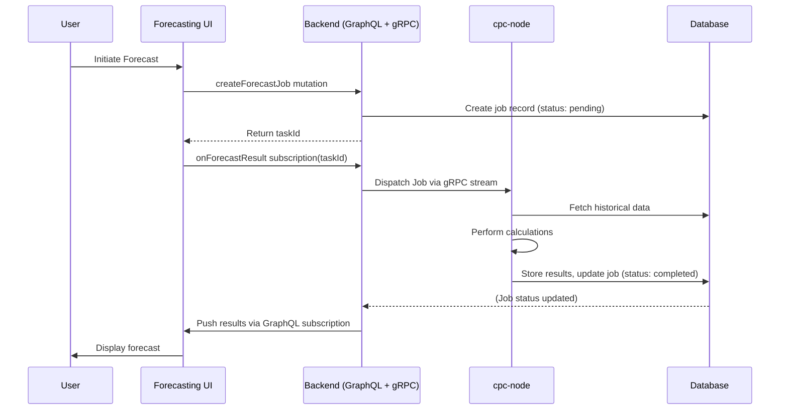
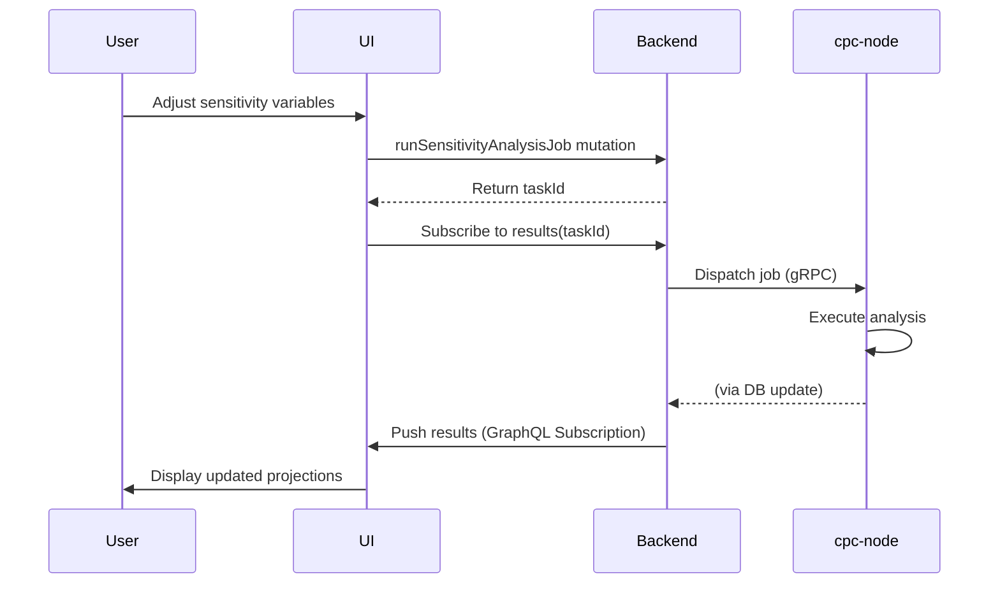
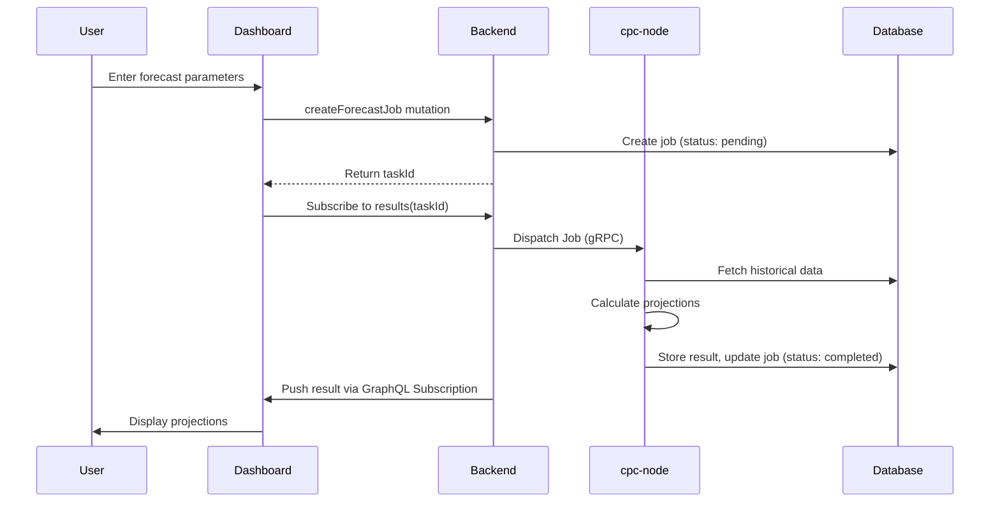
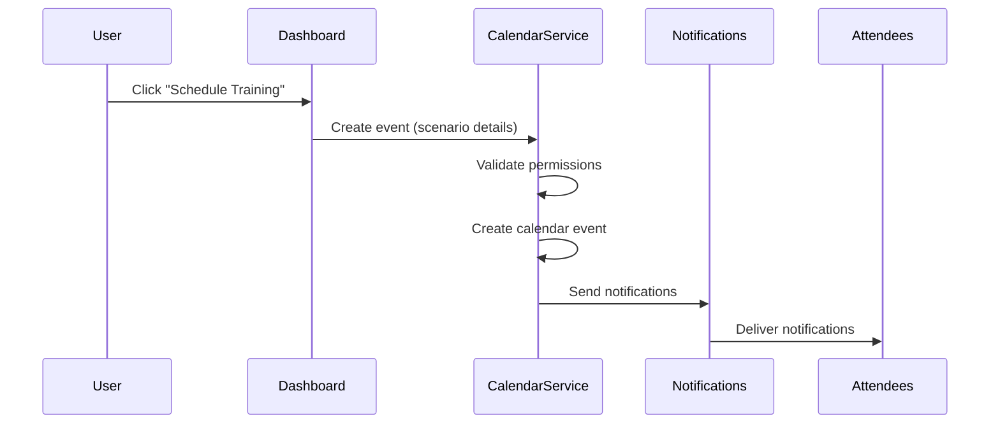
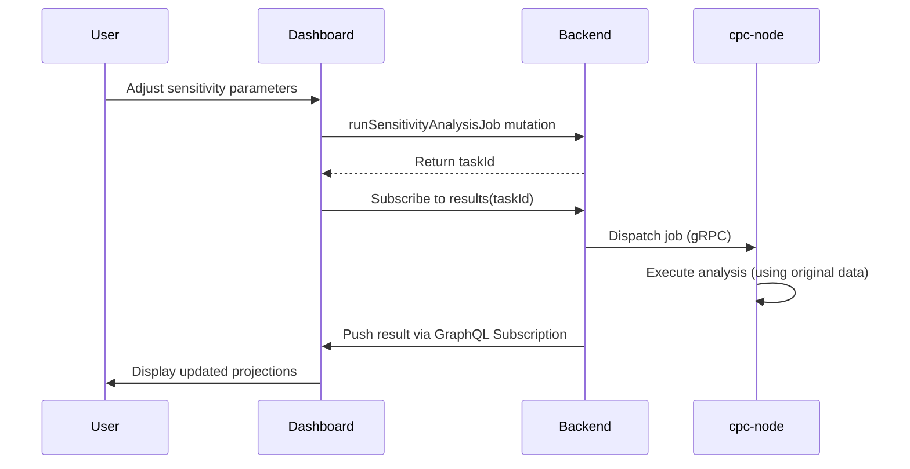

# Financial Forecasting Workflow

## End-to-End Process (v2)

## Training Session Flow
1. User selects "Schedule Training" from forecast scenario
2. System pre-fills calendar event with scenario details
3. User adjusts event details (time, attendees, etc.)
4. System creates calendar event and notifies attendees
5. Attendees receive notifications with session details

## Sensitivity Analysis Flow
1. User selects "Analyze Sensitivity" from forecast scenario.
2. The UI presents the `SensitivityPanel` with adjustable variables.
3. User adjusts variables.
4. The UI calls the `runSensitivityAnalysisJob` mutation.
5. The backend creates a new job, returns a `taskId`, and dispatches it to a `cpc-node` worker.
6. The UI subscribes to the results using the `taskId`.
7. The `cpc-node` worker performs the analysis against the **original historical data** and stores the result.
8. The backend notifies the UI via the subscription when the analysis is complete.

## Permission Requirements
- `ManageFinancialForecasting`: Required for all forecast operations
- `RunSensitivityAnalysis`: Required for sensitivity analysis operations
- `cooperative.read`: Required to access member directory for attendees

## Notification Triggers
- **Job Completion:** A notification is sent via a GraphQL subscription when a forecast or sensitivity analysis job is completed successfully.
- **Job Failure:** A notification is sent if the job fails, including an error message.
- **Training Session Reminders:** Scheduled reminders for training sessions.

## Sequence Diagrams

### Forecast Creation (v2)

### Training Session Scheduling

### Sensitivity Analysis (v2)

## Integration Points
1. **Membership Database**: Source of historical transactions
2. **Tool Registry**: `financial-forecasting` tool registration
3. **Permission System**: `ManageFinancialForecasting` and `RunSensitivityAnalysis` checks
4. **Calendar Service**: `create_event` for training sessions (remains unchanged).
5. **Notification System**: A backend-driven service that pushes results to the UI via GraphQL subscriptions.
6. **gRPC Job Service**: A new service in the `backend` for dispatching jobs to `cpc-node` workers.

## Key Files
- `apps/cpc-platform/src/lib/business-tools/financial_forecasting/FinancialForecastingDashboard.svelte`
- `apps/cpc-platform/src/lib/calendar/CalendarService.rs`
- `apps/cpc-platform/docs/business-tools-architecture-v2.md`
- `apps/backend/src/grpc/job_server.rs` (new)
- `packages/cpc-protos/src/job_service.proto` (new)
- `apps/cpc-node/src/main.rs` (refactored)
- `apps/backend/src/graphql/financial_forecasting.rs` (refactored)
- `packages/cpc-core/src/business/financial_forecasting.rs` (refactored)
- `apps/cpc-platform/src/lib/business-tools/financial_forecasting/SensitivityPanel.svelte`
- `apps/cpc-platform/src/lib/business-tools/financial_forecasting/ComparisonView.svelte`