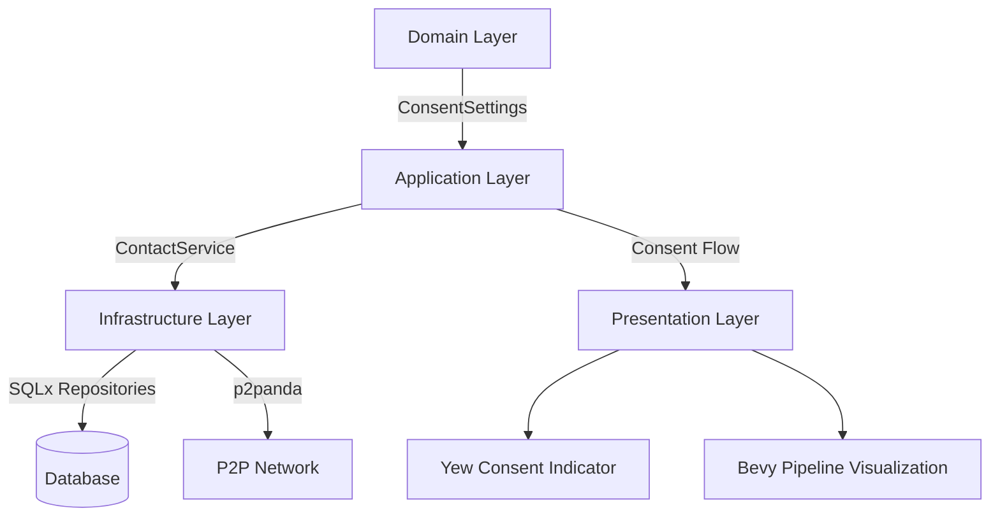
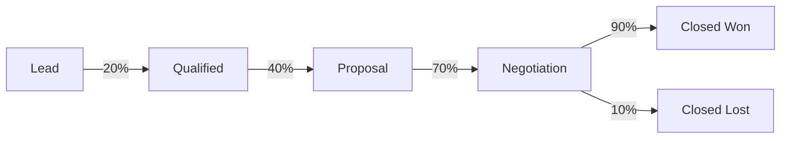

# Customer Relationship Management Module

This module implements a complete CRM system following our cooperative values with special focus on consent-based data sharing. It's designed to empower users to manage relationships while respecting privacy.

## Architecture Overview



### Consent Framework Implementation

The CRM module implements a sophisticated consent-based data sharing framework:

```rust
#[derive(Debug, Clone, Serialize, Deserialize, PartialEq, Eq)]
pub enum DataSharingLevel {
    None,
    ViewOnly,
    Editable,
}

#[derive(Debug, Clone, Serialize, Deserialize, PartialEq, Eq)]
pub struct ConsentSettings {
    pub share_profile: DataSharingLevel,
    pub share_interaction_history: DataSharingLevel,
    pub share_preferences: DataSharingLevel,
    pub custom_fields: HashMap<String, DataSharingLevel>,
}
```

**Consent Flow**:
1. Users set consent preferences when creating platform-native contacts
2. Consent settings are stored with the contact record
3. When sharing data with other cooperative members:
   - System checks consent settings for relevant data fields
   - Data is shared according to the specified level (None, ViewOnly, Editable)
   - Platform-native contacts enable direct p2p sharing with consent enforcement
   - External contacts follow traditional CRM patterns without consent workflows

### Pipeline Visualization System

The sales pipeline visualization uses Bevy to provide interactive analytics:



**Usage Example**:
```rust
// Initialize pipeline visualization
app.add_plugin(PipelineVisualizationPlugin);

// Render a specific pipeline
let pipeline = get_pipeline_from_domain(pipeline_id);
convert_pipeline_to_viz(&pipeline, &deals, &contacts);
```

**Visualization Components**:
- `PipelineVisual`: Main pipeline container
- `StageVisual`: Individual pipeline stage
- `DealVisual`: Visual representation of deals in stages
- `ConversionRateVisual`: Conversion metrics between stages

### Integration Points

#### With Health Module
- Track sales team stress levels based on interaction patterns
- Correlate high-stress periods with deal closure rates
- Provide wellness recommendations when interaction frequency exceeds healthy thresholds

#### With Finance Module
- Forecast revenue from pipeline data
- Integrate deal values with financial planning tools
- Track actual revenue against pipeline projections

## Module Structure

```
apps/crm/
├── Cargo.toml
├── MIGRATION_GUIDE.md
├── README.md
└── src/
    ├── lib.rs
    ├── domain/
    │   ├── contact.rs        # Contact models with consent framework
    │   ├── deal.rs           # Deal models
    │   ├── pipeline.rs       # Pipeline models
    │   └── primitives.rs     # Shared primitives
    ├── application/
    │   ├── contact_service.rs # Contact management
    │   ├── deal_service.rs   # Deal management
    │   └── pipeline_service.rs # Pipeline management
    ├── infrastructure/
    │   ├── database/
    │   │   ├── models.rs     # Database-specific models
    │   │   └── repositories.rs # Repository implementations
    │   └── p2p/
    │       └── data_sharing.rs # P2P data sharing with consent enforcement
    └── presentation/
        ├── bevy/
        │   ├── pipeline_adapter.rs # Domain to visualization conversion
        │   ├── pipeline_viz.rs    # Visualization systems
        │   └── viz.rs             # Visualization components
        └── yew/
            ├── consent_indicator.rs # Consent UI component
            ├── components.rs       # Other UI components
            └── mod.rs
```

## Database Schema Highlights

- **Contacts Table**: Includes consent_settings JSONB field for flexible consent management
- **Interactions Table**: Tracks all customer engagements with timestamp and duration
- **Pipelines & Stages**: Configurable sales pipelines with position-based ordering
- **Deals Table**: Connects contacts to pipelines with value tracking

## Usage

### Creating a Contact with Consent Settings

```rust
let consent_settings = ConsentSettings {
    share_profile: DataSharingLevel::Editable,
    share_interaction_history: DataSharingLevel::ViewOnly,
    share_preferences: DataSharingLevel::None,
    custom_fields: HashMap::new(),
};

let contact = ContactService::create_platform_native_contact(
    user_id,
    "John Doe".to_string(),
    "john@example.com".to_string(),
    consent_settings,
)?;
```

### Visualizing a Sales Pipeline

```rust
// In your Bevy app setup
app.add_plugin(PipelineVisualizationPlugin);

// To render a pipeline
let pipeline = pipeline_service.get_pipeline(pipeline_id)?;
let deals = deal_service.get_deals_for_pipeline(pipeline_id)?;
let contacts = contact_service.get_contacts_for_pipeline(pipeline_id)?;

// This will trigger visualization systems
convert_pipeline_to_viz(&pipeline, &deals, &contacts);
```

## Testing

The module includes comprehensive tests:
- Yew component tests for consent indicator
- Domain model validation tests
- Service layer integration tests

## References
- [modular_architecture_v2.md](../../docs/modular_architecture_v2.md)
- [planned_apps.md - CRM section](../../docs/planned_apps.md)