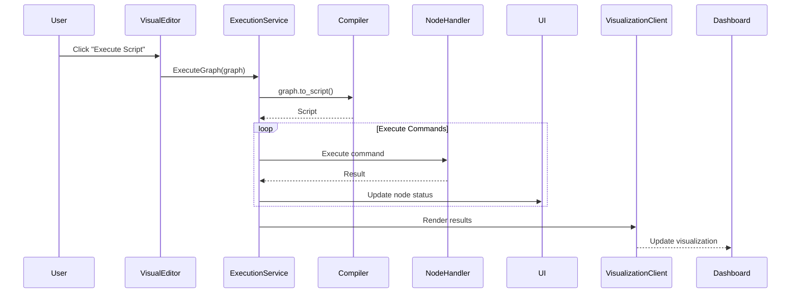

# Visual Scripting Execution Pipeline

## Overview
The execution pipeline processes visual scripts created in the dashboard's visual editor. It converts the node graph into an executable script, runs it, and provides real-time feedback.

## Key Components
- **ExecutionContext**: Tracks variables and node status during execution
- **Node Handlers**: Functions that implement the logic for each node type
- **Execution Service**: Manages the overall execution process
- **UI Feedback System**: Provides visual indicators for execution status

## Creating a Visual Script
1. Open the Visual Scripting view from the dashboard
2. Drag nodes from the palette to the canvas
3. Connect nodes using the input/output ports
4. Configure node parameters using the property editor

## Executing a Script
1. Click the "Execute Script" button in the visual editor
2. The system will:
   - Compile the graph to a Shtairir script
   - Initialize the execution context
   - Process each node in topological order
   - Update the UI with real-time status

## Monitoring Execution
During execution, you'll see visual indicators:
- <span style="color:gray">●</span> Gray: Pending
- <span style="color:blue">●</span> Blue: Running
- <span style="color:green">●</span> Green: Completed
- <span style="color:red">●</span> Red: Failed (hover to see error details)

## Debugging Errors
When a node fails:
1. Check the error message in the tooltip
2. Verify input connections and types
3. Ensure required parameters are set
4. Check the execution logs for additional context

## Creating Custom Nodes
To add a new node type:
1. Create a handler function in `node_handlers.rs`:
```rust
pub fn handle_custom_node(
    command: Command,
    context: &mut ExecutionContext
) -> Result<Value, ExecutionError> {
    // Your custom logic here
    let result = ...;
    Ok(Value::from(result))
}
```
2. Register the node in `dashboard_nodes.rs`:
```rust
NodeTemplate {
    id: "custom_node".to_string(),
    name: "Custom Node".to_string(),
    category: "Custom".to_string(),
    inputs: vec![...],
    outputs: vec![...],
}
```
3. Add it to the node palette in `visual_scripting.rs`

## Execution Flow Example


## Performance Tips
- Use pure functions when possible for result caching
- Chunk large data processing operations
- Avoid blocking operations in node handlers
- Use the Timer node for periodic operations