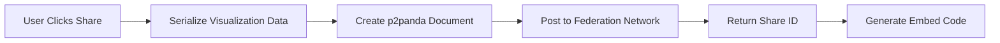
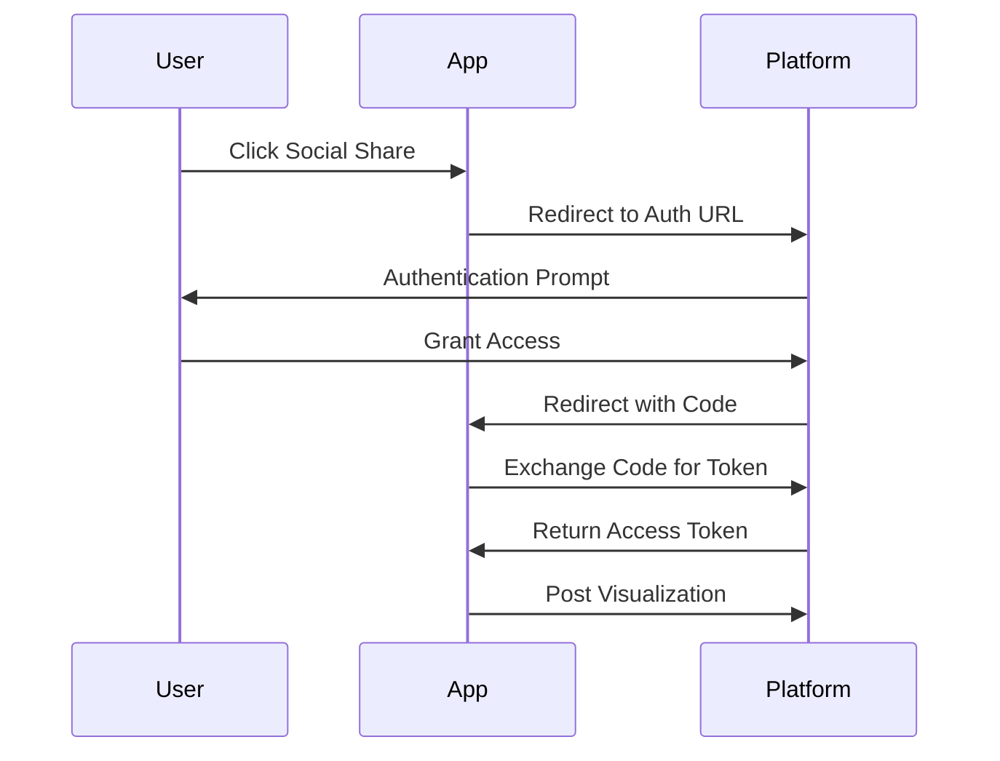

# Social Sharing Architecture for Feedback Showcase

## 1. Federation Integration
### Data Flow


### Data Serialization
- Use existing `SharedVisualization` struct
- Serialize to CBOR for efficiency
- Include metadata:
  - Visualization type
  - Timestamp
  - Creator identity
  - Data schema version

### API Endpoints
| Endpoint | Method | Description |
|----------|--------|-------------|
| `/api/share` | POST | Share visualization (returns share_id) |
| `/api/embed/{id}` | GET | Retrieve visualization data |
| `/api/annotations/{id}` | GET | Get annotations for visualization |

### Error Handling
```rust
pub enum FederationError {
    NetworkError(String),
    SerializationError(String),
    PermissionError(String),
    P2pandaError(String), // New variant
    NotFoundError(String),
}
```

## 2. Social Media Sharing
### OAuth2 Integration Flow


### UI Specifications
**Sharing Dialog Component:**
- Platform selection (Twitter, Facebook, LinkedIn)
- Message customization field
- Preview of shared content
- Alt text display (from accessibility utilities)
- Submit button with loading state

### Data Payload Structure
```json
{
  "platform": "twitter",
  "message": "Check out this visualization!",
  "url": "https://federation.example.com/embed/{id}",
  "image": "base64_encoded_image",
  "alt_text": "Generated alt text"
}
```

## 3. Embedding System
### Customization Options
| Parameter | Type | Default | Description |
|-----------|------|---------|-------------|
| width | number | 600 | iframe width in px |
| height | number | 400 | iframe height in px |
| theme | enum | "light" | "light" or "dark" |
| showTitle | boolean | true | Display visualization title |
| interactive | boolean | true | Enable user interactions |

### Embed Preview
- Live preview in modal dialog
- Responsive sizing controls
- Theme switcher
- Copy-to-clipboard button

### Security Considerations
- CSP headers for embed endpoints
- X-Frame-Options: SAMEORIGIN
- Sandbox attribute in iframe
- Content signature verification

## 4. Annotation System
### Data Model
```rust
pub struct Annotation {
    pub id: Uuid,
    pub share_id: String,
    pub user_id: String,
    pub timestamp: DateTime<Utc>,
    pub content: String,
    pub position: Option<(f32, f32)>, // Normalized coordinates
}
```

### UI Flow
1. User clicks "Add Annotation" on embedded visualization
2. System prompts for annotation text
3. User can optionally click on visualization to tag position
4. Annotation saved to federation network
5. New annotation appears with creator badge

### Storage & Transmission
- Stored as p2panda documents
- Linked to visualization via `share_id`
- Transmitted as JSON array in embedding payload

## 5. Accessibility
### WCAG 2.1 Compliance
- Integrate `ensure_social_button_accessibility()` in sharing UI
- Use `generate_sharing_alt_text()` for all shared images
- Keyboard navigation:
  - Tab through sharing options
  - Space/Enter to activate
  - Arrow keys for embed customization
- Color contrast checks with `check_color_contrast()`

### Accessibility Utilities Integration
| Component | Accessibility Feature |
|-----------|------------------------|
| ShareButtonGroup | ARIA roles from accessibility.rs |
| EmbedDialog | Alt text generation |
| AnnotationUI | Keyboard navigation |
| FederationService | Screen reader announcements |