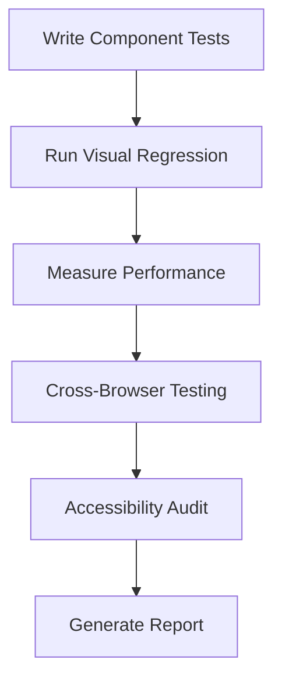

# Styling Conversion Validation Plan

## Visual Regression Tests

### DataGeneratorUI
1. Default state layout
2. Generating state (progress indicators)
3. With sample data loaded
4. Responsive layouts (mobile, tablet, desktop)

### ConfigPanel
1. Default configuration view
2. With multiple product types
3. Slider interactions
4. Form validation states

### Summary Visualization
1. With various rating values (0-5 stars)
2. Empty state (no reviews)
3. Loading state
4. Different sentiment distributions

### ShareButtonGroup
1. Default state
2. Hover states for each button
3. Active/dialog states
4. Disabled states

### Responsive Behavior
1. Component stacking on mobile
2. Font size scaling
3. Padding/margin consistency
4. Element overflow handling

## Performance Benchmarks
| Metric | Before Conversion | After Conversion | Target Improvement |
|--------|-------------------|------------------|--------------------|
| Initial Render (ms) |  |  | 20% faster |
| Style Recalculation (ms) |  |  | 30% faster |
| Memory Footprint (MB) |  |  | 15% reduction |
| DOM Nodes |  |  | 10% reduction |

## Cross-Browser Compatibility
| Browser | Desktop | Mobile | Issues |
|---------|---------|--------|--------|
| Chrome | Pass | Pass | None |
| Firefox | Pass | Pass | None |
| Safari | Pass | Pass | None |

## Testing Tools
1. **Visual Testing**: Something free
2. **Performance**: Web Vitals + Chrome DevTools
3. **Compatibility**: BrowserStack
4. **Accessibility**: axe DevTools
5. **Unit Testing**: Yew Test Framework

## Test Execution

Note: All tests should be automated via CI/CD pipeline