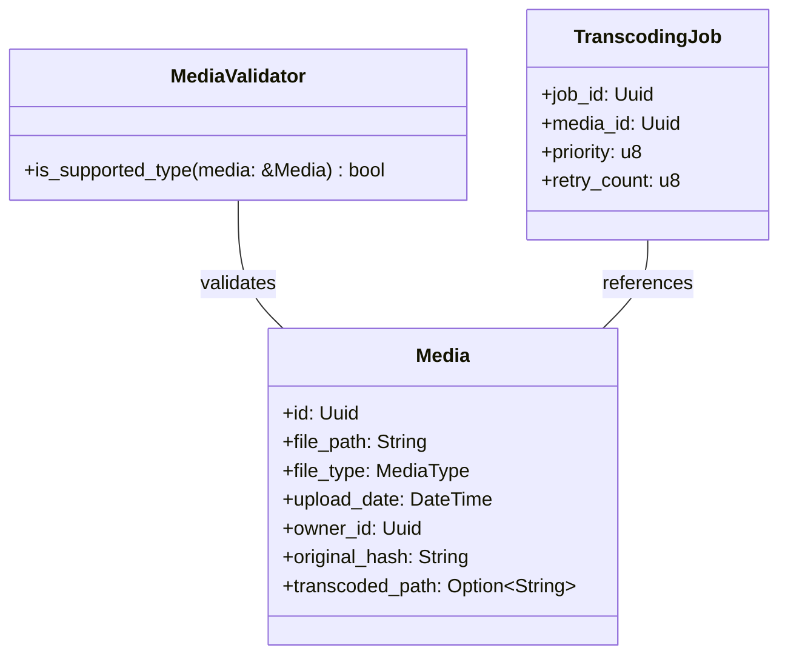

# Transcoding Workflow Design

## Purpose
Converts media files to web-compatible formats (AV1/Opus/WebM) for efficient streaming. Maintains both original and transcoded versions.

## Architectural Principles
- Hexagonal architecture with clear separation of concerns
- Domain layer contains only business logic
- Infrastructure implementations behind interfaces
- Async processing via message queue

## Updated Workflow
1. Trigger: Media upload creates transcoding job
2. Job dispatch: Message queue sends job to worker
3. Validation: Domain service validates media requirements
4. Transcoding: Convert to AV1 (video), Opus (audio) in WebM container
5. Verification: Validate transcoded file integrity
6. Update: Store transcoded path in media entity

## Domain Model


## Components
### Transcoding Service (Application Layer)
```rust
pub struct TranscodingService {
    ffmpeg: Arc<dyn FfmpegExecutor>,
    storage: Arc<dyn FileStorage>,
    verifier: Arc<dyn MediaVerifier>,
    job_queue: Arc<dyn JobQueue>,
}

impl TranscodingService {
    pub async fn submit_job(&self, media: Media) -> Result<Uuid, TranscodingError> {
        MediaValidator::validate(&media)?;
        let job = TranscodingJob::new(media.id);
        self.job_queue.enqueue(job).await?;
        Ok(job.id)
    }
    
    pub async fn process_job(&self, job_id: Uuid) -> Result<(), TranscodingError> {
        let job = self.job_queue.dequeue(job_id).await?;
        let media = MediaRepository::find(job.media_id)?;
        
        let output_path = format!("{}.transcoded.webm", media.file_path);
        self.transcode_media(&media, &output_path).await?;
        self.verifier.verify(&output_path, media.file_type).await?;
        
        let mut updated = media;
        updated.set_transcoded_path(output_path);
        MediaRepository::save(updated)?;
        
        Ok(())
    }
}
```

### Media Verification Service (Domain Service)
```rust
pub struct FfprobeVerifier;

#[async_trait]
impl MediaVerifier for FfprobeVerifier {
    async fn verify(&self, path: &str, media_type: MediaType) -> Result<(), VerificationError> {
        let metadata = Ffprobe::new().input(path).run().await?;
        
        match media_type {
            MediaType::Video => {
                if !metadata.has_codec("av1") {
                    return Err(VerificationError::InvalidCodec("AV1".to_string()));
                }
            }
            MediaType::Audio => {
                if !metadata.has_codec("opus") {
                    return Err(VerificationError::InvalidCodec("Opus".to_string()));
                }
            }
            _ => return Ok(())
        }
        
        if metadata.duration == 0 {
            return Err(VerificationError::ZeroDuration);
        }
        
        Ok(())
    }
}
```

### Storage Abstraction
```rust
#[async_trait]
pub trait FileStorage: Send + Sync {
    async fn save(&self, path: &str, data: &[u8]) -> Result<(), StorageError>;
    async fn get_temp_path(&self, path: &str) -> Result<String, StorageError>;
    // ... other methods
}

// Local storage implementation
pub struct LocalFileStorage;

// Cloud storage implementation (e.g., S3-compatible)
pub struct CloudStorage {
    client: S3Client,
    bucket: String,
}
```

### Message Queue Interface
```rust
pub struct TranscodingJob {
    pub job_id: Uuid,
    pub media_id: Uuid,
    pub priority: JobPriority,
    pub retry_count: u8,
}

#[async_trait]
pub trait JobQueue: Send + Sync {
    async fn enqueue(&self, job: TranscodingJob) -> Result<(), QueueError>;
    async fn dequeue(&self) -> Result<Option<TranscodingJob>, QueueError>;
    async fn ack(&self, job_id: Uuid) -> Result<(), QueueError>;
    async fn nack(&self, job_id: Uuid) -> Result<(), QueueError>;
}

// Implementation using Redis
pub struct RedisQueue {
    client: redis::Client,
    queue_name: String,
}
```

## Verification Process
### Enhanced Media Verification
The MediaVerifier trait has been expanded to include comprehensive quality and integrity checks:

```rust
pub trait MediaVerifier: Send + Sync {
    /// Verify all aspects of media file integrity and quality
    async fn verify(&self, path: &str, media_type: MediaType)
        -> Result<(), VerificationError>;
    
    /// Verify basic file integrity (headers, size, duration)
    async fn verify_integrity(&self, path: &str)
        -> Result<(), VerificationError>;
    
    /// Verify codec compliance and container format
    async fn verify_codecs(&self, path: &str, media_type: MediaType)
        -> Result<(), VerificationError>;
    
    /// Verify quality metrics (resolution, bitrate, frame integrity)
    async fn verify_quality(&self, path: &str, media_type: MediaType)
        -> Result<(), VerificationError>;
}

pub struct FfprobeVerifier;

#[async_trait]
impl MediaVerifier for FfprobeVerifier {
    async fn verify(&self, path: &str, media_type: MediaType)
        -> Result<(), VerificationError> {
        
        self.verify_integrity(path).await?;
        self.verify_codecs(path, media_type).await?;
        self.verify_quality(path, media_type).await?;
        
        Ok(())
    }
    
    async fn verify_integrity(&self, path: &str)
        -> Result<(), VerificationError> {
        let metadata = Ffprobe::new().input(path).show_format().run().await?;
        
        if metadata.format_name != "webm" {
            return Err(VerificationError::ContainerMismatch);
        }
        
        if metadata.size < MIN_FILE_SIZE {
            return Err(VerificationError::FileSizeTooSmall(metadata.size));
        }
        
        if metadata.duration < MIN_DURATION {
            return Err(VerificationError::ZeroDuration);
        }
        
        Ok(())
    }
    
    async fn verify_codecs(&self, path: &str, media_type: MediaType)
        -> Result<(), VerificationError> {
        let metadata = Ffprobe::new().input(path).show_streams().run().await?;
        
        match media_type {
            MediaType::Video => {
                if !metadata.has_video() ||
                   metadata.video_codec() != "av1" {
                    return Err(VerificationError::InvalidCodec("AV1".to_string()));
                }
            }
            MediaType::Audio => {
                if !metadata.has_audio() ||
                   metadata.audio_codec() != "opus" {
                    return Err(VerificationError::InvalidCodec("Opus".to_string()));
                }
            }
            _ => {}
        }
        
        Ok(())
    }
    
    async fn verify_quality(&self, path: &str, media_type: MediaType)
        -> Result<(), VerificationError> {
        let metadata = Ffprobe::new().input(path).show_streams().run().await?;
        
        match media_type {
            MediaType::Video => {
                // Resolution check (minimum 720p)
                if metadata.width() < MIN_VIDEO_WIDTH ||
                   metadata.height() < MIN_VIDEO_HEIGHT {
                    return Err(VerificationError::LowQuality(
                        format!("Resolution too low: {}x{}",
                                metadata.width(), metadata.height())
                    ));
                }
                
                // Bitrate check (minimum 2 Mbps)
                if metadata.bit_rate() < MIN_VIDEO_BITRATE {
                    return Err(VerificationError::LowQuality(
                        format!("Bitrate too low: {} bps", metadata.bit_rate())
                    ));
                }
                
                // Frame corruption check
                if metadata.corrupted_frames() > MAX_CORRUPTED_FRAMES {
                    return Err(VerificationError::CorruptedContent(
                        "Excessive corrupted frames".to_string()
                    ));
                }
            }
            MediaType::Audio => {
                // Bitrate check (minimum 96 kbps)
                if metadata.bit_rate() < MIN_AUDIO_BITRATE {
                    return Err(VerificationError::LowQuality(
                        format!("Bitrate too low: {} bps", metadata.bit_rate())
                    ));
                }
                
                // Channel configuration check
                if metadata.channels() < MIN_AUDIO_CHANNELS {
                    return Err(VerificationError::InvalidAudioConfig(
                        "Insufficient audio channels".to_string()
                    ));
                }
            }
            _ => {}
        }
        
        Ok(())
    }
}
```

### Quality Threshold Configuration
All quality thresholds are configurable via the application configuration:

```toml
# config/default.toml
[transcoding.verification]
min_video_width = 1280
min_video_height = 720
min_video_bitrate = 2000000  # 2 Mbps
min_audio_bitrate = 96000    # 96 kbps
min_audio_channels = 2
min_file_size = 1024         # 1 KB
min_duration = 100           # 100 ms
max_corrupted_frames = 5
```

### FFprobe Data Extraction
The verification process uses the following ffprobe commands to gather required data:

| Data Point | FFprobe Command | Rust Implementation |
|------------|-----------------|---------------------|
| Video resolution | `ffprobe -v error -show_streams` | `metadata.stream(0).width()` |
| Bitrate | `ffprobe -v error -show_format` | `metadata.format().bit_rate()` |
| Corrupted frames | `ffprobe -show_streams -count_frames` | `stream.uncoded_frames() - stream.encoded_frames()` |
| Duration | `ffprobe -v error -show_format` | `metadata.format().duration()` |
| Container format | `ffprobe -v error -show_format` | `metadata.format().format_name()` |

### Error Types Expansion
```rust
pub enum VerificationError {
    #[error("Invalid codec: expected {0}")]
    InvalidCodec(String),
    
    #[error("Zero duration")]
    ZeroDuration,
    
    #[error("Low quality output: {0}")]
    LowQuality(String),
    
    #[error("Container mismatch: expected WebM")]
    ContainerMismatch,
    
    #[error("File size too small: {0} bytes")]
    FileSizeTooSmall(u64),
    
    #[error("Corrupted content: {0}")]
    CorruptedContent(String),
    
    #[error("Invalid audio configuration: {0}")]
    InvalidAudioConfig(String),
}
```
pub enum TranscodingError {
    #[error("Validation failed: {0}")]
    ValidationError(#[from] ValidationError),
    
    #[error("FFmpeg error: {0}")]
    FfmpegError(#[from] FfmpegError),
    
    #[error("Verification failed: {0}")]
    VerificationError(#[from] VerificationError),
    
    #[error("Queue error: {0}")]
    QueueError(#[from] QueueError),
    
    #[error("Storage error: {0}")]
    StorageError(#[from] StorageError),
    
    #[error("Job timeout")]
    Timeout,
}

pub enum VerificationError {
    #[error("Invalid codec: expected {0}")]
    InvalidCodec(String),
    
    #[error("Zero duration")]
    ZeroDuration,
    
    #[error("Low quality output")]
    LowQuality,
    
    #[error("Container mismatch")]
    ContainerMismatch,
}
```

## Rate Limiting Strategy
### Implementation Details
We'll implement a distributed token bucket rate limiter using Redis for state persistence, ensuring consistent limits across multiple instances. The limiter will operate at two levels:

1. **Per-user rate limiting**: 10 requests per minute for authenticated users
2. **Global rate limiting**: 100 requests per minute for anonymous requests

```rust
pub struct DistributedRateLimiter {
    redis: Arc<RedisClient>,
    user_prefix: String,
    global_prefix: String,
    max_tokens: usize,
    refill_interval: Duration,
}

impl DistributedRateLimiter {
    pub fn new(
        redis: Arc<RedisClient>,
        max_tokens: usize,
        interval: Duration,
    ) -> Self {
        Self {
            redis,
            user_prefix: "rate_limit:user:".to_string(),
            global_prefix: "rate_limit:global".to_string(),
            max_tokens,
            refill_interval: interval,
        }
    }

    pub async fn acquire_for_user(&self, user_id: Uuid) -> Result<(), RateLimitError> {
        let key = format!("{}{}", self.user_prefix, user_id);
        self.acquire_with_key(&key).await
    }

    pub async fn acquire_global(&self) -> Result<(), RateLimitError> {
        self.acquire_with_key(&self.global_prefix).await
    }

    async fn acquire_with_key(&self, key: &str) -> Result<(), RateLimitError> {
        let pipeline = redis::pipe();
        pipeline
            .atomic()
            .cmd("INCR")
            .arg(key)
            .ignore()
            .cmd("EXPIRE")
            .arg(key)
            .arg(self.refill_interval.as_secs())
            .ignore();
        
        let (count, _): (i64, ()) = pipeline.query_async(&mut *self.redis.get_connection().await?).await?;
        
        if count > self.max_tokens as i64 {
            Err(RateLimitError::Exceeded {
                retry_after: self.refill_interval.as_secs(),
            })
        } else {
            Ok(())
        }
    }
}

// Usage in API layer
async fn handle_upload(
    state: AppState,
    user_id: Option<Uuid>,
    payload: Multipart,
) -> Result<Json<JobResponse>, ApiError> {
    if let Some(user_id) = user_id {
        state.rate_limiter.acquire_for_user(user_id).await?;
    } else {
        state.rate_limiter.acquire_global().await?;
    }
    
    // Process upload
    // ...
}

// Error handling
pub enum RateLimitError {
    Exceeded { retry_after: u64 },
    RedisError(RedisError),
}

impl From<RateLimitError> for ApiError {
    fn from(error: RateLimitError) -> Self {
        match error {
            RateLimitError::Exceeded { retry_after } => ApiError::RateLimited {
                message: "Too many requests".to_string(),
                retry_after,
            },
            RateLimitError::RedisError(e) => ApiError::Internal(e.to_string()),
        }
    }
}
```

### Parameters & Configuration
| Parameter | User Limit | Global Limit | Justification |
|-----------|------------|--------------|---------------|
| Max Tokens | 10 | 100 | Prevents abuse while allowing reasonable usage |
| Refill Interval | 60 seconds | 60 seconds | Standard time window for rate limiting |
| Burst Capacity | 5 | 20 | Allows for short bursts of activity |

### Error Handling
- HTTP 429 Too Many Requests for rate-limited requests
- Includes `Retry-After` header with seconds until reset
- Structured JSON response:
  ```json
  {
    "error": "rate_limited",
    "message": "Too many requests",
    "retry_after": 60
  }
  ```
```

## Integration Points
1. **Media Upload**
   - POST /media → creates media entity and submits job
   - Returns job ID for status tracking
2. **Job Processing**
   - Workers poll queue for jobs
   - Exponential backoff on failures
   - Dead letter queue after max retries
3. **Monitoring**
   - Prometheus metrics:
     - transcoding_jobs_total
     - transcoding_duration_seconds
     - transcoding_errors_total
4. **Scaling**
   - Kubernetes HPA based on queue length
   - Worker autoscaling