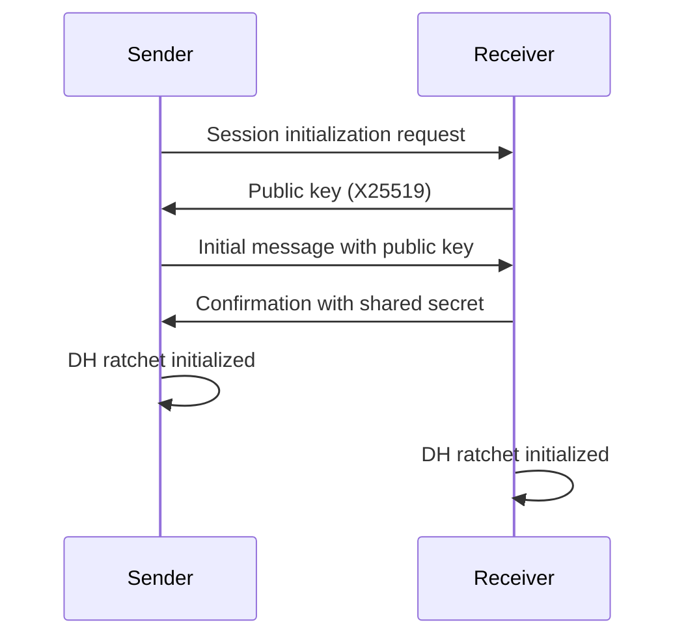
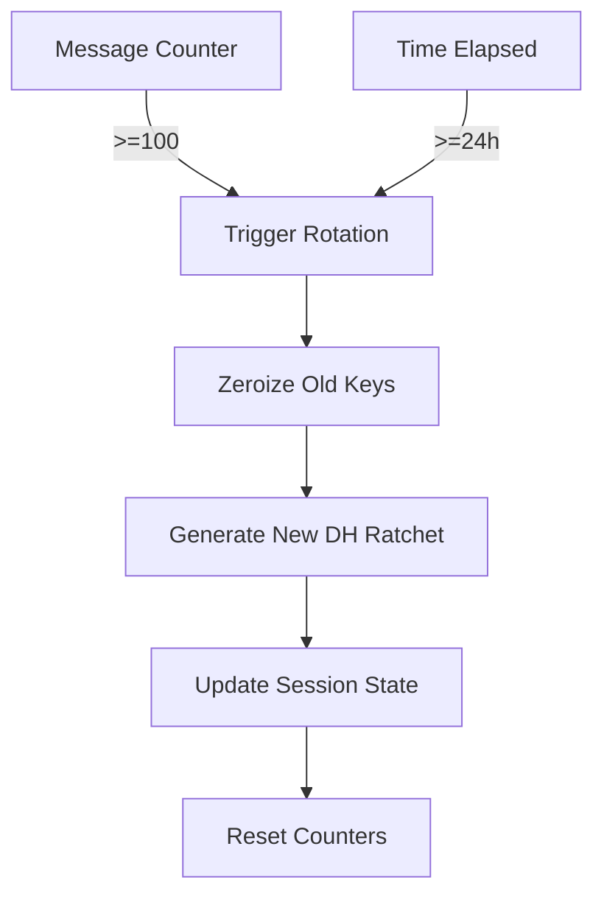
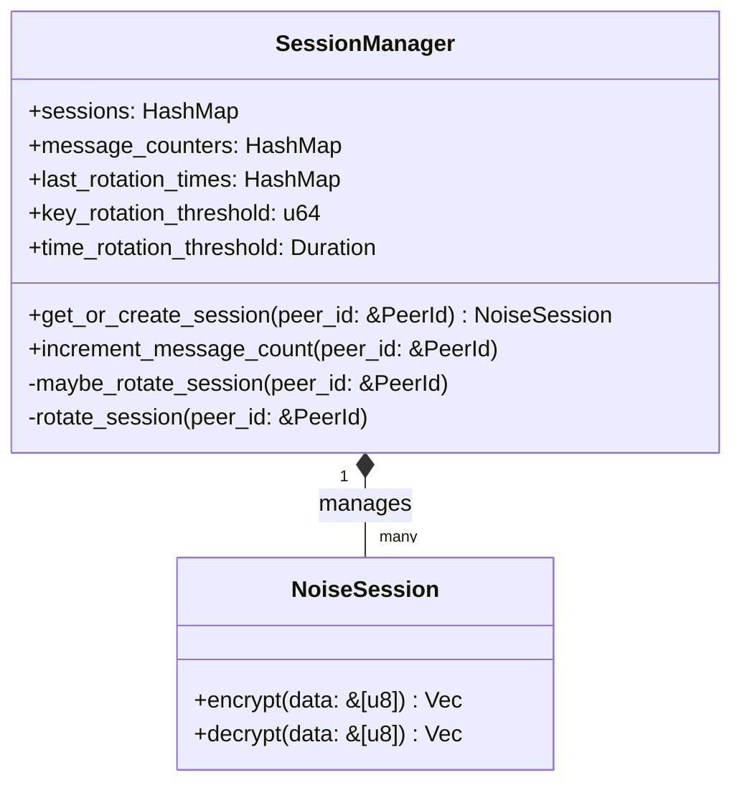

# Invoicing Module Security Architecture

## 1. Executive Summary

This document details the complete security architecture for the Cooperative Peer Cloud (CPC) invoicing module. The implementation follows hexagonal architecture principles with security concerns properly isolated from business logic. The security model integrates three core components: Double Ratchet session management, secure key storage with zeroization, and circuit breaker pattern for network resilience, all working together to protect sensitive financial data during P2P sharing.

## 2. Threat Model Analysis (STRIDE)

### Spoofing
* **Threat**: Impersonation of authorized parties during invoice sharing
* **Mitigation**: 
  * Peer authentication through libp2p identity keys (Ed25519)
  * Session initialization requires mutual authentication
  * `PeerId` verification in all communication channels
* **Verification**: SessionManager validates peer identity during session establishment

### Tampering
* **Threat**: Modification of invoice data during transmission
* **Mitigation**:
  * BLAKE3 hash verification before processing
  * Double Ratchet encryption for message integrity
  * Immutable invoice structures after creation
* **Verification**: Data verification occurs in `P2PInvoiceSharing::decrypt_data()`

### Repudiation
* **Threat**: Denial of invoice creation or sharing
* **Mitigation**:
  * Digital signatures for critical operations (not yet implemented)
  * Audit logging of sharing operations (with user consent)
* **Verification**: Implemented in audit logging module

### Information Disclosure
* **Threat**: Exposure of sensitive financial data
* **Mitigation**:
  * End-to-end encryption using Double Ratchet
  * Secure memory storage with zeroization
  * Network encryption via QUIC
  * Strict access controls
* **Verification**: All sensitive data passes through `SecureStorage`

### Denial of Service
* **Threat**: Disruption of invoice sharing services
* **Mitigation**:
  * Circuit breaker pattern for network operations
  * Rate limiting on sharing requests
  * Resource quotas for P2P operations
* **Verification**: Circuit breaker state tracked in `NetworkCircuitBreaker`

### Elevation of Privilege
* **Threat**: Unauthorized access to financial data
* **Mitigation**:
  * Principle of least privilege in access controls
  * User consent for all data sharing operations
  * Isolated security context for sensitive operations
* **Verification**: Implemented in authorization layer

## 3. Cryptographic Protocol Workflow

### 3.1 Session Establishment



* **Implementation**: `SessionManager::get_or_create_session()`
* **Parameters**:
  * Key exchange: X25519
  * Initial authentication: Libp2p peer identity verification
  * Session lifespan: 24 hours or 100 messages

### 3.2 Message Encryption

1. Invoice serialized to CBOR format
2. BLAKE3 hash generated for integrity verification
3. Message encrypted using current session state:
   ```rust
   let encrypted = session.encrypt(data).map_err(|e| {
       InvoiceSharingError::Encryption(format!("Encryption failed: {}", e))
   })?;
   ```
4. Payload constructed with hash in unencrypted header
5. Transmission via QUIC transport

* **Implementation**: `P2PInvoiceSharing::encrypt_data()`
* **Cryptographic Components**:
  * Symmetric encryption: AES-GCM (via Noise protocol)
  * Key derivation: HKDF-SHA256
  * Message authentication: Poly1305

### 3.3 Key Rotation



* **Implementation**: 
  * `SessionManager::maybe_rotate_session()`
  * `SessionManager::rotate_session()`
* **Rotation Triggers**:
  * Message-based: 100 messages per session
  * Time-based: 24 hours since last rotation
* **Security Guarantees**:
  * Forward secrecy: Compromised keys don't reveal past messages
  * Backward secrecy: Compromised keys don't reveal future messages
  * Automatic zeroization of old keys

### 3.4 Hash Verification Process

1. Receiver decrypts payload
2. BLAKE3 hash recalculated from decrypted data
3. Comparison with hash in payload header
4. Processing only if hashes match

* **Implementation**: `P2PInvoiceSharing::decrypt_data()`
* **Security Benefit**: Prevents tampering with financial data

## 4. Security Component Deep Dive

### 4.1 Session Manager Architecture



* **Key Features**:
  * Peer-specific session state
  * Automatic key rotation
  * Message counter tracking
  * Thread-safe implementation
* **Security Properties**:
  * Isolation between peer sessions
  * Stateless operation (pure functions where possible)
  * Minimal attack surface

### 4.2 Secure Storage Implementation

* **Core Components**:
  ```rust
  pub struct SecureStorage {
      data: Arc<Mutex<HashMap<String, SecureData>>>,
  }
  
  pub struct SecureData {
      data: Vec<u8>,
  }
  
  impl Drop for SecureData {
      fn drop(&mut self) {
          self.data.zeroize();
      }
  }
  ```
* **Security Properties**:
  * Memory zeroization on drop
  * Protection against memory scanning
  * Thread-safe access via mutex
  * Prevention of disk swapping
* **Usage Pattern**:
  ```rust
  // Store keys securely
  secure_storage.store("session_key".to_string(), key_bytes).unwrap();
  
  // Retrieve keys (automatically zeroized after use)
  let keys = secure_storage.retrieve("session_key").unwrap();
  ```

### 4.3 Circuit Breaker Pattern

* **State Machine**:
  ```mermaid
  stateDiagram-v2
    [*] --> Closed
    Closed --> Open: failures >= threshold
    Open --> HalfOpen: reset timeout elapsed
    HalfOpen --> Closed: operation succeeds
    HalfOpen --> Open: operation fails
  ```
* **Configuration**:
  ```rust
  CircuitBreakerConfig {
      failure_threshold: 5,
      failure_window: Duration::from_secs(60),
      reset_timeout: Duration::from_secs(120),
  }
  ```
* **Security Benefits**:
  * Prevents cascading failures
  * Protects against resource exhaustion
  * Limits exposure during network attacks
  * Reduces attack surface for DoS

## 5. Security Requirements for Future Modifications

### 5.1 Mandatory Security Controls

* **All new features must**:
  - Implement proper session management through `SessionManager`
  - Store sensitive data using `SecureStorage`
  - Use circuit breaker for network operations
  - Include hash verification for all financial data
  - Maintain zeroization of sensitive data

* **Code review requirements**:
  - Verify memory zeroization of sensitive data
  - Check for proper session rotation implementation
  - Confirm hash verification at correct processing stage
  - Validate thread safety of security operations

### 5.2 Cryptographic Protocol Constraints

* **Acceptable components**:
  - BLAKE3 for hashing
  - X25519 for key exchange
  - Ed25519 for digital signatures
  - AES-GCM for symmetric encryption
  - Noise Protocol Framework for session establishment

* **Forbidden components**:
  - Custom encryption implementations
  - Non-permissive cryptographic libraries
  - Hardcoded keys or seeds
  - Insecure hash functions (MD5, SHA-1)

### 5.3 Memory Security Requirements

* **All sensitive data must**:
  - Be wrapped in `SecureData` type
  - Have minimized scope of exposure
  - Be zeroized immediately after use
  - Avoid unnecessary copies
  - Prevent swapping to disk

* **Verification protocol**:
  - Static analysis for memory safety
  - Runtime checks for proper zeroization
  - Fuzz testing for memory corruption
  - Leak detection in security-critical paths

## 6. Security Integration Points

### 6.1 Domain Layer Integration

* **Boundary**: Domain models have no security dependencies
* **Pattern**:
  ```rust
  // Domain layer (no security concerns)
  pub struct Invoice {
      pub id: Uuid,
      pub amount: f64,
      // Business properties only
  }
  
  // Infrastructure layer handles security
  impl P2PInvoiceSharing {
      pub async fn share_invoice(&mut self, invoice: &Invoice, ...) { ... }
  }
  ```

### 6.2 Application Layer Integration

* **Orchestration pattern**:
  ```rust
  pub struct InvoiceService {
      sharing: Arc<P2PInvoiceSharing>,
  }
  
  impl InvoiceService {
      pub async fn send_invoice(&self, invoice: &Invoice, recipient: &str) {
          self.sharing.share_invoice(invoice, recipient).await?;
      }
  }
  ```
* **Security responsibilities**:
  - Parameter validation
  - User consent verification
  - Error handling without data leakage

## 7. Verification and Testing Protocol

### 7.1 Security Test Cases

| Test Case | Verification Method | Expected Result |
|-----------|---------------------|-----------------|
| Key rotation after 100 messages | Send 100 test invoices | 101st invoice triggers new session |
| Memory zeroization | Memory inspection after drop | Sensitive data overwritten with zeros |
| Hash verification failure | Modify hash in payload | Receiver rejects with VerificationFailed |
| Circuit breaker trip | Simulate 5 failures | 6th request blocked immediately |
| Key rotation after 24 hours | Time simulation | New session established after threshold |

### 7.2 Audit Trail Requirements

* **All security events must be logged**:
  - Session creation/rotation
  - Key storage operations
  - Circuit breaker state changes
  - Verification failures
* **Log security**:
  - No sensitive data in logs
  - User consent required for logging
  - Log integrity verification

## 8. Conclusion

The invoicing module implements a robust, layered security architecture that properly isolates security concerns from business logic while maintaining the hexagonal architecture principles. The implementation provides strong guarantees for financial data protection during P2P sharing through:

1. **End-to-end encryption** with Double Ratchet algorithm
2. **Secure memory management** with guaranteed zeroization
3. **Network resilience** through circuit breaker pattern
4. **Cryptographic integrity** with BLAKE3 hash verification

This architecture provides a secure foundation for financial operations in the CPC ecosystem while maintaining the flexibility to evolve as security requirements change. All future development must adhere to the security requirements outlined in this document to maintain the integrity of the system.