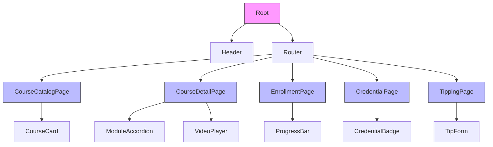
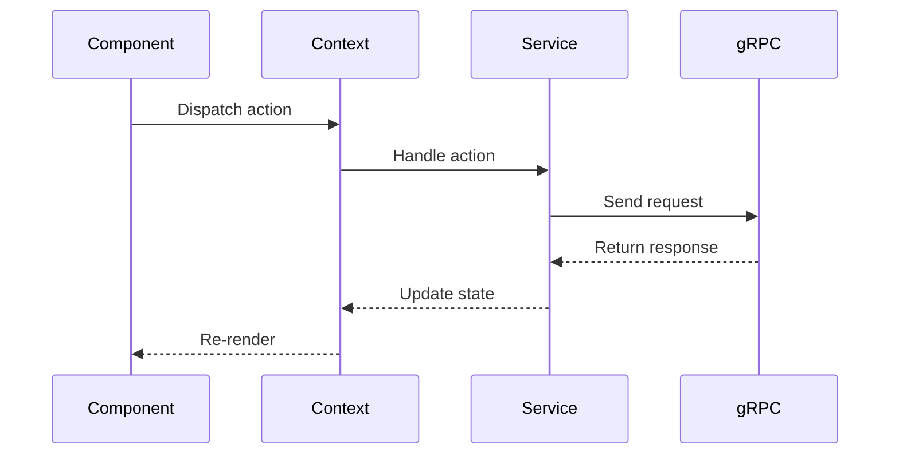

# Learning Platform Frontend Architecture

## 1. Tech Stack Implementation
- **UI Framework**: Yew 0.21.0 (Rust/WASM)
- **Desktop Integration**: Tauri 2.0
- **Styling**: Stylist (CSS-in-Rust)
- **State Management**: Yew Context API + Reducers
- **gRPC Client**: Tonic for Rust
- **Charting**: Plotters (for progress visualizations)
- **Responsive Design**: Flexbox/Grid with media queries
- **Theming**: CSS variables for dark/light mode

## 2. Application Structure (Screaming Architecture)
```
apps/learning_platform/
├── src/
│   ├── main.rs                # Tauri entry point
│   ├── lib.rs                 # Application root component
│   ├── routes/                # Application routing
│   ├── contexts/              # Global state contexts
│   ├── services/              # gRPC service clients
│   ├── pages/                 # Page components
│   ├── components/            # Reusable UI components
│   ├── types/                 # Shared type definitions
│   └── utils/                 # Utility functions
```

## 3. Core Components

### 3.1 Page Components
- **CourseCatalogPage**: Displays available courses with filtering
- **CourseDetailPage**: Shows course details, modules, and lessons
- **EnrollmentPage**: Manages user enrollments and progress
- **CredentialPage**: Displays earned credentials
- **TippingPage**: Interface for tipping educators

### 3.2 UI Components


### 3.3 Component Descriptions
| Component | Purpose | Props |
|-----------|---------|-------|
| CourseCard | Displays course summary | course_id, title, description |
| ModuleAccordion | Expandable module with lessons | modules |
| VideoPlayer | AV1/Opus media player | media_url, autoplay |
| ProgressBar | Visual enrollment progress | progress, status |
| CredentialBadge | Displays earned credential | credential_type, issued_at |
| TipForm | Tipping interface | to_user_id, course_id |

## 4. State Management Design

### 4.1 Contexts
- **AuthContext**: Manages user authentication state
- **CourseContext**: Caches courses and enrollment data
- **ThemeContext**: Handles dark/light theme preference

### 4.2 State Flow


## 5. gRPC Integration
```rust
// Example service client
pub struct LearningPlatformService {
    client: LearningPlatformServiceClient<Channel>,
}

impl LearningPlatformService {
    pub async fn new() -> Result<Self> {
        let channel = Channel::from_static("http://localhost:50051")
            .connect()
            .await?;
        Ok(Self {
            client: LearningPlatformServiceClient::new(channel),
        })
    }

    pub async fn enroll_user(&mut self, req: EnrollmentRequest) -> Result<Enrollment> {
        let response = self.client.enroll_user(req).await?;
        Ok(response.into_inner().enrollment.unwrap())
    }
}
```

## 6. Responsive Design Strategy
- Mobile-first CSS using Stylist
- Breakpoints:
  - Mobile: < 768px
  - Tablet: 768px - 1024px
  - Desktop: > 1024px
- Responsive grid for course cards
- Collapsible sidebar navigation

## 7. Theming Implementation
```css
:root {
    --primary: #4361ee;
    --background: #ffffff;
    --text: #2b2d42;
    /* Light mode variables */
}

[data-theme="dark"] {
    --primary: #4cc9f0;
    --background: #121212;
    --text: #f8f9fa;
    /* Dark mode variables */
}
```

## 8. Error Handling
- Global error boundary component
- gRPC error mapping to user-friendly messages
- Toast notifications for API errors
- Fallback UI for loading states

## 9. Future Considerations
- Payment integration placeholder
- Offline caching with Sled
- Peer-to-peer sharing (when p2panda available)
- Accessibility enhancements