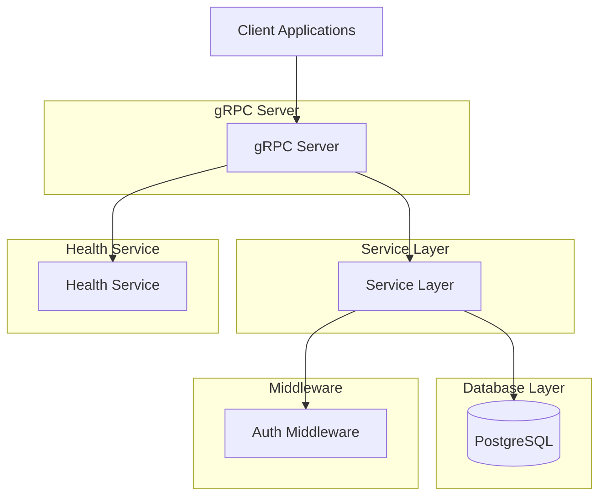

# Learning Platform Server Architecture

## Overview

The Learning Platform Server is a gRPC-based backend service written in Rust. It provides APIs for course management, user enrollment, credential issuance, and tipping functionality.

## Architecture Diagram

## Components

### 1. gRPC Server

The main entry point for all API requests. It exposes the following services:

- **CourseService**: Manage courses, modules, and lessons
- **EnrollmentService**: Handle user enrollments and progress tracking
- **CredentialService**: Issue academic credentials
- **TipService**: Process tips to educators
- **AuthService**: User authentication
- **UserService**: User registration
- **HealthService**: Service health checks

### 2. Service Layer

Contains the business logic for each domain:

- **CourseService**: Handles course creation, retrieval, and updates
- **EnrollmentService**: Manages user enrollments and progress
- **CredentialService**: Issues and validates academic credentials
- **TipService**: Processes tip transactions
- **AuthService**: Handles user authentication and JWT token generation
- **UserService**: Manages user registration and account management

### 3. Database Layer

Uses PostgreSQL with SQLx for database access:

- **Repository Pattern**: Abstracts database operations
- **Migrations**: Database schema management
- **Models**: Database entity representations

### 4. Middleware

- **Authentication Middleware**: Validates JWT tokens and extracts user information

### 5. Utilities

- **Configuration**: Environment-based configuration management
- **Error Handling**: Centralized error types and conversion
- **Logging**: Structured logging with tracing
- **Utilities**: Common helper functions

## Data Flow

1. **Client Request**: Client sends gRPC request to server
2. **Middleware Processing**: Authentication middleware validates request
3. **Service Processing**: Service layer processes business logic
4. **Database Access**: Repository layer handles database operations
5. **Response**: Server sends gRPC response back to client

## Error Handling

The system uses a centralized error handling approach:

- **AppError**: Custom error types for all application errors
- **Error Conversion**: Automatic conversion from internal errors to gRPC Status
- **Logging**: Errors are logged with context information

## Security

- **Authentication**: JWT-based authentication
- **Password Security**: bcrypt password hashing
- **Input Validation**: Comprehensive input validation
- **SQL Injection Protection**: Prepared statements via SQLx

## Testing

The system includes multiple levels of testing:

- **Unit Tests**: Test individual functions and modules
- **Integration Tests**: Test service integration with database
- **Benchmark Tests**: Performance testing of critical functions

## Deployment

- **Docker**: Containerized deployment
- **Docker Compose**: Multi-container deployment (server + database)
- **Environment Configuration**: Configurable through environment variables

## Performance Considerations

- **Async/Await**: Non-blocking I/O operations
- **Connection Pooling**: Database connection reuse
- **Caching**: Potential for future caching implementation
- **Indexing**: Database indexes for common query patterns

## Future Enhancements

- **Caching Layer**: Redis-based caching for frequently accessed data
- **Event Sourcing**: Event-driven architecture for audit trails
- **Microservices**: Split services into separate microservices
- **Rate Limiting**: API rate limiting for abuse prevention
- **Monitoring**: Integration with monitoring and observability tools