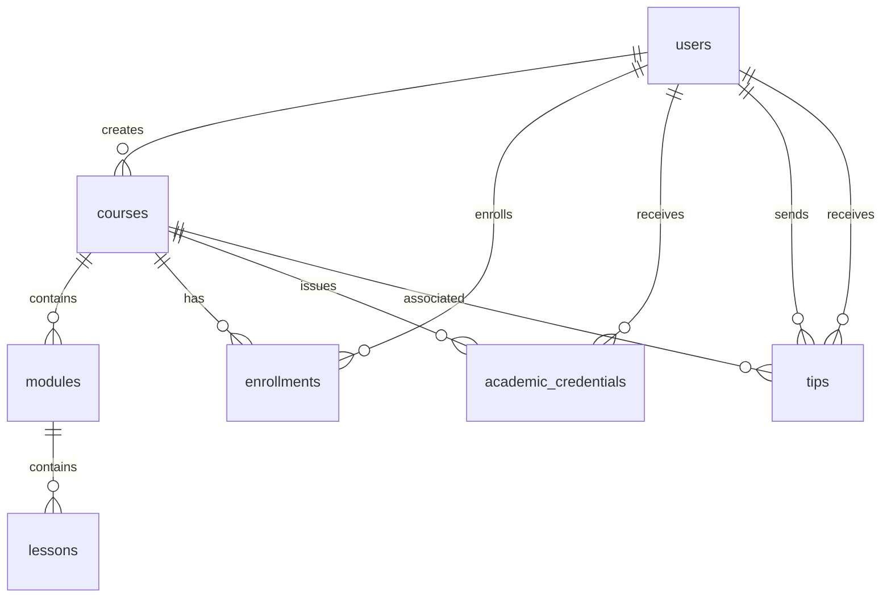

# Learning Platform Database Schema

## Overview

This document describes the database schema for the Learning Platform Server.

## Tables

### users

Stores user account information.

| Column | Type | Constraints | Description |
|--------|------|-------------|-------------|
| id | UUID | PRIMARY KEY | Unique user identifier |
| username | VARCHAR(255) | UNIQUE, NOT NULL | User's username |
| email | VARCHAR(255) | UNIQUE, NOT NULL | User's email address |
| password_hash | TEXT | NOT NULL | Hashed password |
| created_at | TIMESTAMP | DEFAULT CURRENT_TIMESTAMP | Account creation timestamp |

**Indexes:**
- idx_users_username ON username
- idx_users_email ON email

### courses

Stores course information.

| Column | Type | Constraints | Description |
|--------|------|-------------|-------------|
| id | UUID | PRIMARY KEY | Unique course identifier |
| title | VARCHAR(255) | NOT NULL | Course title |
| description | TEXT |  | Course description |
| creator_id | UUID | NOT NULL | ID of the course creator (references users.id) |
| created_at | TIMESTAMP | DEFAULT CURRENT_TIMESTAMP | Course creation timestamp |

**Indexes:**
- None

### modules

Stores course modules.

| Column | Type | Constraints | Description |
|--------|------|-------------|-------------|
| id | UUID | PRIMARY KEY | Unique module identifier |
| course_id | UUID | REFERENCES courses(id) ON DELETE CASCADE | Parent course ID |
| title | VARCHAR(255) | NOT NULL | Module title |
| order_index | INTEGER | NOT NULL | Module order within course |
| created_at | TIMESTAMP | DEFAULT CURRENT_TIMESTAMP | Module creation timestamp |

**Indexes:**
- idx_modules_course_id ON course_id

### lessons

Stores module lessons.

| Column | Type | Constraints | Description |
|--------|------|-------------|-------------|
| id | UUID | PRIMARY KEY | Unique lesson identifier |
| module_id | UUID | REFERENCES modules(id) ON DELETE CASCADE | Parent module ID |
| title | VARCHAR(255) | NOT NULL | Lesson title |
| content | TEXT |  | Lesson content |
| media_url | TEXT |  | URL to lesson media (video, etc.) |
| order_index | INTEGER | NOT NULL | Lesson order within module |
| created_at | TIMESTAMP | DEFAULT CURRENT_TIMESTAMP | Lesson creation timestamp |

**Indexes:**
- idx_lessons_module_id ON module_id

### enrollments

Stores user course enrollments.

| Column | Type | Constraints | Description |
|--------|------|-------------|-------------|
| id | UUID | PRIMARY KEY | Unique enrollment identifier |
| user_id | UUID | NOT NULL | Enrolled user ID (references users.id) |
| course_id | UUID | REFERENCES courses(id) ON DELETE CASCADE | Enrolled course ID |
| progress | FLOAT | NOT NULL DEFAULT 0.0 | Course progress (0.0 to 100.0) |
| status | VARCHAR(20) | NOT NULL DEFAULT 'ENROLLED' | Enrollment status |
| created_at | TIMESTAMP | DEFAULT CURRENT_TIMESTAMP | Enrollment creation timestamp |
| updated_at | TIMESTAMP | DEFAULT CURRENT_TIMESTAMP | Last update timestamp |

**Indexes:**
- idx_enrollments_user_id ON user_id
- idx_enrollments_course_id ON course_id

### academic_credentials

Stores issued academic credentials.

| Column | Type | Constraints | Description |
|--------|------|-------------|-------------|
| id | UUID | PRIMARY KEY | Unique credential identifier |
| user_id | UUID | NOT NULL | User ID (references users.id) |
| course_id | UUID | REFERENCES courses(id) ON DELETE CASCADE | Course ID |
| credential_type | VARCHAR(20) | NOT NULL | Type of credential |
| issued_at | TIMESTAMP | NOT NULL | Credential issuance timestamp |
| verification_code | VARCHAR(50) | UNIQUE, NOT NULL | Verification code |
| created_at | TIMESTAMP | DEFAULT CURRENT_TIMESTAMP | Record creation timestamp |

**Indexes:**
- idx_academic_credentials_user_id ON user_id
- idx_academic_credentials_course_id ON course_id

### tips

Stores tip transactions.

| Column | Type | Constraints | Description |
|--------|------|-------------|-------------|
| id | UUID | PRIMARY KEY | Unique tip identifier |
| from_user_id | UUID | NOT NULL | Sender user ID (references users.id) |
| to_user_id | UUID | NOT NULL | Recipient user ID (references users.id) |
| course_id | UUID | REFERENCES courses(id) ON DELETE SET NULL | Associated course ID |
| amount | DECIMAL(10, 2) | NOT NULL | Tip amount |
| currency | VARCHAR(10) | NOT NULL | Currency code (USD, EUR, etc.) |
| created_at | TIMESTAMP | DEFAULT CURRENT_TIMESTAMP | Tip creation timestamp |

**Indexes:**
- idx_tips_from_user_id ON from_user_id
- idx_tips_to_user_id ON to_user_id
- idx_tips_course_id ON course_id

## Relationships

## Enums

### Enrollment Status Values

- ENROLLED
- IN_PROGRESS
- COMPLETED
- DROPPED

### Credential Type Values

- CERTIFICATE
- BADGE
- MICRO_DEGREE
- DEGREE

## Indexes Summary

| Index Name | Table | Columns |
|------------|-------|---------|
| idx_users_username | users | username |
| idx_users_email | users | email |
| idx_modules_course_id | modules | course_id |
| idx_lessons_module_id | lessons | module_id |
| idx_enrollments_user_id | enrollments | user_id |
| idx_enrollments_course_id | enrollments | course_id |
| idx_academic_credentials_user_id | academic_credentials | user_id |
| idx_academic_credentials_course_id | academic_credentials | course_id |
| idx_tips_from_user_id | tips | from_user_id |
| idx_tips_to_user_id | tips | to_user_id |
| idx_tips_course_id | tips | course_id |