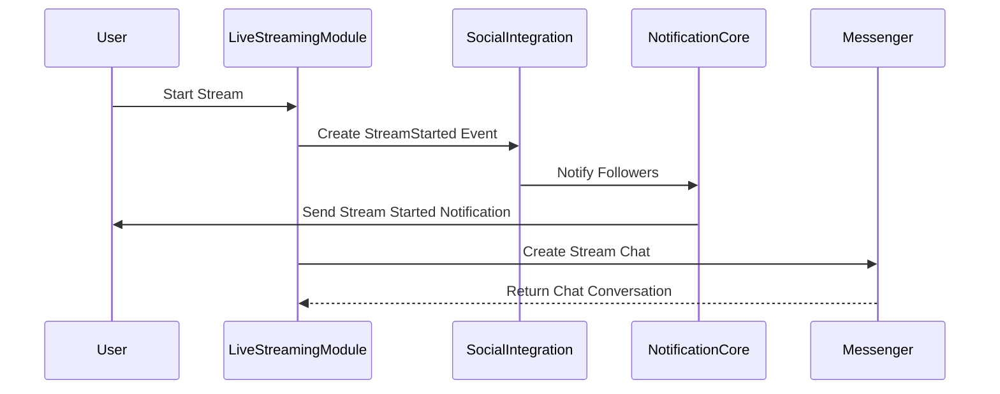
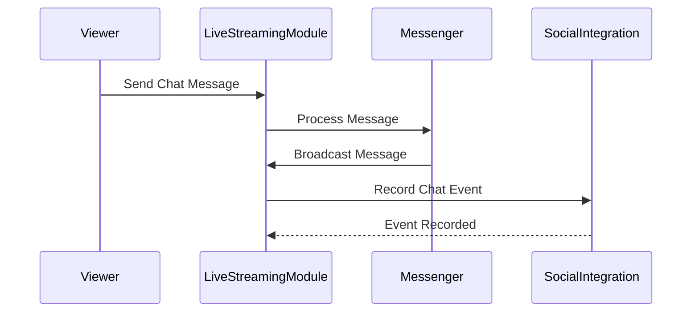

# Live Streaming Integration Diagrams

## Stream Start/Stop Flow



## Chat Message Propagation



## Subscription Notification Flow

```mermaid
sequenceDiagram
    participant Broadcaster
    participant SocialIntegration
    participant NotificationCore
    participant Follower

    Broadcaster->>SocialIntegration: Stream Started
    SocialIntegration->>NotificationCore: Create Notification
    NotificationCore->>Follower: Send Stream Notification
    Follower->>LiveStreamingModule: Join Stream