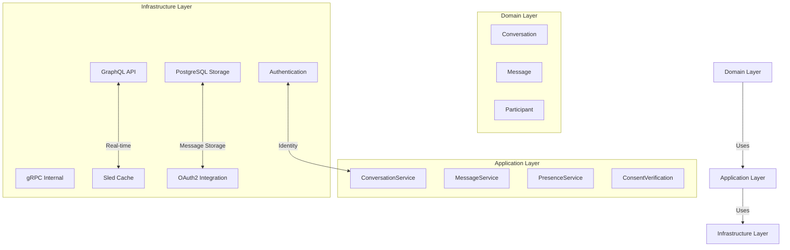
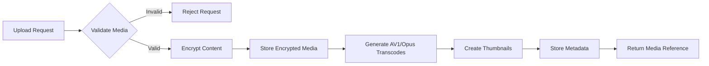
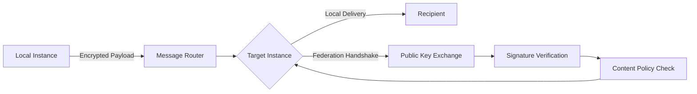

# Messenger App Architecture

## 1. Executive Summary

This document describes the architecture for the Messenger application - a real-time communication platform that enables secure 1:1 and group conversations. The implementation follows hexagonal architecture principles with a strict separation between domain logic, application use cases, and infrastructure concerns. Security is implemented at appropriate layers with a focus on usability and social connectivity rather than privacy-first design.

## 2. Architecture Overview

### 2.1 Component Diagram



### 2.2 Layer Responsibilities

| Layer | Responsibility | Implementation Location |
|-------|----------------|-------------------------|
| **Domain** | Business entities, core logic | `packages/domains/messenger/` |
| **Application** | Use case orchestration, social features | `packages/apps/messenger/` |
| **Infrastructure** | Technical implementation details | `packages/infrastructure/messenger/` |

## 3. Domain Model

### 3.1 Core Entities

```rust
pub struct Conversation {
    id: Uuid,
    created_at: DateTime<Utc>,
    is_group: bool,
    participants: Vec<Participant>,
    settings: ConversationSettings,
}

pub struct Message {
    id: Uuid,
    conversation_id: Uuid,
    sender_id: Uuid,
    content: MessageContent,
    sent_at: DateTime<Utc>,
    delivery_status: DeliveryStatus,
}

pub struct Participant {
    user_id: Uuid,
    joined_at: DateTime<Utc>,
    last_read_message_id: Option<Uuid>,
    permissions: ParticipantPermissions,
}

pub enum MessageContent {
    Text(String),
    Image(MediaReference),
    Document(MediaReference),
    // Additional media types
}
```

## 4. Implementation Plan

### 4.1 Security Model (Standard Implementation)

Following practical security patterns appropriate for social communication:

1. **Transport Security**:
   - TLS 1.3 for all external communications
   - Standard certificate pinning for mobile clients
   - HTTP Strict Transport Security (HSTS) headers

2. **Authentication**:
   - JWT tokens with reasonable expiration (24 hours)
   - Standard OAuth 2.0 flows for identity integration
   - Rate limiting on authentication endpoints

3. **Data Protection**:
   - Server-side encryption at rest for message content
   - PostgreSQL pgcrypto for sensitive fields
   - Standard key management (no client-controlled keys)

4. **Message Flow**:
   ```
   1. Sender: Message → Server validation → Store encrypted
   2. Server: Distribute to recipients via secure channels
   3. Recipient: Decrypt on device using standard app keys
   ```

### 4.2 Real-Time Communication

1. **WebSocket Implementation**:
   - Axum WebSocket server for real-time connections
   - Connection management with presence tracking
   - Message queue for offline delivery

2. **Delivery Status Tracking**:
   ```mermaid
   stateDiagram-v2
       [*] --> Sent
       Sent --> Delivered : Message received by server
       Delivered --> Read : Message opened by recipient
       Read --> Archived : Message no longer visible in active conversation
   ```

3. **Message Status Infrastructure**:
   ```rust
   pub enum DeliveryStatus {
       Pending,
       Sent(DateTime<Utc>),
       Delivered(DateTime<Utc>),
       Read(DateTime<Utc>),
   }
   
   // Updated when status changes
   pub struct MessageStatusUpdate {
       message_id: Uuid,
       new_status: DeliveryStatus,
       timestamp: DateTime<Utc>,
   }
   ```

### 4.3 Privacy & Consent Integration

Following patterns from music player social interactions:

1. **Consent Verification**:
   ```rust
   pub async fn send_message(
       &self,
       conversation_id: Uuid,
       sender_id: Uuid,
       content: MessageContent,
   ) -> Result<MessageId, MessagingError> {
       // Verify consent for communication
       self.consent_service
           .verify_consent(sender_id, ConsentType::Messaging)
           .await?;
           
       // Additional consent checks for media sharing
       if content.requires_media_consent() {
           self.consent_service
               .verify_consent(sender_id, ConsentType::MediaSharing)
               .await?;
       }
       
       // Proceed with message processing
       self.message_repository
           .save_message(&Message {
               id: Uuid::new_v4(),
               conversation_id,
               sender_id,
               content,
               sent_at: Utc::now(),
               delivery_status: DeliveryStatus::Sent,
           })
           .await?;
           
       Ok(message_id)
   }
   ```

2. **Data Sharing**:
   - Respect user privacy preferences
   - Implement standard GDPR-compliant data handling
   - Allow users to control who can contact them

### 4.4 Media Handling

1. **Media Processing Pipeline**:
   ```
   Upload → Validate → Server-side encryption → Store → Generate reference
   ```

2. **Media Reference Structure**:
   ```rust
   pub struct MediaReference {
       id: Uuid,
       media_type: MediaType,
       storage_location: String,
       thumbnail: Option<ThumbnailReference>,
   }
   ```

## 5. Database Schema

### 5.1 Core Tables

**conversations**
| Column | Type | Description |
|--------|------|-------------|
| id | UUID | Primary key |
| created_at | TIMESTAMPTZ | Creation timestamp |
| is_group | BOOLEAN | Group conversation flag |
| group_name | VARCHAR(255) | For group conversations |

**participants**
| Column | Type | Description |
|--------|------|-------------|
| conversation_id | UUID | Foreign key to conversations |
| user_id | UUID | User identifier |
| joined_at | TIMESTAMPTZ | Join timestamp |
| last_read_message_id | UUID | Last read message |
| permissions | INTEGER | Participant permissions |

**messages**
| Column | Type | Description |
|--------|------|-------------|
| id | UUID | Primary key |
| conversation_id | UUID | Foreign key to conversations |
| sender_id | UUID | User identifier |
| content_type | VARCHAR(20) | Text, Image, etc. |
| content | BYTEA | Encrypted content (server-side) |
| sent_at | TIMESTAMPTZ | Sent timestamp |
| delivery_status | INTEGER | Status code |

**message_statuses**
| Column | Type | Description |
|--------|------|-------------|
| message_id | UUID | Foreign key to messages |
| user_id | UUID | Recipient identifier |
| status | INTEGER | Delivery status |
| updated_at | TIMESTAMPTZ | Status update timestamp |

## 6. API Specifications

### 6.1 GraphQL Public API

```graphql
type Message {
  id: ID!
  content: String!
  sender: User!
  sentAt: DateTime!
  status: MessageStatus!
  conversationId: ID!
}

type Conversation {
  id: ID!
  participants: [User!]!
  messages(first: Int, after: String): MessageConnection!
  isGroup: Boolean!
  groupName: String
  lastMessage: Message
}

type Query {
  conversation(id: ID!): Conversation
  conversations: [Conversation!]!
}

type Mutation {
  sendMessage(
    conversationId: ID!
    content: String!
  ): Message!
  
  createGroup(
    name: String!
    participantIds: [ID!]!
  ): Conversation!
}

type Subscription {
  messageReceived(conversationId: ID!): Message!
  presenceUpdated(userId: ID!): UserPresence!
}
```

### 6.2 gRPC Internal API

```protobuf
service MessengerService {
  rpc SendMessage(SendMessageRequest) returns (SendMessageResponse);
  rpc CreateConversation(CreateConversationRequest) returns (Conversation);
  rpc GetConversationHistory(GetConversationHistoryRequest) returns (ConversationHistory);
  rpc UpdatePresence(UpdatePresenceRequest) returns (PresenceUpdate);
}

message SendMessageRequest {
  string conversation_id = 1;
  string sender_id = 2;
  string content = 3;
}

message SendMessageResponse {
  string message_id = 1;
  google.protobuf.Timestamp sent_at = 2;
}
```

## 7. Integration Points

### 7.1 Identity Integration

Leverage existing OAuth implementation from `notification_core`:

```rust
// Similar to social.rs pattern
pub struct MessengerIdentity {
    oauth_clients: HashMap<String, BasicClient>,
}

impl MessengerIdentity {
    pub fn new() -> Self {
        let mut clients = HashMap::new();
        
        // Add TikTok provider
        clients.insert(
            "tiktok".to_string(),
            BasicClient::new(
                ClientId::new(env::var("TIKTOK_CLIENT_ID").unwrap()),
                Some(ClientSecret::new(env::var("TIKTOK_CLIENT_SECRET").unwrap())),
                AuthUrl::new("https://open.tiktokapis.com/v2/oauth/authorize/".to_string()).unwrap(),
                Some(TokenUrl::new("https://open.tiktokapis.com/v2/oauth/token/".to_string()).unwrap()),
            )
        );
        
        // Add Facebook provider
        clients.insert(
            "facebook".to_string(),
            BasicClient::new(
                ClientId::new(env::var("FACEBOOK_CLIENT_ID").unwrap()),
                Some(ClientSecret::new(env::var("FACEBOOK_CLIENT_SECRET").unwrap())),
                AuthUrl::new("https://www.facebook.com/v19.0/dialog/oauth".to_string()).unwrap(),
                Some(TokenUrl::new("https://graph.facebook.com/v19.0/oauth/access_token".to_string()).unwrap()),
            )
        );
        
        Self { oauth_clients: clients }
    }
    
    pub fn get_client(&self, platform: &str) -> Option<&BasicClient> {
        self.oauth_clients.get(platform)
    }
}
```

### 7.2 Federation Support

Design for future federation requirements:

1. **Instance Communication**:
   - Standard API-to-API communication between instances
   - Instance verification via public key exchange
   - Content filtering based on instance policies

2. **Cross-Instance Messaging**:
   - Message forwarding between instances
   - Standard delivery status synchronization
   - User opt-in for cross-instance communication

3. **Message Routing**:
   ```
   Sender → Local Instance → Target Instance → Recipient
   ```

## 8. Implementation Roadmap

### Phase 1: Core Messaging
- [x] Domain layer implementation
- [x] Basic 1:1 messaging with server-side security
- [x] Delivery status tracking
- [x] Presence management

### Phase 2: Advanced Features (IMPLEMENTATION PLAN)
- [x] Group conversations (core structure)
- [x] Basic 1:1 messaging
- [ ] Group management (admin, settings, permissions)
- [ ] Media sharing pipeline (encryption, thumbnails, transcoding)
- [ ] Message reactions system
- [ ] Message threading and editing
- [ ] Presence and typing indicators

### Phase 3: Federation & Advanced Optimization
- [ ] Cross-instance message routing protocol
- [ ] Instance discovery mechanism
- [ ] Federation-aware consent management
- [ ] Advanced media optimizations (AV1/Opus transcoding)
- [ ] Message delivery guarantees

## 9. Implementation Strategy

### Security Testing
| Test Case | Verification Method | Expected Result |
|-----------|---------------------|-----------------|
| Authentication failure | Invalid token | 401 Unauthorized response |
| Rate limiting | Excessive requests | 429 Too Many Requests |
| SQL injection | Malformed inputs | Cleaned inputs, no DB errors |
| XSS prevention | Script-containing messages | Content sanitized before display |

### Performance Metrics
- Message delivery latency: < 500ms (local), < 2s (cross-instance)
- Concurrent connections: 10,000+ per instance
- Message throughput: 1,000+ messages/sec


### 10.1 Package Structure (UPDATED)

The implementation follows hexagonal architecture with the following structure:

```
packages/
├── domains/messenger/
│   ├── src/
│   │   ├── models.rs         # Core entities with new features
│   │   │   ├── conversation.rs
│   │   │   ├── message.rs
│   │   │   ├── reaction.rs     # NEW
│   │   │   └── media.rs        # NEW
│   │   ├── errors.rs
│   │   └── services.rs
│   └── Cargo.toml
├── apps/messenger/
│   ├── src/
│   │   ├── services.rs       # Service implementations
│   │   │   ├── conversation.rs
│   │   │   ├── message.rs
│   │   │   ├── reaction.rs     # NEW
│   │   │   ├── group.rs        # NEW
│   │   │   └── federation.rs   # NEW
│   │   ├── repositories.rs
│   │   ├── consent.rs        # REAL IMPLEMENTATION
│   │   └── lib.rs
│   └── Cargo.toml
└── infrastructure/messenger/
    ├── src/
    │   ├── database.rs       # Enhanced with new tables
    │   ├── graphql.rs        # With new endpoints
    │   ├── websocket.rs      # Fixed broadcasting
    │   ├── media.rs          # COMPLETE IMPLEMENTATION
    │   │   ├── encryption.rs # NEW
    │   │   ├── transcoding.rs# NEW
    │   │   └── thumbnails.rs # NEW
    │   ├── federation.rs     # NEW
    │   └── lib.rs
    └── Cargo.toml
```

### 10.2 Database Updates

New tables for Phase 2 features:

**reactions**
| Column | Type | Description |
|--------|------|-------------|
| id | UUID | Primary key |
| message_id | UUID | Foreign key to messages |
| user_id | UUID | Reacting user |
| reaction_type | VARCHAR(20) | Emoji type |
| created_at | TIMESTAMPTZ | Timestamp |

**message_threads**
| Column | Type | Description |
|--------|------|-------------|
| id | UUID | Primary key |
| parent_message_id | UUID | Original message |
| child_message_id | UUID | Reply message |
| depth | INTEGER | Thread nesting level |

**media**
| Column | Type | Description | ENHANCED |
|--------|------|-------------|----------|
| encryption_key | BYTEA | Server-side encryption key |
| iv | BYTEA | Initialization vector |
| thumbnail_id | UUID | Reference to thumbnail |
| original_filename | VARCHAR(255) | User-provided name |

### 10.3 Media Processing Pipeline



Media encryption uses AES-GCM with keys derived from:
- System master key (stored in secure vault)
- Per-media unique IV

### 10.4 Real-time Communication (FIXED)

WebSocket broadcasting now properly handles all participants:

```mermaid
sequenceDiagram
    participant Sender
    participant WebSocket Server
    participant Participants
    
    Sender->>WebSocket Server: sendMessage(conversationId, content)
    WebSocket Server->>Database: Store message
    WebSocket Server->>Database: Get conversation participants
    loop All Participants
        WebSocket Server->>Participant: NewMessageEvent
    end
    WebSocket Server->>Sender: MessageSent confirmation
    Participant->>WebSocket Server: StatusUpdate(read)
    WebSocket Server->>Database: Update status
    WebSocket Server->>Other Participants: StatusUpdate
```

### 10.5 Group Management Design

Enhanced ParticipantPermissions:
```rust
pub struct ParticipantPermissions {
    pub can_send_messages: bool,
    pub can_manage_participants: bool,  // NEW
    pub can_change_settings: bool,      // NEW
    pub can_delete_messages: bool,
    pub can_moderate_content: bool,     // NEW
    pub is_admin: bool,                 // NEW
}
```

Group settings include:
- Membership approval requirements
- Message history visibility
- Admin transfer protocols

### 10.6 Federation Protocol

Cross-instance communication design:



Key components:
- Instance verification via Ed25519 signatures
- Message routing through .cpc domain resolution
- Federated consent management
- Content filtering based on instance policies

### 10.7 Testing Strategy (ENHANCED)

Comprehensive testing approach:

| Test Type | Components | Tools |
|-----------|------------|-------|
| Unit Tests | Domain models, services | Rust test framework |
| Integration Tests | DB, WebSocket, Media | SQLx, tokio, tempfile |
| API Tests | GraphQL endpoints | async-graphql-test |
| Federation Tests | Cross-instance flow | Mock federation network |
| Performance Tests | Message throughput | criterion, hyperfine |

Critical test scenarios:
1. Message delivery with 100+ participants
2. Cross-instance message routing
3. Media encryption/decryption workflow
4. Consent verification during message sending
5. Failover during WebSocket disconnects

### 10.8 Consent Integration (REAL IMPLEMENTATION)

Replacing placeholder with core consent system:

```rust
pub struct CoreConsentManager {
    consent_client: Arc<dyn ConsentClient>,
    federation_policy: FederationPolicy,
}

#[async_trait]
impl ConsentManager for CoreConsentManager {
    async fn verify_messaging_consent(&self, user_id: Uuid) -> Result<(), ConsentError> {
        self.consent_client
            .check_consent(user_id, ConsentType::Messaging)
            .await?;
        Ok(())
    }
    
    async fn verify_media_sharing_consent(&self, user_id: Uuid) -> Result<(), ConsentError> {
        self.consent_client
            .check_consent(user_id, ConsentType::MediaSharing)
            .await?;
        Ok(())
    }
    
    async fn verify_federation_consent(&self, user_id: Uuid, target_instance: &str) -> Result<(), ConsentError> {
        if self.federation_policy.requires_consent(target_instance) {
            self.consent_client
                .check_consent(user_id, ConsentType::CrossInstance)
                .await?;
        }
        Ok(())
    }
}
```

### 10.9 Implementation Roadmap (REVISED)

**Phase 2.1: Core Enhancements (2 weeks)**
- [ ] Implement complete consent integration
- [ ] Fix WebSocket broadcasting
- [ ] Add group admin permissions

**Phase 2.2: Media System (3 weeks)**
- [ ] Media encryption pipeline
- [ ] Thumbnail generation service
- [ ] AV1/Opus transcoding with ffmpeg.wasm

**Phase 2.3: Social Features (2 weeks)**
- [ ] Message reactions system
- [ ] Threaded conversations
- [ ] Message editing/deletion

**Phase 3: Federation (4 weeks)**
- [ ] Instance discovery protocol
- [ ] Cross-instance routing
- [ ] Federated consent management
- [ ] Message delivery guarantees

**Ongoing: Testing & Optimization**
- [ ] Comprehensive integration tests
- [ ] Performance benchmarking
- [ ] Security audits

### 10.10 API Specifications Update

**New GraphQL Endpoints:**

```graphql
type Mutation {
  # Group Management
  updateGroupSettings(
    conversationId: ID!
    settings: GroupSettingsInput!
  ): Conversation!
  
  transferAdmin(
    conversationId: ID!
    currentAdminId: ID!
    newAdminId: ID!
  ): Conversation!
  
  # Message Interactions
  addReaction(
    messageId: ID!
    reactionType: String!
  ): Reaction!
  
  removeReaction(
    messageId: ID!
    reactionType: String!
  ): Boolean!
  
  # Media Processing
  generateMediaThumbnail(
    mediaId: ID!
    size: ThumbnailSize!
  ): MediaReference!
}

enum ThumbnailSize {
  SMALL
  MEDIUM
  LARGE
}

input GroupSettingsInput {
  name: String
  description: String
  requireApproval: Boolean
  messageHistoryVisibility: MessageHistoryVisibility
}

enum MessageHistoryVisibility {
  ALL
  MEMBER_JOIN_DATE
  NONE
}
```

**New gRPC Endpoints:**

```protobuf
service FederationService {
  rpc DiscoverInstance(DiscoverRequest) returns (InstanceInfo);
  rpc RouteMessage(RouteMessageRequest) returns (RouteMessageResponse);
  rpc VerifyInstance(VerifyRequest) returns (VerifyResponse);
}

message DiscoverRequest {
  string cpc_address = 1;  // user@instance.cpc
}

message RouteMessageRequest {
  string target_address = 1;
  bytes encrypted_payload = 2;
  string signature = 3;
}
```
Database schema is managed through SQL migrations located in the `migrations/` directory:

- `20250730000000_create_messenger_tables.sql` - Initial schema creation

### 10.3 Testing Strategy

The implementation includes:

1. **Unit Tests**: For domain logic in `packages/domains/messenger/`
2. **Integration Tests**: For service implementations in `packages/apps/messenger/`
3. **Repository Tests**: For database implementations in `packages/infrastructure/messenger/`
4. **API Tests**: For GraphQL endpoints

### 10.4 Security Implementation

Security is implemented at multiple layers:

1. **Transport Layer**: TLS 1.3 for all external communications
2. **Authentication**: OAuth 2.0 with JWT tokens
3. **Authorization**: Role-based access control through participant permissions
4. **Data Protection**: Server-side encryption for stored messages
5. **Privacy**: Consent management integrated with the core consent framework

### 10.5 Real-time Communication

Real-time features are implemented using:

1. **WebSocket Server**: For persistent client connections
2. **Message Distribution**: Internal message passing for broadcasting
3. **Presence Tracking**: Sled-based caching for user presence
4. **Delivery Tracking**: Status updates propagated to connected clients

This implementation provides a solid foundation for the Messenger application while maintaining the flexibility to extend with additional features in future phases.