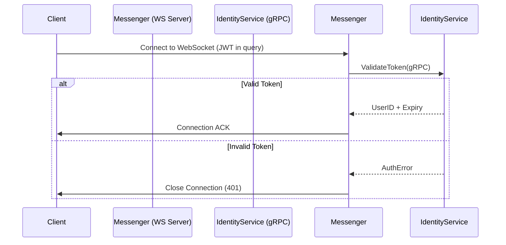
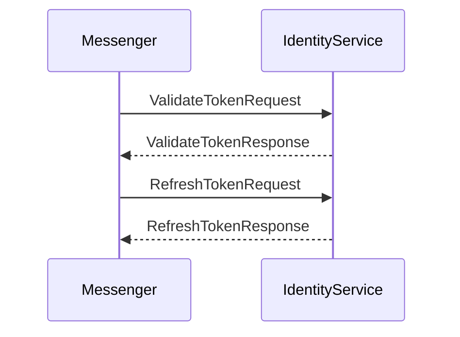
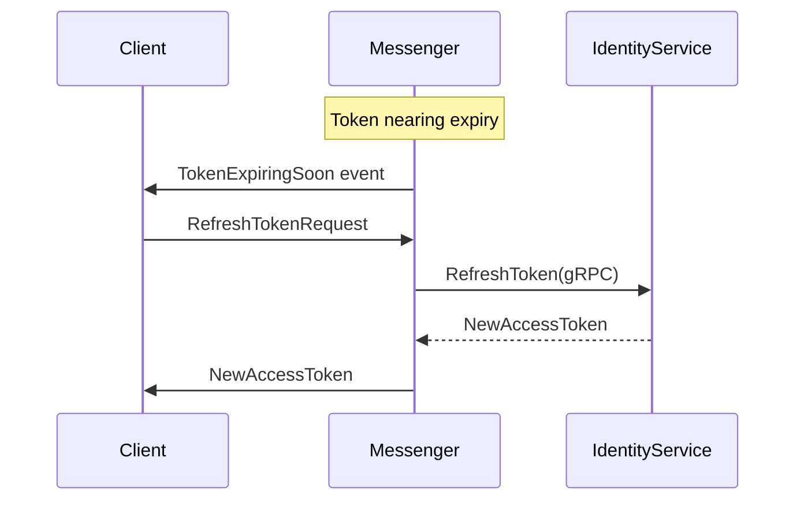

# Messenger Authentication Design

## WebSocket Authentication Flow

## gRPC Communication Flow

## Token Refresh Workflow

## Key Components
- `AuthService` trait (validate_token, refresh_token)
- `GrpcAuthService` (gRPC client implementation)
- WebSocket auth middleware
- GraphQL auth middleware
## Related Documents

See these Architecture Decision Records for implementation details:
- [005: Websocket Token Refresh](adr/005-websocket-token-refresh.md)
- [006: GraphQL Auth Middleware](adr/006-graphql-auth-middleware.md)
- [007: gRPC Client Implementation](adr/007-grpc-client-implementation.md)