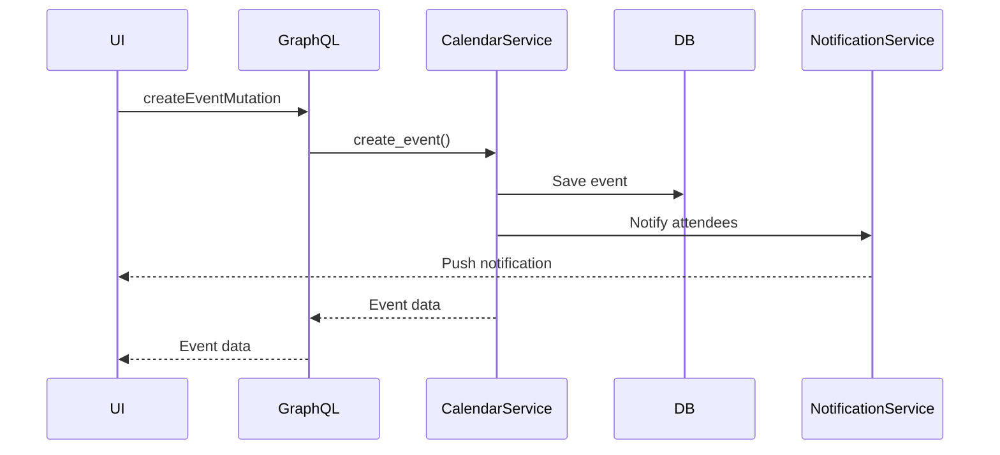

# Calendar Module Architecture

## Overview
The calendar module provides scheduling capabilities integrated with CPC's business tools. It handles events, reminders, team availability, and forecasting scenario integration.

## Database Schema
```mermaid
erDiagram
    CALENDARS ||--o{ CALENDAR_EVENTS : contains
    CALENDARS ||--o{ CALENDAR_MEMBERS : has
    CALENDAR_EVENTS }o--|| FORECAST_SCENARIOS : references
    
    CALENDARS {
        uuid id PK
        string name
        string description
        uuid owner_id FK
        boolean is_public
        timestamp created_at
        timestamp updated_at
    }
    
    CALENDAR_MEMBERS {
        uuid calendar_id FK
        uuid user_id FK
        enum permission ("owner", "editor", "viewer")
        timestamp created_at
    }
    
    CALENDAR_EVENTS {
        uuid id PK
        uuid calendar_id FK
        string title
        string description
        timestamp start_time
        timestamp end_time
        string location
        uuid[] attendees FK
        uuid forecast_scenario_id FK
        string recurrence_rule
        timestamp created_at
        timestamp updated_at
    }
```

## GraphQL API
### Queries
```graphql
calendar(id: ID!): Calendar
calendars: [Calendar!]!
event(id: ID!): CalendarEvent
events(calendarId: ID!, startDate: DateTime!, endDate: DateTime!): [CalendarEvent!]!
teamAvailability(userIds: [ID!]!, startDate: DateTime!, endDate: DateTime!): [AvailabilitySlot!]!
```

### Mutations
```graphql
createCalendar(input: CalendarCreateInput!): Calendar!
updateCalendar(id: ID!, input: CalendarUpdateInput!): Calendar!
createEvent(input: EventCreateInput!): CalendarEvent!
updateEvent(id: ID!, input: EventUpdateInput!): CalendarEvent!
deleteEvent(id: ID!): Boolean!
scheduleForecastReview(scenarioId: ID!): CalendarEvent!
```

### Subscriptions
```graphql
eventCreated(calendarId: ID!): CalendarEvent!
eventUpdated(calendarId: ID!): CalendarEvent!
eventDeleted(calendarId: ID!): ID!
```

## Integration Points
1. **Financial Forecasting:**
   - Events can link to forecast scenarios
   - Automatic scheduling of forecast reviews
   - Reminders for financial milestones

2. **Notifications:**
   - Event invitations
   - Reminders
   - Schedule changes
   - Forecast review notifications

## Permission Model
| Permission   | Create | Read | Update | Delete |
|--------------|--------|------|--------|--------|
| Owner        | ✓      | ✓    | ✓      | ✓      |
| Editor       | ✓      | ✓    | ✓      | ✗      |
| Viewer       | ✗      | ✓    | ✗      | ✗      |
| Public       | ✗      | ✓    | ✗      | ✗      |

## Sequence Diagrams

### Event Creation Flow


### Forecasting Scenario Scheduling
```mermaid
sequenceDiagram
    participant ForecastService
    participant GraphQL
    participant CalendarService
    
    ForecastService->>GraphQL: scheduleForecastReview(scenarioId)
    GraphQL->>CalendarService: create_event()
    CalendarService->>CalendarService: Generate event details
    CalendarService-->>GraphQL: Event data
    GraphQL-->>ForecastService: Event confirmation