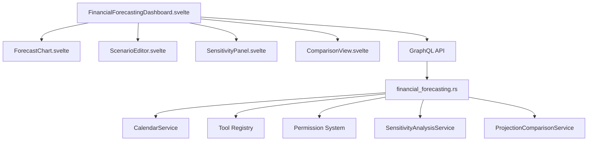

> **DEPRECATED:** This document is out of date. Please refer to the new [Business Tools Architecture (v2)](business-tools-architecture-v2.md) for the current architectural plan.
# Business Tools Architecture

## Financial Forecasting Module

### Overview
The financial forecasting module provides cash flow projections and scenario modeling capabilities. It allows users to:
- Create multiple forecast scenarios with custom parameters
- Project cash flow using historical transaction data
- Compare different financial scenarios using interactive dashboards
- Track budget variances
- Analyze sensitivity of projections to parameter changes

### Key Components

### Core Architecture
- **Hexagonal Architecture**: Domain logic separated from infrastructure
- **Domain Layer**: `FinancialForecast`, `Scenario`, `CashFlowProjection` entities
- **Application Layer**:
  - Projection logic in `project_cash_flow()`
  - Sensitivity analysis in `run_sensitivity_analysis()`
  - Budget variance calculation in `calculate_budget_variance()`
- **Infrastructure**: GraphQL API, Database access, Calendar integration

### Integration Points
1. **Membership Database**: Fetches historical transactions
2. **Tool Registry**: Registers as a business tool (`financial-forecasting`)
3. **Permission System**: Requires `ManageFinancialForecasting` permission
4. **Calendar Service**: Schedules training sessions for scenarios
5. **Notification System**: Sends forecast updates and sensitivity analysis results

### Key Files
- `packages/cpc-core/src/business/financial_forecasting.rs`
- `apps/backend/src/graphql/financial_forecasting.rs`
- `apps/cpc-platform/src/lib/business-tools/tool-registry.js`
- `packages/cpc-core/src/auth/permissions.rs`
- `apps/cpc-platform/src/lib/calendar/CalendarService.rs`
- `apps/cpc-platform/src/lib/business-tools/financial_forecasting/*.svelte`

## Sensitivity Analysis Module

### Components
- SensitivityPanel.svelte: Variable adjustment UI (revenueGrowth, expenseChange, interestRate)
- ComparisonView.svelte: Scenario comparison with variance calculation
- SensitivityParameters: Backend struct (revenue_growth, expense_change, interest_rate)
- ProjectionComparisonService: Backend service for comparing projections

### Integration Points
1. Financial Forecasting Dashboard: Embeds sensitivity panel
2. Scenario Manager: Saves modified scenarios
3. Forecast Engine: Receives adjustment parameters
4. GraphQL API: Exposes endpoints for sensitivity and comparison

### Permission Matrix
| Operation                     | Permission Required          |
|-------------------------------|------------------------------|
| Create Forecast               | ManageFinancialForecasting   |
| Update Forecast               | ManageFinancialForecasting   |
| Delete Forecast               | ManageFinancialForecasting   |
| Run Sensitivity Analysis      | RunSensitivityAnalysis       |
| Compare Projections           | ManageFinancialForecasting   |
| Calculate Budget Variance     | ManageFinancialForecasting   |