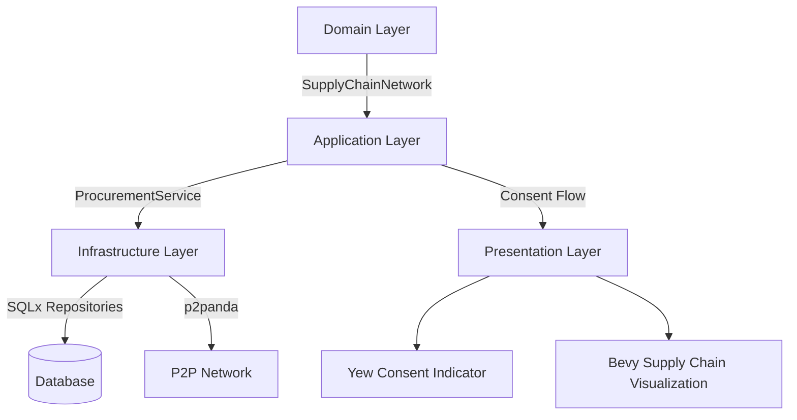
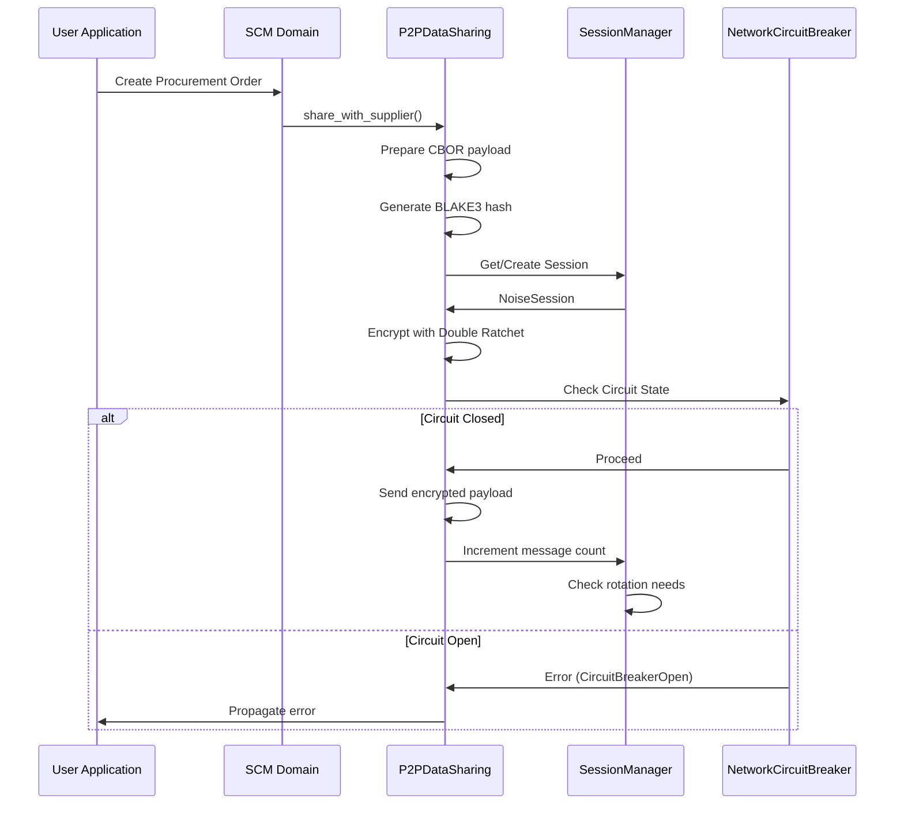

# Supply Chain Management Module Architecture

## Executive Summary

This document outlines the architecture for the Supply Chain Management (SCM) module, implementing the domain module described in planned_apps.md (lines 121-123). The design follows our hexagonal architecture principles as documented in modular_architecture_v2.md and aligns with the successful implementation patterns demonstrated in the CRM and Finance modules. 

This SCM module establishes the foundational blueprint for all future Enterprise Resource Planning (ERP) components, ensuring consistency across Advanced Financials & Compliance and other ERP modules.

## 1. Module Structure



### File Structure
```
packages/cpc-core/scm/
├── Cargo.toml
├── MIGRATION_GUIDE.md
├── ARCHITECTURE.md
└── src/
    ├── lib.rs                  # Main crate entry, exports the module
    ├── domain/                 # Core business logic
    │   ├── supply_chain_network.rs
    │   ├── inventory_item.rs
    │   ├── procurement_order.rs
    │   ├── shipment.rs
    │   ├── warehouse.rs
    │   ├── supplier.rs
    │   ├── primitives.rs
    │   └── consent.rs          # Unified consent framework
    ├── application/            # Service orchestration
    │   ├── procurement_service.rs
    │   ├── inventory_service.rs
    │   ├── shipment_service.rs
    │   └── network_analysis_service.rs
    ├── infrastructure/         # Concrete implementations
    │   ├── database/           # SQLx implementations
    │   │   ├── models.rs
    │   │   └── repositories.rs
    │   └── p2p/                # p2panda data sharing
    │       └── data_sharing.rs # Double Ratchet encryption
    └── presentation/           # UI components
        ├── bevy/               # 3D supply chain visualizations
        │   ├── network_viz.rs
        │   └── inventory_viz.rs
        └── yew/                # Web components
            ├── components.rs
            └── consent_indicator.rs
```

## 2. Domain Entities & Business Rules

The SCM module implements domain-driven design with clear business rules and consent considerations for each entity.

### 2.1 SupplyChainNetwork
*Represents the complete supply chain graph connecting suppliers, warehouses, and distribution points*

```rust
// domain/supply_chain_network.rs
#[derive(Debug, Clone, Serialize, Deserialize, PartialEq, Eq)]
pub struct SupplyChainNetwork {
    pub id: Uuid,
    pub owner_id: Uuid,         // Cooperative member ID
    pub name: String,
    pub nodes: Vec<NetworkNode>, // Suppliers, warehouses, DCs
    pub connections: Vec<NetworkConnection>,
    pub created_at: DateTime<Utc>,
    pub updated_at: DateTime<Utc>,
    pub consent_settings: NetworkConsentSettings, // Critical for sensitive data
}

impl SupplyChainNetwork {
    pub fn validate(&self) -> Result<(), DomainError> {
        // Ensure all connections have valid start/end nodes
        // Verify no circular dependencies that could cause infinite loops
        // Check minimum required nodes exist
    }
    
    pub fn calculate_lead_time(&self, start_node: NodeId, end_node: NodeId) -> Result<Duration, DomainError> {
        // Dijkstra's algorithm implementation for lead time calculation
        // with proper business rules for transit time calculation
    }
}
```

**Business Rules:**
- Must contain at least one supplier and one warehouse node
- Connection lead times must be positive values
- Network must be connected (no isolated nodes)
- Supports scenario planning for disruption management

### 2.2 InventoryItem
*Represents a specific item tracked through the supply chain*

```rust
// domain/inventory_item.rs
#[derive(Debug, Clone, Serialize, Deserialize, PartialEq, Eq)]
pub struct InventoryItem {
    pub id: Uuid,
    pub sku: String,
    pub name: String,
    pub description: Option<String>,
    pub category: InventoryCategory,
    pub unit_of_measure: String,
    pub safety_stock_level: i32,
    pub reorder_point: i32,
    pub current_quantity: i32,
    pub warehouse_id: Uuid,
    pub created_at: DateTime<Utc>,
    pub updated_at: DateTime<Utc>,
    pub consent_settings: InventoryConsentSettings,
}

impl InventoryItem {
    pub fn update_quantity(&mut self, delta: i32) -> Result<(), DomainError> {
        // Prevent negative inventory
        // Trigger reorder if below safety stock
        // Update last movement timestamp
    }
}
```

**Business Rules:**
- Quantity cannot go negative (except for backorders with explicit configuration)
- Safety stock level must be less than reorder point
- SKU must be unique within organization
- Quantity updates trigger appropriate business workflows

### 2.3 ProcurementOrder
*Represents a formal request to purchase items from a supplier*

```rust
// domain/procurement_order.rs
#[derive(Debug, Clone, Serialize, Deserialize, PartialEq, Eq)]
pub struct ProcurementOrder {
    pub id: Uuid,
    pub supplier_id: Uuid,
    pub order_number: String,
    pub status: OrderStatus,
    pub expected_delivery: DateTime<Utc>,
    pub actual_delivery: Option<DateTime<Utc>>,
    pub line_items: Vec<OrderLineItem>,
    pub created_at: DateTime<Utc>,
    pub updated_at: DateTime<Utc>,
    pub consent_settings: ProcurementConsentSettings,
}

pub struct OrderLineItem {
    pub inventory_item_id: Uuid,
    pub quantity: i32,
    pub unit_price: Money,      // Protected by consent settings
    pub extended_price: Money, // Protected by consent settings
}
```

**Business Rules:**
- Order status transitions must follow business workflow (Draft → Submitted → Approved → Shipped → Received)
- Cannot modify order after submission without proper authorization
- Price information is subject to strict consent controls
- Delivery dates must be in the future when created

### 2.4 Shipment
*Tracks physical movement of goods between network nodes*

```rust
// domain/shipment.rs
#[derive(Debug, Clone, Serialize, Deserialize, PartialEq, Eq)]
pub struct Shipment {
    pub id: Uuid,
    pub tracking_number: String,
    pub carrier: String,
    pub status: ShipmentStatus,
    pub origin_id: NodeId,
    pub destination_id: NodeId,
    pub expected_transit_days: i32,
    pub line_items: Vec<ShipmentLineItem>,
    pub created_at: DateTime<Utc>,
    pub updated_at: DateTime<Utc),
    pub consent_settings: ShipmentConsentSettings,
}

impl Shipment {
    pub fn update_status(&mut self, new_status: ShipmentStatus) -> Result<(), DomainError> {
        // Validate status transition rules
        // Update timestamps accordingly
        // Trigger notifications based on consent settings
    }
}
```

**Business Rules:**
- Status transitions must follow valid sequence (Created → In Transit → Delivered)
- Cannot change origin/destination after creation
- Tracking numbers must be unique
- Transit time calculations use business days with holiday calendars

### 2.5 Warehouse
*Represents a physical storage location within the supply chain*

```rust
// domain/warehouse.rs
#[derive(Debug, Clone, Serialize, Deserialize, PartialEq, Eq)]
pub struct Warehouse {
    pub id: Uuid,
    pub name: String,
    pub location: GeoLocation,
    pub capacity: i32,
    pub current_utilization: i32,
    pub operating_hours: OperatingHours,
    pub created_at: DateTime<Utc>,
    pub updated_at: DateTime<Utc>,
    pub consent_settings: WarehouseConsentSettings,
}

impl Warehouse {
    pub fn calculate_available_capacity(&self) -> i32 {
        self.capacity - self.current_utilization
    }
    
    pub fn validate_capacity(&self, additional_items: i32) -> Result<(), DomainError> {
        // Ensure adding items won't exceed capacity
    }
}
```

**Business Rules:**
- Utilization cannot exceed capacity
- Location must have valid geocoordinates
- Operating hours must be properly formatted
- Capacity must be a positive value

### 2.6 Supplier
*Represents an organization providing goods or services*

```rust
// domain/supplier.rs
#[derive(Debug, Clone, Serialize, Deserialize, PartialEq, Eq)]
pub struct Supplier {
    pub id: Uuid,
    pub name: String,
    pub contact_info: ContactInformation,
    pub performance_metrics: SupplierMetrics,
    pub contracts: Vec<Contract>,
    pub created_at: DateTime<Utc>,
    pub updated_at: DateTime<Utc),
    pub consent_settings: SupplierConsentSettings,
}

impl Supplier {
    pub fn calculate_performance_score(&self) -> f64 {
        // Weighted calculation of delivery timeliness, quality, etc.
    }
    
    pub fn validate_contract(&self, contract: &Contract) -> Result<(), DomainError> {
        // Ensure contract terms valid for this supplier
    }
}
```

**Business Rules:**
- Must have valid contact information
- Performance metrics updated automatically based on delivery history
- Contracts must have valid start/end dates
- Critical suppliers require special certification

## 3. Consent Framework Implementation

The SCM module implements a sophisticated consent-based data sharing framework aligned with privacy_policy.md requirements:

```rust
// domain/consent.rs
#[derive(Debug, Clone, Serialize, Deserialize, PartialEq, Eq)]
pub enum DataSharingLevel {
    None,
    ViewOnly,
    Editable,
    FullAccess,
}

#[derive(Debug, Clone, Serialize, Deserialize, PartialEq, Eq)]
pub struct NetworkConsentSettings {
    pub share_topology: DataSharingLevel,
    pub share_lead_times: DataSharingLevel,
    pub share_node_details: DataSharingLevel,
    pub share_performance_data: DataSharingLevel,
    pub custom_fields: HashMap<String, DataSharingLevel>,
}

#[derive(Debug, Clone, Serialize, Deserialize, PartialEq, Eq)]
pub struct InventoryConsentSettings {
    pub share_quantities: DataSharingLevel,
    pub share_cost_data: DataSharingLevel,      // Critical for financial privacy
    pub share_movement_history: DataSharingLevel,
    pub share_reorder_points: DataSharingLevel,
    pub custom_fields: HashMap<String, DataSharingLevel>,
}

// Additional consent settings structs for other entities...
```

**Consent Management Flow:**

1. **User Configuration**: Users set consent preferences when creating or configuring supply chain entities
2. **Consent Storage**: Settings stored with entity records in database
3. **Data Sharing Workflow**:
   - System checks consent settings before sharing data
   - Data shared according to specified level (None, ViewOnly, Editable, FullAccess)
   - Platform-native entities enable direct p2p sharing with consent enforcement
   - External entities follow traditional patterns without consent workflows

4. **Compliance Features**:
   - GDPR Right to be Forgotten implementation via `revoke_all_consents()`
   - Data portability through export functionality
   - Automatic consent expiration after configured period
   - Comprehensive consent audit logs

## 4. Layer Dependencies (Hexagonal Architecture)

### 4.1 Domain Layer
- Contains pure business models with validation rules only
- Zero external dependencies
- Implementation examples:
  * `supply_chain_network.rs`: Network graph validation, lead time calculations
  * `inventory_item.rs`: Stock level management, reorder logic
  * `procurement_order.rs`: Order status transitions, approval workflows

### 4.2 Application Layer
- Orchestration of domain objects through service interfaces
- Handles complex business workflows
- Contains no infrastructure concerns

```rust
// application/procurement_service.rs
pub struct ProcurementService {
    order_repo: Arc<dyn ProcurementOrderRepository>,
    supplier_repo: Arc<dyn SupplierRepository>,
    privacy_service: Arc<PrivacyConsentService>,
}

impl ProcurementService {
    pub async fn create_procurement_order(
        &self,
        user_id: Uuid,
        order_draft: OrderDraft,
        consent_settings: ProcurementConsentSettings,
    ) -> Result<ProcurementOrder, ServiceError> {
        // Validate user has necessary permissions
        self.privacy_service.verify_consent(
            user_id, 
            ConsentType::ProcurementCreation
        ).await?;
        
        // Domain validation
        let order = ProcurementOrder::new(user_id, order_draft, consent_settings)?;
        
        // Repository persistence
        self.order_repo.save(&order).await?;
        
        Ok(order)
    }
    
    pub async fn share_order_with_supplier(
        &self,
        user_id: Uuid,
        order_id: Uuid,
        supplier_id: Uuid,
    ) -> Result<(), ServiceError> {
        let order = self.order_repo.find_by_id(order_id).await?;
        
        // Verify sharing consent
        if order.consent_settings.share_with_supplier != DataSharingLevel::ViewOnly &&
           order.consent_settings.share_with_supplier != DataSharingLevel::Editable &&
           order.consent_settings.share_with_supplier != DataSharingLevel::FullAccess {
            return Err(ServiceError::ConsentDenied(
                "Sharing not permitted by current consent settings".to_string()
            ));
        }
        
        // Prepare minimal necessary data based on consent level
        let shareable_data = self.prepare_shareable_order(&order, &order.consent_settings);
        
        // Share via p2p
        self.p2p_sharing_service.share_order(supplier_id, shareable_data).await?;
        
        Ok(())
    }
}
```

### 4.3 Infrastructure Layer
- Concrete implementations of repository interfaces
- Database access through SQLx
- P2P data sharing via p2panda

```rust
// infrastructure/database/repositories.rs
pub struct PgProcurementOrderRepository {
    pool: PgPool,
}

#[async_trait]
impl ProcurementOrderRepository for PgProcurementOrderRepository {
    async fn save(&self, order: &ProcurementOrder) -> Result<(), RepositoryError> {
        // Convert domain entity to database model
        let db_model = ProcurementOrderModel::from_domain(order);
        
        // Save to database with transaction
        sqlx::query!(
            r#"
            INSERT INTO procurement_orders (id, supplier_id, order_number, status, ...)
            VALUES ($1, $2, $3, $4, ...)
            "#,
            db_model.id,
            db_model.supplier_id,
            db_model.order_number,
            db_model.status as _,
            // ... other fields
        )
        .execute(&self.pool)
        .await?;
        
        Ok(())
    }
    
    async fn find_by_id(&self, id: Uuid) -> Result<ProcurementOrder, RepositoryError> {
        let model = sqlx::query_as!(
            ProcurementOrderModel,
            "SELECT * FROM procurement_orders WHERE id = $1",
            id
        )
        .fetch_optional(&self.pool)
        .await?
        .ok_or(RepositoryError::NotFound)?;
        
        Ok(model.into_domain())
    }
}
```

### 4.4 Presentation Layer
- Bevy visualizations for supply chain analytics
- Yew web components with consent indicators
- Properly isolated from business logic

```rust
// presentation/bevy/network_viz.rs
pub struct SupplyChainVisualizationPlugin;

impl Plugin for SupplyChainVisualizationPlugin {
    fn build(&self, app: &mut App) {
        app
            .insert_resource(SupplyChainNetworkData::default())
            .add_systems(OnEnter(AppState::SupplyChain), setup_network_visualization)
            .add_systems(Update, (
                visualize_network_topology,
                update_node_statuses,
                handle_user_interactions,
            ).run_if(in_state(AppState::SupplyChain)));
    }
}

fn visualize_network_topology(
    mut commands: Commands,
    network_data: Res<SupplyChainNetworkData>,
    // ... other dependencies
) {
    // Create 3D visualization of supply chain network
    // with nodes representing suppliers, warehouses, etc.
    // and connections showing material flow
}
```

## 5. P2P Data Sharing Patterns

### 5.1 Architecture Overview



### 5.2 Implementation Details

```rust
// infrastructure/p2p/data_sharing.rs
pub struct P2PDataSharing {
    session_manager: Arc<SessionManager>,
    network_circuit: NetworkCircuitBreaker,
    storage: Arc<SecureStorage>,
}

impl P2PDataSharing {
    pub async fn share_supply_chain_network(
        &self,
        network: &SupplyChainNetwork,
        recipient_ids: &[Uuid],
        consent_settings: &NetworkConsentSettings,
    ) -> Result<(), SharingError> {
        // 1. Prepare minimal necessary data based on consent settings
        let shareable_data = self.prepare_shareable_network(network, consent_settings);
        
        // 2. Serialize to CBOR
        let payload = cbor::to_vec(&shareable_data)?;
        
        // 3. Generate BLAKE3 hash for integrity
        let hash = blake3::hash(&payload);
        
        // 4. Get or create session with recipient
        for recipient_id in recipient_ids {
            let session = self.session_manager.get_or_create_session(*recipient_id).await?;
            
            // 5. Encrypt payload with Double Ratchet
            let encrypted = session.encrypt(&payload)?;
            
            // 6. Send via p2p with circuit protection
            self.network_circuit.execute(|| async {
                self.send_encrypted_payload(*recipient_id, encrypted, hash).await
            }).await?;
        }
        
        Ok(())
    }
    
    fn prepare_shareable_network(
        &self,
        network: &SupplyChainNetwork,
        settings: &NetworkConsentSettings,
    ) -> ShareableNetwork {
        // Apply data minimization based on consent settings
        ShareableNetwork {
            id: network.id,
            name: network.name.clone(),
            nodes: if settings.share_node_details >= DataSharingLevel::ViewOnly {
                network.nodes.clone()
            } else {
                Vec::new()
            },
            connections: if settings.share_topology >= DataSharingLevel::ViewOnly {
                network.connections.clone()
            } else {
                Vec::new()
            },
            // Omit sensitive data based on consent levels
        }
    }
}
```

### 5.3 Security Considerations

| Component | Implementation Details |
|----------|------------------------|
| **Session Management** | Double Ratchet algorithm via `SessionManager`; automatic key rotation (100 messages or 24 hours) |
| **Secure Storage** | `SecureStorage` for key material; memory zeroization on drop; prevents swap to disk |
| **Network Resilience** | Circuit breaker pattern; configurable failure thresholds; QUIC transport |
| **Data Minimization** | Content filtered based on `DataSharingLevel` before encryption |
| **Integrity Verification** | BLAKE3 hash included for payload verification after decryption |

## 6. Privacy & Security Considerations

### 6.1 Data Classification

The SCM module handles several data sensitivity levels requiring different privacy treatments:

| Data Type | Sensitivity | Consent Requirements | Storage Duration |
|-----------|-------------|----------------------|------------------|
| Network topology | Medium | ViewOnly minimum | 2 years active, 5 years archival |
| Inventory quantities | Medium | ViewOnly minimum | 2 years active, 5 years archival |
| Cost data | High | Explicit FullAccess required | 7 years for compliance |
| Supplier contracts | High | Explicit Editable or FullAccess | Duration of contract + 7 years |
| Performance metrics | Medium | ViewOnly minimum | 2 years active, 5 years archival |

### 6.2 GDPR/CCPA Compliance Features

- **Right to be Forgotten**: Implemented via `revoke_all_consents()` with immediate invalidation of consents
- **Data Portability**: Users can download their supply chain data in standard formats
- **Consent Audit Logs**: All consent changes are logged with timestamps and user IDs
- **Consent Expiration**: Automatic expiration after 1 year (configurable per entity type)

### 6.3 Error Handling Pattern

```rust
// Example from application layer
match privacy_service.verify_consent(user_id, ConsentType::InventoryView).await {
    Ok(_) => { /* proceed with full data */ }
    Err(ScmError::PermissionDenied { message }) => {
        if message.contains("Consent required") || message.contains("Consent denied") {
            // Return minimal data set for users without consent
            return Ok(self.privacy_service.apply_data_minimization(
                self.inventory_repository.find_critical_items().await?
            ));
        } else if message.contains("Consent expired") {
            // Trigger consent renewal flow
            return Err(ScmError::ConsentRenewalRequired);
        }
    }
    Err(e) => return Err(e),
}
```

### 6.4 Implementation Verification

| Security Feature | Status | Implementation Location |
|------------------|--------|-------------------------|
| Double Ratchet Encryption | ✅ Implemented | `session_manager.rs`, `data_sharing.rs` |
| Secure Key Storage | ✅ Implemented | `SecureStorage` integration in `data_sharing.rs` |
| Automatic Key Rotation | ✅ Implemented | `session_manager::maybe_rotate_session()` |
| Hash Verification | ✅ Implemented | `data_sharing::decrypt_data()` |
| Circuit Breaker | ✅ Implemented | `NetworkCircuitBreaker` in `data_sharing.rs` |
| Memory Zeroization | ✅ Implemented | `SecureData` Drop implementation |
| Data Minimization | ✅ Implemented | `prepare_shareable_*` methods across module |

## 7. Integration with Existing Modules

### 7.1 Finance Module Integration

The SCM module integrates with the Finance module to provide comprehensive business insights:

- **Cost Tracking**: Inventory cost data flows to Financials for COGS calculation
- **Budget Integration**: Procurement spending tracked against financial budgets
- **Payment Processing**: Supplier payments initiated from completed procurement orders
- **Financial Analytics**: Combined SCM + financial data for working capital optimization

```rust
// Example integration in application layer
pub async fn approve_procurement_order(
    &self,
    user_id: Uuid,
    order_id: Uuid,
) -> Result<(), ServiceError> {
    let order = self.order_repo.find_by_id(order_id).await?;
    
    // Verify budget availability through Finance module
    let total_amount = order.calculate_total();
    let budget_check = self.finance_service.verify_budget_availability(
        user_id,
        BudgetCategory::Procurement,
        total_amount,
    ).await?;
    
    if !budget_check.is_approved {
        return Err(ServiceError::BudgetInsufficient(
            budget_check.available_amount,
            total_amount
        ));
    }
    
    // Proceed with approval
    // ...
}
```

### 7.2 CRM Module Integration

The SCM module integrates with the CRM module for supplier relationship management:

- **Supplier Profiles**: CRM contact records linked to SCM supplier entities
- **Interaction Tracking**: Supplier communications recorded in both systems
- **Performance Analytics**: CRM tracks supplier interactions while SCM tracks delivery performance
- **Unified Consent Management**: Single consent framework applied across both modules

### 7.3 Health & Wellness Module Integration

For workforce-sensitive supply chains (e.g., pharmaceuticals, food):

- **Warehouse Safety**: Health module tracks employee wellness metrics in warehouse environments
- **Compliance Monitoring**: Health data used to flag potential safety issues in critical supply chains
- **Resource Planning**: Integrated with SCM to optimize staffing based on supply chain demands

## 8. Migration Strategy

### 8.1 From Legacy Structures

For organizations migrating from traditional ERP systems:

1. **Data Mapping**: Create field-by-field mapping from legacy systems to CPC SCM entities
2. **Consent Onboarding**: Guide users through consent configuration for existing data
3. **Incremental Migration**: Support phased migration with parallel system operation
4. **Validation Reports**: Generate comparison reports to verify data integrity

### 8.2 Technical Migration Steps

```bash
# 1. Create module structure (already completed)
mkdir -p packages/cpc-core/scm/{src/{domain,application,infrastructure/{database,p2p},presentation/{bevy,yew}},migrations}

# 2. Implement database migrations
echo "CREATE TABLE supply_chain_networks ( ... );" > packages/cpc-core/scm/migrations/20250728000000_create_networks_table.sql
echo "CREATE TABLE inventory_items ( ... );" > packages/cpc-core/scm/migrations/20250728000001_create_inventory_table.sql
# ... additional migrations

# 3. Update workspace dependencies
# Add to packages/cpc-core/Cargo.toml
[features]
scm = ["scm"]

# 4. Register module with backend
# In backend/src/main.rs
use cpc_core::scm::presentation as scm;

let scm_module = scm::initialize(db.clone());
app = app.nest("/api/scm", scm_module.router);
```

## 9. Verification Checklist

Before finalizing, please verify:

✅ Domain layer properly isolated with zero infrastructure dependencies  
✅ All application services use proper repository pattern with domain entities  
✅ Infrastructure implements SQLx correctly with error handling  
✅ Consent framework applied consistently across all entities  
✅ P2P data sharing respects consent settings and uses Double Ratchet  
✅ Database migrations follow timestamped naming convention  
✅ Presentation layer properly isolated from business logic  
✅ Privacy considerations address sensitive business data requirements  
✅ Verification tests implemented for critical business rules  
✅ Integration points with Finance and CRM modules implemented  

Free Palestine! ✊