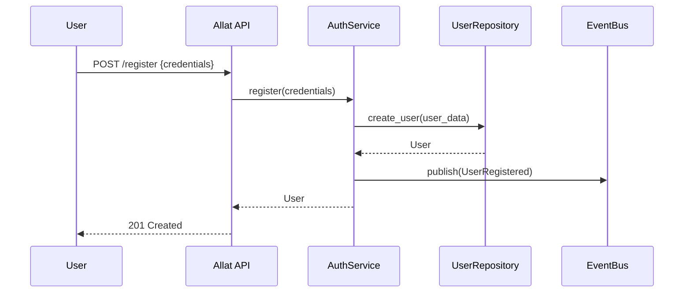
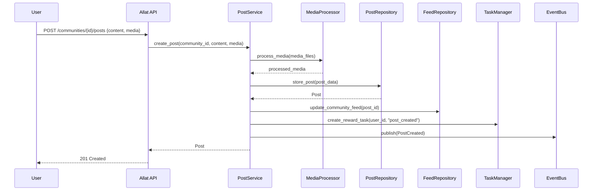
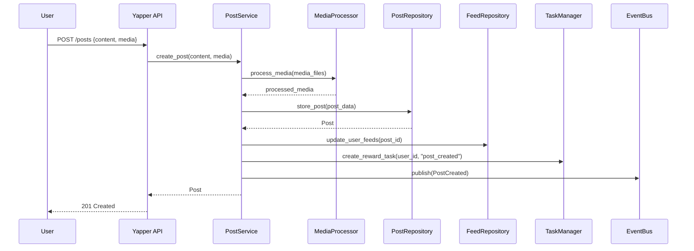
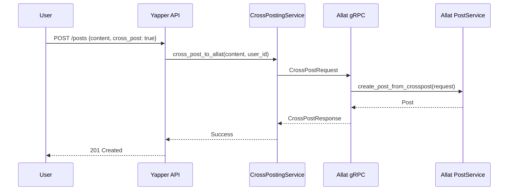
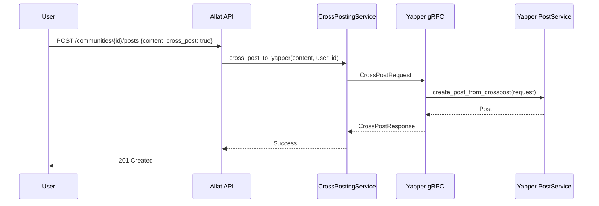
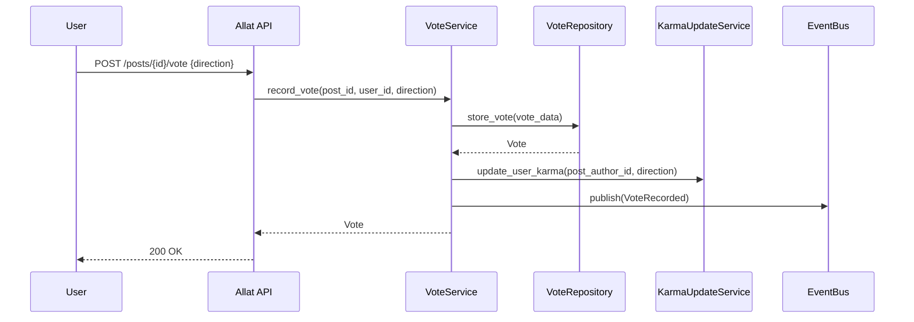
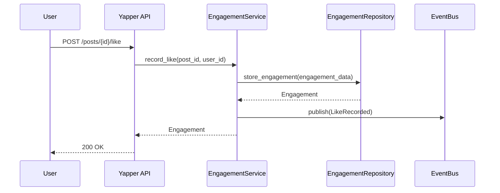
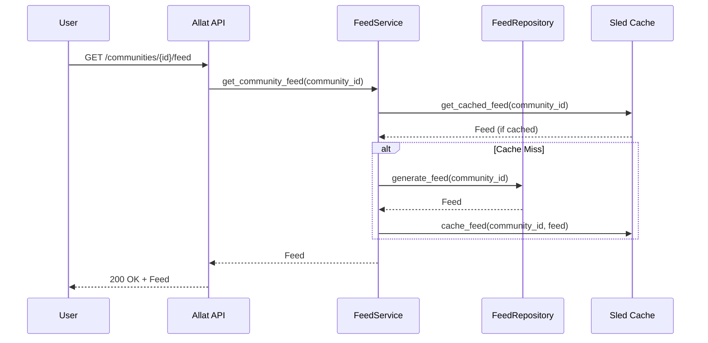

# Social Apps Sequence Diagrams

## Overview
This document contains sequence diagrams illustrating key workflows in the Allat and Yapper social applications, as well as their integration.

## User Registration Flow

### Allat Registration


### Yapper Registration


## Post Creation Flow

### Allat Post Creation


### Yapper Post Creation


## Cross-Posting Flow

### Yapper to Allat Cross-Post


### Allat to Yapper Cross-Post


## Voting/Engagement Flow

### Allat Vote


### Yapper Like


## Feed Generation Flow

### Allat Community Feed


### Yapper Personal Feed
```mermaid
sequenceDiagram
    participant U as User
    participant Y as Yapper API
    participant FS as FeedService
    participant FR as FeedRepository
    participant S as Sled Cache
    
    U->>Y: GET /feed
    Y->>FS: get_personal_feed(user_id)
    FS->>S: get_cached_feed(user_id)
    S-->>FS: Feed (if cached)
    alt Cache Miss
        FS->>FR: generate_feed(user_id, following)
        FR-->>FS: Feed
        FS->>S: cache_feed(user_id, feed)
    end
    FS-->>Y: Feed
    Y-->>U: 200 OK + Feed