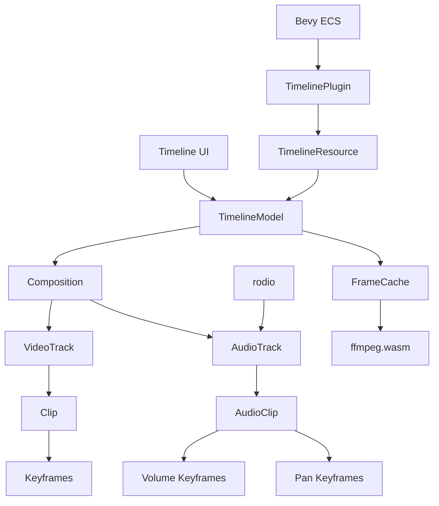
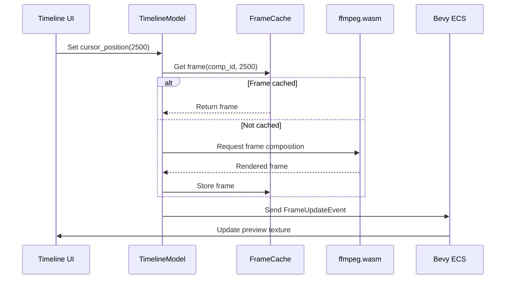

# Video Editor Timeline Architecture

## Component Relationships


## Data Structures
```rust
// Core timeline container
pub struct TimelineModel {
    compositions: BTreeMap<Uuid, Composition>,
    current_composition: Option<Uuid>,
    cursor_position: u64, // ms
    scale_factor: f32,    // px per second
    frame_cache: FrameCache, // Cached rendered frames
}

// Media container
pub struct Composition {
    id: Uuid,
    video_tracks: Vec<VideoTrack>,
    audio_tracks: Vec<AudioTrack>,
    nested_compositions: HashMap<Uuid, Composition>,
    transform: Transform, 
}

// Video track with spatial partitioning
pub struct VideoTrack {
    clips: Vec<Clip>,
    spatial_index: RTree<ClipRegion>, // For efficient lookup
    // ... other fields
}

// Optimized clip region for spatial lookup
struct ClipRegion {
    start_ms: u64,
    end_ms: u64,
    clip_id: u64,
}
```

## User Interaction Patterns
1. **Drag-and-Drop Media**:
   - On drop event: `TimelineModel::add_clip()`
   - Triggers `TimelineEvent::ClipAdded`
   - UI updates track view

2. **Trim Handling**:
   - On drag start: Capture original clip boundaries
   - On drag: Constrain to adjacent clips
   - On release: `TimelineModel::update_clip_duration()`

3. **Keyframe Manipulation**:
   - Right-click + "Add Keyframe": `TimelineModel::add_keyframe()`
   - Drag keyframe: `TimelineModel::update_keyframe()`
   - Interpolation menu: `TimelineModel::set_keyframe_interpolation()`

## Performance Optimization
1. **Frame Caching**:
```rust
struct FrameCache {
    cache: LruCache<FrameKey, Frame>,
    max_size: usize,
}

impl FrameCache {
    fn get(&mut self, composition_id: Uuid, time: u64) -> Option<&Frame> {
        let key = FrameKey { composition_id, time };
        self.cache.get(&key)
    }
    
    fn store(&mut self, frame: Frame) {
        // ... storage logic
    }
}
```

2. **Spatial Partitioning**:
   - Use R-tree for O(log n) clip lookup by time
   - Rebuild index only on track modifications

3. **Rendering Optimization**:
   - Offload interpolation to GPU using Bevy compute shaders
   - Limit keyframe resolution during scrubbing (sample every 10ms)

## Real-time Preview Sync


## Integration Points
1. **ffmpeg.wasm**:
   - Frame rendering via WASM module
   - Only AV1/Opus/WebM formats

2. **rodio**:
   - Audio mixing and playback
   - Real-time effect processing

3. **Bevy ECS**:
   - UI rendering
   - Event handling
   - GPU acceleration