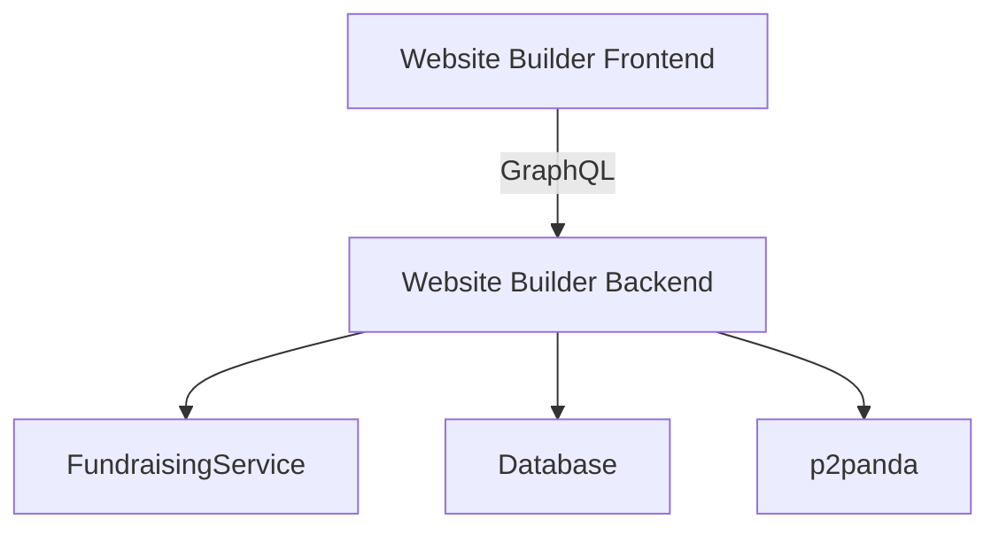
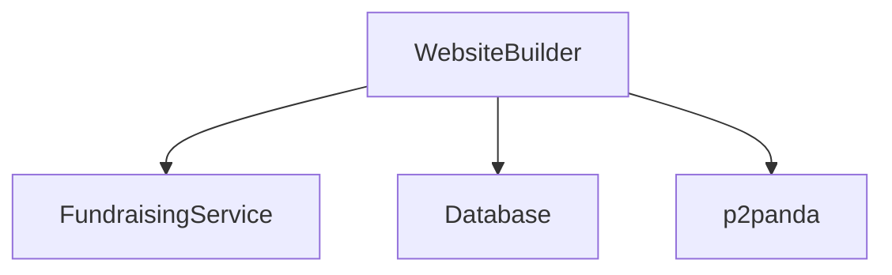

# Website Builder Module Deployment

This document explains how to run and deploy the website builder module.

## Prerequisites

- Rust toolchain (latest stable version)
- PostgreSQL database
- Access to a p2panda network
- ffmpeg.wasm for media processing
- Access to the cooperative fundraising service

## Frontend/Backend Relationship

The Website Builder consists of two main components:

- **Backend**: The `website-builder` module (this project) provides the GraphQL API, database interactions, and business logic.
- **Frontend**: The `website-builder-frontend` project provides the web-based user interface.

The frontend communicates with the backend via GraphQL. They are separate applications that can be developed and deployed independently.

### Architecture Diagram



## Development Setup

1. Clone the repository
2. Install Rust toolchain: https://www.rust-lang.org/tools/install
3. Set up a PostgreSQL database
4. Run the database migrations
5. Configure the environment variables

## Environment Variables

The module requires the following environment variables:

- `DATABASE_URL` - Connection string for the PostgreSQL database
- `P2PANDA_NODE_URL` - URL of the p2panda node
- `JWT_SECRET` - Secret key for JWT token generation
- `FUNDRAISING_SERVICE_URL` - URL of the cooperative fundraising service

## Fundraising Service Integration

The website builder integrates with the cooperative fundraising service to allow users to create fundraising campaigns.

### Required Environment Variables

- `FUNDRAISING_SERVICE_URL`: The base URL of the fundraising service
- `DEFAULT_CURRENCY`: The default currency for fundraising campaigns (e.g., USD, EUR)

### Configuration Steps

1. Set the `FUNDRAISING_SERVICE_URL` to point to your fundraising service instance
2. Configure `DEFAULT_CURRENCY` to specify the base currency for all campaigns
3. Ensure the fundraising service is running and accessible before starting the website builder
4. Currency handling is automatically configured through the service - no additional setup required

### Service Dependencies



## Running Tests

To run the tests for the module:

```bash
cargo test -p cpc-website-builder
```

## Building

To build the module:

```bash
cargo build -p cpc-website-builder
```

To build for release:

```bash
cargo build --release -p cpc-website-builder
```

## Integration with Main Backend

The website builder module is designed to be integrated with the main backend application. To integrate it:

1. Add the module as a dependency in the main backend's `Cargo.toml`
2. Initialize the module in the main application
3. Add the module's routes to the main router
4. Add the module's GraphQL components to the main schema

See the main backend's `src/main.rs` and `src/graphql/schema.rs` files for examples of how to integrate the module.

## Database Migrations

The module requires the following database tables:

- `sites`
- `pages`
- `link_items`
- `templates`
- `site_analytics`
- `fundraising_campaigns` (added by fundraising migration)

Run these migration files in order:

1. `apps/backend/migrations/20250726000000_create_website_builder_tables.sql` - Creates core tables
2. `apps/website-builder/migrations/20250803000000_add_campaign_fields.sql` - Adds fundraising campaign fields

## Troubleshooting

If you encounter issues:

1. Check the application logs for error messages
2. Verify that all environment variables are set correctly
3. Ensure the database is accessible and the migrations have been run
4. Check the p2panda node is running and accessible
5. For fundraising service issues:
   - Verify `FUNDRAISING_SERVICE_URL` is correct
   - Check network connectivity to the fundraising service
   - Validate currency configuration matches service expectations
   - Ensure service has proper CORS headers configured

### Currency Conversion Note
The fundraising service handles all currency conversion automatically. Campaigns can accept donations in any currency, but will display amounts in the `DEFAULT_CURRENCY` after conversion. Exchange rates are updated daily from the cooperative financial service.

## Deployment

To deploy the module as part of the main application:

1. Build the main application with the module included
2. Deploy the application to your server
3. Set up the required environment variables
4. Run the database migrations
5. Start the application

## Monitoring

The module uses tracing for logging. You can configure the logging level using the `RUST_LOG` environment variable.

## Scaling

The module is designed to be stateless and can be scaled horizontally by running multiple instances behind a load balancer.

## Backup and Recovery

Regular backups of the PostgreSQL database are recommended. The p2panda network provides distributed storage for published sites, so they don't need to be backed up separately.

## Troubleshooting

If you encounter issues:

1. Check the application logs for error messages
2. Verify that all environment variables are set correctly
3. Ensure the database is accessible and the migrations have been run
4. Check the p2panda node is running and accessible