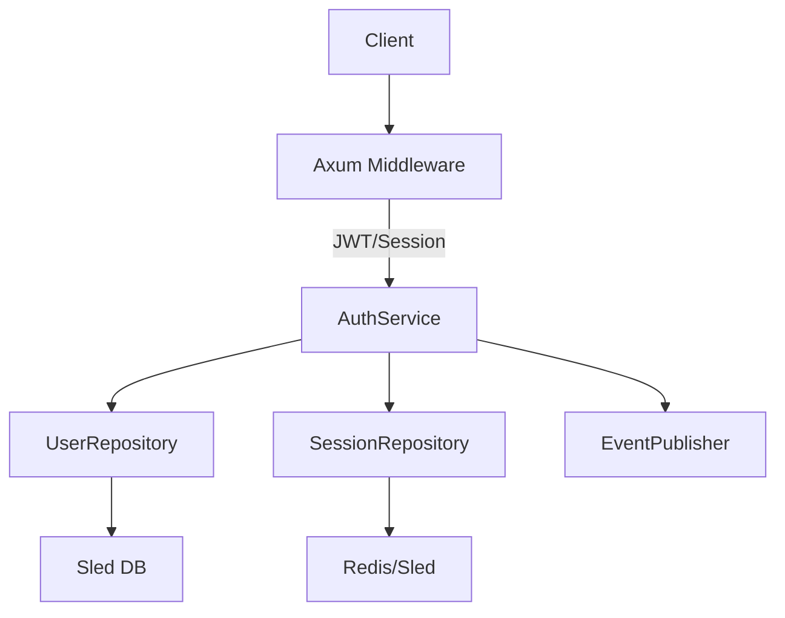
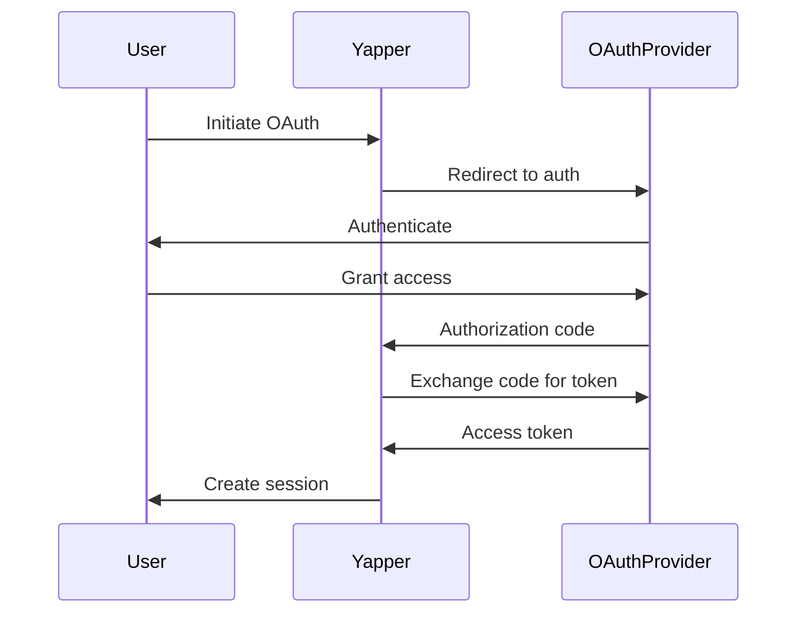

# Authentication System Design for Yapper

## 1. Architectural Overview


## 2. Domain Models

### User (Authentication Entity)
```rust
pub struct User {
    pub id: Uuid,
    pub email: String,
    pub password_hash: String, // Argon2 hash
    pub is_verified: bool,
    pub created_at: DateTime<Utc>,
    pub roles: Vec<Role>,
}
```

### Session
```rust
pub struct Session {
    pub id: Uuid,
    pub user_id: Uuid,
    pub created_at: DateTime<Utc>,
    pub expires_at: DateTime<Utc>,
    pub device_info: String,
}
```

### Credentials (Value Object)
```rust
pub struct Credentials {
    pub email: String,
    pub password: String,
}
```

### Updated UserProfile
```rust
pub struct UserProfile {
    pub id: Uuid,
    pub user_id: Uuid, // FK to User
    pub display_name: String,
    pub bio: Option<String>,
    pub avatar_url: Option<String>,
}
```

## 3. Service Interfaces

### AuthService
```rust
#[async_trait]
pub trait AuthService {
    async fn register(&self, credentials: Credentials) -> Result<User, AuthError>;
    async fn login(&self, credentials: Credentials) -> Result<Session, AuthError>;
    async fn logout(&self, session_id: Uuid) -> Result<(), AuthError>;
    async fn validate_session(&self, session_id: Uuid) -> Result<User, AuthError>;
    async fn refresh_token(&self, refresh_token: String) -> Result<Session, AuthError>;
    async fn initiate_password_reset(&self, email: String) -> Result<(), AuthError>;
    async fn confirm_password_reset(&self, token: String, new_password: String) -> Result<(), AuthError>;
}
```

### UserService
```rust
#[async_trait]
pub trait UserService {
    async fn get_user_by_id(&self, user_id: Uuid) -> Result<User, UserError>;
    async fn update_user(&self, user: User) -> Result<(), UserError>;
    async fn assign_role(&self, user_id: Uuid, role: Role) -> Result<(), UserError>;
}
```

### SessionManagement
```rust
pub trait SessionManagement {
    fn create_session(&self, user_id: Uuid) -> Result<Session, SessionError>;
    fn invalidate_session(&self, session_id: Uuid) -> Result<(), SessionError>;
    fn find_session(&self, session_id: Uuid) -> Result<Option<Session>, SessionError>;
}
```

## 4. Middleware Design

### Axum Authentication Layer
```rust
pub async fn auth_middleware<T>(
    mut req: Request<T>,
    next: Next<T>
) -> Result<Response, StatusCode> {
    let auth_header = req.headers()
        .get(AUTHORIZATION)
        .and_then(|h| h.to_str().ok());
    
    let user = match auth_header {
        Some(token) if token.starts_with("Bearer ") => {
            let token = &token[7..];
            auth_service.validate_jwt(token).await?
        }
        _ => {
            // Check session cookie
            let session_id = get_session_cookie(&req);
            auth_service.validate_session(session_id).await?
        }
    };

    req.extensions_mut().insert(user);
    next.run(req).await
}
```

## 5. Database Schema Updates

### Sled Trees:
- `users`: `Uuid` → `User` (serialized)
- `sessions`: `Uuid` → `Session` (serialized)
- `password_reset_tokens`: `String` (token) → `Uuid` (user_id)

### Indexes:
- `user_emails`: `String` (email) → `Uuid` (user_id)
- `user_sessions`: `Uuid` (user_id) → `Vec<Uuid>` (session_ids)

## 6. Security Measures

1. **Password Hashing**: Argon2id with:
   - Time cost: 3
   - Memory cost: 4096 KB
   - Parallelism: 1
   
2. **JWT**:
   - Algorithm: ES256
   - Claims: sub (user_id), exp, iat, roles
   - Secret: Rotated weekly

3. **Session Security**:
   - HTTP-only cookies
   - SameSite strict
   - Secure flag (HTTPS only)
   - 30 minute idle timeout

4. **Rate Limiting**:
   - 5 attempts per minute for login
   - 2 requests per hour for password reset

5. **CSRF Protection**:
   - Double submit cookie pattern
   - Synchronizer token pattern for sensitive operations

## 7. OAuth2 Integration



## 8. Event Integration

### New Events:
```rust
pub enum YapperEvent {
    // ... existing events
    UserRegistered {
        user_id: Uuid,
        email: String,
    },
    UserLoggedIn {
        user_id: Uuid,
        device_info: String,
    },
    PasswordResetRequested {
        user_id: Uuid,
    },
    // ... other auth events
}
```

## 9. Repository Interfaces

### UserRepository
```rust
#[async_trait]
pub trait UserRepository {
    async fn create(&self, user: &User) -> Result<(), RepositoryError>;
    async fn find_by_id(&self, id: Uuid) -> Result<Option<User>, RepositoryError>;
    async fn find_by_email(&self, email: &str) -> Result<Option<User>, RepositoryError>;
    async fn update(&self, user: &User) -> Result<(), RepositoryError>;
}
```

### SessionRepository
```rust
#[async_trait]
pub trait SessionRepository {
    async fn create(&self, session: &Session) -> Result<(), RepositoryError>;
    async fn find_by_id(&self, id: Uuid) -> Result<Option<Session>, RepositoryError>;
    async fn delete(&self, id: Uuid) -> Result<(), RepositoryError>;
    async fn find_by_user(&self, user_id: Uuid) -> Result<Vec<Session>, RepositoryError>;
}
```

## 10. Error Handling

### AuthError Enum:
```rust
pub enum AuthError {
    InvalidCredentials,
    UserNotFound,
    AccountNotVerified,
    SessionExpired,
    TokenInvalid,
    RateLimitExceeded,
    OAuthFailure(String),
    DatabaseError(String),
    // ... other cases
}