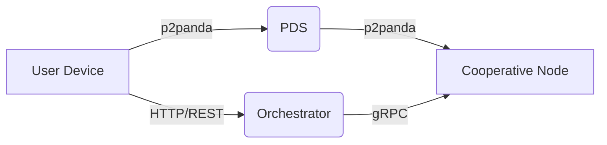
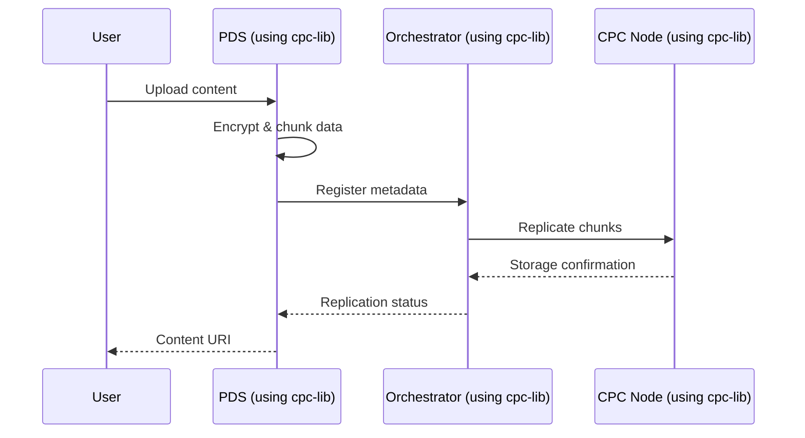
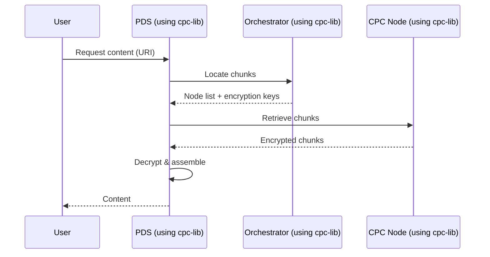

# Cooperative Peer Cloud (CPC) Architecture

## Core Components

### 1. Central Orchestrator (Rust Server)
- **Responsibilities**:
  - Manages user identities and social graphs
  - Tracks content metadata and node locations
  - Coordinates content distribution
  - Collects metrics via p2panda-metrics (OpenMetrics format)
- **Key Features**:
  - REST API for client interactions
  - gRPC for internal component communication
  - Persistent storage (SQLx)
  - Uses shared `cpc-lib` for networking, cryptography, and common data structures

### 2. Personal Data Server (Tauri Desktop App)
- **Responsibilities**:
  - User-controlled encrypted storage
  - P2P network participation
  - Local-first data management
- **Key Features**:
  - Configurable storage/bandwidth limits
  - LRU cache eviction policy
  - End-to-end encryption (using Noise protocol)
  - Local database (SQLx)
  - Uses shared `cpc-lib` for networking and cryptography

### 3. Cooperative Cloud Providers (Rust Servers)
- **Responsibilities**:
  - Persistent storage for text data
  - Super-seeding for media content
  - High-availability node operation
- **Key Features**:
  - Content-addressable storage (IPFS-like)
  - Automated replication and healing
  - Resource monitoring and throttling
  - Uses shared `cpc-lib` for networking protocols and metrics

## Shared Library (cpc-lib)
- **Purpose**: Common functionality used across all components
- **Key Modules**:
  - `net`: p2panda networking setup and protocols
  - `crypto`: Encryption/decryption utilities
  - `models`: Common data structures
- **Benefits**:
  - Code reuse
  - Consistent implementation
  - Simplified maintenance

## Communication Protocols

### Component Interactions


### p2panda Protocols
- **Peer Discovery**: Kademlia DHT using p2panda
- **Data Transfer**: Bitswap implementation from p2panda
- **Messaging**: p2panda gossipsub for pub/sub
- **NAT Traversal**: p2panda autonat + upnp

## Data Structures

### User Identity
```rust
pub struct UserIdentity {
    pub peer_id: PeerId,                // Derived from public key
    pub signing_key: secp256k1::PublicKey,
    pub encryption_key: x25519::PublicKey,
    pub social_graph: Vec<PeerId>,      // Followed users
}
```

### Content Metadata
```rust
pub struct ContentMetadata {
    pub content_id: Multihash,          // BLAKE3 hash of content
    pub owner: PeerId,
    pub size: u64,
    pub created_at: u64,                // Unix timestamp
    pub replicas: Vec<PeerId>,          // Nodes storing content
    pub access_control: AccessControl,  // Enum: Public, FollowersOnly, Private
}
```

### Network Metrics (OpenMetrics)
```yaml
# TYPE cpc_bandwidth_bytes gauge
cpc_bandwidth_bytes{node_type="orchestrator"} 12582912
cpc_bandwidth_bytes{node_type="pds"} 5242880
```

## Implementation Notes

PeerId derivation, transport configuration, and network behaviors are now implemented in the shared `cpc-lib` crate:

```rust
// Example usage in components:
use cpc_lib::net::NetworkBuilder;

let mut network = NetworkBuilder::new()
    .with_tcp()
    .with_quic()
    .with_kademlia()
    .with_gossipsub()
    .build();
```

This provides a consistent implementation across all components and simplifies maintenance.

## Data Flow Diagrams

### Initial Content Posting


### Content Consumption


### Trending Content Handling
1. Orchestrator monitors access patterns
2. Hot content replicated to edge nodes
3. Cold content archived to deep storage

## PDS Configuration Options
```rust
pub struct PdsConfig {
    pub storage_limit: Byte,                // e.g., 10 GB
    pub bandwidth_limit: BytePerSecond,     // e.g., 10 Mbps
    pub cache_eviction: EvictionPolicy,     // LRU only for now
    pub network: NetworkConfig,             // Bootstrap nodes, protocols
    pub encryption: EncryptionConfig,       // Default: ChaCha20Poly1305
}

## Next Development Priorities

1. **gRPC Server Implementation**
   - Internal communication between Orchestrator and CPC Nodes
   - Protocol buffers definition
   - Streaming support for metrics

2. **PDS Tauri UI**
   - Desktop interface for content management
   - Network status dashboard
   - Storage configuration panel

3. **Node Registration**
   - Onboarding flow for new CPC Nodes
   - Resource commitment agreements
   - Automated verification

4. **Extended REST API**
   - User profile management endpoints
   - Content search functionality
   - Node status reporting
## Business Intelligence and Tools

The CPC platform includes tools for cooperatives and individuals to manage their business operations.

### Invoice Management
We've implemented an invoice management system with offline capabilities and cross-device synchronization. 
See [ADR 0006](./architecture/adr/0006-invoice_system_architecture.md) for architectural details.

Key features:
- Local-first data storage using SQLx
- GraphQL API integration with backend
- Real-time updates via subscriptions
- PDF generation using pdf-rs
- Conflict resolution for multi-device sync