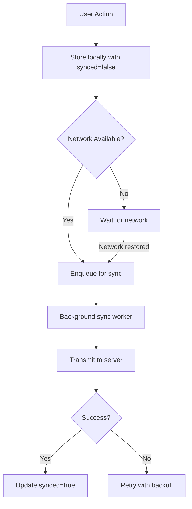

# CPC Architecture Foundation

This document establishes the architectural standards for all CPC software development. It codifies proven patterns from our currency integration implementation while addressing improvement opportunities identified during architectural reviews.

## Core Architectural Principles

### Hexagonal Architecture (Ports & Adapters)
We strictly implement the hexagonal architecture pattern to ensure:
- Complete separation between domain logic and infrastructure concerns
- Domain code remains pure business logic with no framework dependencies
- All external interactions occur through well-defined ports

**Canonical Example (Currency Preferences):**
```rust
// Domain port interface (packages/domains/finance/application/user_preferences.rs)
pub trait UserPreferences {
    async fn get_preferred_currency(&self, user_id: Uuid) -> Result<Currency, String>;
    async fn set_preferred_currency(&self, user_id: Uuid, currency: Currency) -> Result<(), String>;
}
```

**Implementation Pattern:**
- Android UI layer interacts *only* with port interfaces through FFI:
```kotlin
// Android UI layer (apps/android/app/src/main/java/cpc/android/features/userpreferences/UserPreferencesManager.kt)
class UserPreferencesManager {
    external fun getPreferredCurrency(): String
    external fun setPreferredCurrency(currencyCode: String): Boolean
}
```
- Infrastructure adapters implement domain ports:
  - `SledUserPreferences` (offline storage)
  - `GrpcUserPreferences` (network communication)

### Screaming Architecture
Directory structure must explicitly communicate the system's purpose through:

1. **Feature-based organization**:
   ```
   apps/android/app/src/main/java/cpc/android/features/userpreferences/
   packages/domains/finance/
   packages/infra/sled/adapters/user_preferences.rs
   ```

2. **Explicit naming conventions**:
   - `SledUserPreferences` clearly indicates offline storage implementation
   - `GrpcUserPreferences` explicitly identifies network implementation
   - Zero generic utility files containing domain logic

3. **Vertical boundary enforcement**:
   - All currency-related functionality contained within coherent feature boundaries
   - Cross-feature dependencies handled through port interfaces

### Vertical Slices
Each feature forms a complete vertical slice from UI to storage:

```kotlin
// Vertical slice dependency through port interface (ImportViewModel.kt)
class ImportViewModel(application: Application) {
    private val userPreferencesManager = UserPreferencesManager(application)
    
    fun importExpenses(file: File) {
        val currency = userPreferencesManager.getPreferredCurrency()
        // Process with currency context
    }
}
```

Key characteristics:
- No horizontal "services" layer
- Each feature contains all components needed for its functionality
- Dependencies flow downward through ports, never sideways between features

## Domain Module Structure

### Organization Principles
```
packages/
├── core/              # True cross-cutting concerns only
├── domains/
│   └── finance/       # Domain-specific business logic
│       ├── application/  # Use cases & port interfaces
│       ├── domain/       # Core domain models
│       └── infrastructure/ # Domain-specific infrastructure
└── infra/
    ├── sled/          # Edge intelligence implementations
    ├── grpc/          # Network communication
    └── android/       # Android-specific bindings
```

### Domain Implementation Guidelines
1. Domain logic must never depend on infrastructure
2. Domain modules must expose ports (traits/interfaces) for infrastructure to implement
3. Domain tests must run without any infrastructure dependencies
4. Domain models must remain pure business concepts (e.g., `Currency` enum)

## Offline-First Implementation Guide

### Storage Model Requirements
All offline-capable features must implement storage models containing:
```rust
struct StoredPreference {
    currency_code: String,
    synced: bool,      // Critical sync state flag
    timestamp: u64,    // For conflict resolution
}
```

### Critical Implementation Patterns

**1. Local-First Workflow:**
1. User action → stored locally with `synced: false`
2. Background sync service detects unsynced items
3. Items queued for transmission when network available
4. `synced` flag updated on successful transmission

**2. Conflict Resolution Strategy:**
```rust
impl ConflictResolution for SledUserPreferences {
    fn resolve_conflict(&self, local: &StoredPreference, remote: &StoredPreference) -> &StoredPreference {
        // Last-write-wins strategy using timestamp comparison
        if local.timestamp > remote.timestamp { local } else { remote }
    }
}
```
All implementations must:
- Use vector clocks or timestamp-based resolution
- Implement explicit `ConflictResolution` trait
- Provide at minimum a last-write-wins strategy

**3. Android-Rust Interaction Pattern:**
- JNI layer routes calls to domain logic without infrastructure details
- Kotlin only knows port interfaces through FFI
- Sync status reflected in UI using cloud status icons:
```xml
<!-- apps/android/app/src/main/res/layout/fragment_currency_preference.xml -->
<ImageView
    android:id="@+id/sync_status"
    android:src="@drawable/ic_cloud_done" /> <!-- or ic_cloud_off -->
```

## Adapter Selection Patterns

### Composite Adapter Strategy
Implement runtime selection between online/offline implementations:

```rust
pub enum UserPreferencesImpl {
    Online(GrpcUserPreferences),
    Offline(SledUserPreferences),
}

impl UserPreferences for UserPreferencesImpl {
    async fn get_preferred_currency(&self, user_id: Uuid) -> Result<Currency, String> {
        match self {
            UserPreferencesImpl::Online(service) => service.get_preferred_currency(user_id).await,
            UserPreferencesImpl::Offline(service) => service.get_preferred_currency(user_id).await,
        }
    }
    
    // Similar delegation for other methods
}
```

### Network-Aware Initialization
Dependency injection should incorporate network status monitoring:

```rust
fn create_user_preferences(
    db: &Db,
    network_monitor: &NetworkStatusMonitor
) -> impl UserPreferences {
    if network_monitor.is_connected() {
        UserPreferencesImpl::Online(GrpcUserPreferences::new(...))
    } else {
        UserPreferencesImpl::Offline(SledUserPreferences::new(db))
    }
}
```

### Network Status Detection
Implement robust network monitoring:
- Use platform-specific network APIs (Android ConnectivityManager)
- Maintain connection status in application state
- Notify adapters of network status changes
- Implement exponential backoff for failed sync attempts

## Sync Queue Requirements

### Core Components
All offline features must implement:

1. **Sync State Tracking**:
   - `synced: bool` flag in all storage models
   - Timestamp for conflict resolution

2. **Explicit Sync Queue**:
```rust
struct SyncQueue {
    pending_operations: Tree,  // Sled tree for queue
}

impl SyncQueue {
    fn enqueue(&self, operation: SyncOperation) { /* ... */ }
    fn process(&self, client: &UserPreferencesClient) { /* ... */ }
}
```

3. **Background Sync Worker**:
   - Runs periodically or on network status change
   - Processes queue in priority order
   - Handles conflict resolution during sync
   - Updates sync status flags on completion

### Sync Process Flow


## Testing Standards

### Test Coverage Requirements
1. **Domain Logic**:
   - 100% unit test coverage for core business rules
   - Zero dependencies on infrastructure in domain tests

2. **Conflict Resolution**:
   - Test all conflict scenarios (local newer, remote newer, simultaneous)
   - Validate resolution outcomes match strategy

3. **Offline-First Behavior**:
   - Test workflow with network disconnected
   - Verify local state preservation
   - Test successful sync when network restored

4. **Adapter Selection**:
   - Test proper adapter selection based on network status
   - Validate fallback behavior during network transitions

### Example Test Case
```rust
#[tokio::test]
async fn test_conflict_resolution_last_write_wins() {
    let local = StoredPreference { timestamp: 100, .. };
    let remote = StoredPreference { timestamp: 50, .. };
    let resolver = SledUserPreferences::new(&db);
    
    assert_eq!(resolver.resolve_conflict(&local, &remote), &local);
    
    let local = StoredPreference { timestamp: 50, .. };
    let remote = StoredPreference { timestamp: 100, .. };
    assert_eq!(resolver.resolve_conflict(&local, &remote), &remote);
}
```

### Android Integration Testing
- Test FFI layer with mock implementations
- Verify UI reflects sync status correctly
- Validate offline/online transitions in UI
- Test error handling for invalid inputs

## Evolution Path
This architecture will evolve to support our p2panda network implementation while maintaining these core principles. Future iterations will focus on:
- Enhanced conflict resolution for collaborative editing
- Advanced sync queue prioritization
- More sophisticated network status awareness
## Unified Authentication System

### Overview
The CPC ecosystem implements a unified authentication system that provides centralized identity management across all applications. This system consists of:
- gRPC-based Auth Service for session management
- Redis-based session storage
- Role-Based Access Control (RBAC) system
- Consent management for data sharing
- Karma system for user reputation

### Components

#### Auth Service
A gRPC service that handles session creation, validation, and invalidation. See [Auth Service API Documentation](auth_service_api.md) for detailed API specifications.

#### RBAC System
The Role-Based Access Control system provides flexible permission management:
- Roles are defined with specific permissions
- Permissions are checked at the middleware level
- Roles can be assigned to users through the auth service

#### Consent Management
Users can control their data sharing preferences across different application domains:
- Consent levels: None, Minimal, Standard, Full
- Domain-specific consent profiles
- Middleware enforcement of consent requirements

#### Karma System
A unified reputation system that tracks user contributions across all applications:
- Karma scores are stored with user profiles
- Karma transactions are logged for audit purposes
- Karma can be transferred between users
- Improved performance metrics for offline operations