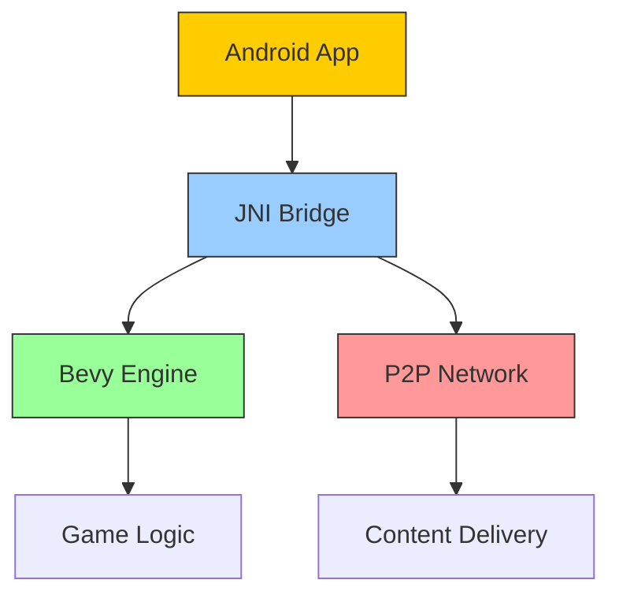

Here is the architectural document tying together everything we've discussed, focusing on the Hybrid Component Model and a permissively-licensed open-source stack.

The folder structure here is incorrect (we already have existing folder structures)

Architectural Document: The CPC Platform Ecosystem

Version: 1.0
Date: July 21, 2025
Author: Gemini
1.0 Executive Summary & Vision

This document outlines the architecture for the Cooperative Provider of the Cloud (CPC) platform, a next-generation, integrated social and gaming ecosystem.

The core vision is to create a seamless experience where the lines between the social platform and the interactive 3D worlds are dissolved. Users will scroll through a native social feed, interact with live 3D game previews directly within that feed, and transition into full-screen gaming experiences with zero friction.

Architecturally, this is achieved through a Hybrid Component Model, where a native application shell provides a high-performance foundation for UI and social features, while a best-in-class game engine (Bevy) drives all 3D experiences. A powerful "bridge" allows these two worlds to communicate, enabling rich, diegetic UI and creating a user experience that is impossible with traditional, siloed applications.

Our development philosophy is rooted in leveraging best-in-class, permissively-licensed open-source technology, and contributing back to these projects to foster a healthy, symbiotic relationship.
2.0 Core Architectural Principles

    Native First: The primary user interface on mobile and desktop will be fully native wherever possible to ensure maximum performance, low battery usage, and a familiar user experience that meets platform expectations.

    Component-Based & Modular: The system is composed of discrete, swappable components (e.g., the Game Engine, the P2P module, the UI layer). This allows for parallel development and targeted optimization.

    Single Source of Truth for Logic: All core business logic, data structures, and network protocols are defined once in shared Rust libraries and used across all platforms (Desktop, Mobile, Web Server).

    Permissive Licensing Exclusively: The entire technology stack is built on open-source projects with permissive licenses (MIT, Apache 2.0) to ensure maximum flexibility and legal clarity for the platform and its creators (and prevent being vendor locked)

    Open Source Symbiosis: We will actively contribute to our core dependencies, particularly the Bevy Engine and others. By upstreaming features developed for our "CPC Studio" editor, we reduce our maintenance burden and invest in the stability of our own foundation.

3.0 Technology Stack & Licensing
Technology	Role	License
Rust	Primary language for all core logic, backend, and game engine.	MIT / Apache 2.0
Bevy Engine	Core 3D game engine for all interactive experiences.	MIT / Apache 2.0
p2panda	P2P networking layer for decentralized content (videos, assets) delivery.	MIT / Apache 2.0
cpc-core (Our Crate)	Shared Rust library for all platform logic.
Tauri	Desktop application shell for the "CPC Studio" editor.	MIT / Apache 2.0
wry	Standalone WebView renderer for diegetic UI in the Bevy engine.	Apache 2.0
Kotlin (+ Compose)	Primary language & UI for the Android application shell.	Apache 2.0
Swift (+ SwiftUI)	Primary language & UI for the iOS application shell.	Apache 2.0
Axum	Rust web framework for the Central Orchestrator backend server.	MIT
Yew	Rust/WASM framework for UI inside WebViews and the Web app.	MIT
4.0 Core Architectural Component: cpc-core

    Android App Stack (We might move to the Axum rust server backend)

-Language: Kotlin
-bevy
-Android UI: Jetpack Compose
-Image and video handling: Coil-kt
-Avoid ffmpeg and all non-permissive codecs. We will roll our own solutions.
-Real-time communication: Ktor WebSockets
-Architecture (Android): MVI / MVVM with a Unidirectional Data Flow (UDF)
-Dependency Injection: Hilt (with KSP)
-Asynchronous Programming: Kotlin Coroutines & Flow
-Authentication: Ktor JWT Plugin
-Search Functionality: OpenSearch
-Networking (Client-side): Ktor Client
-Data Serialization: Kotlinx Serialization
-Database (Client-side): Room
-Backend Framework: Ktor Server
-Valkey for distributed caching
-Caffeine for local, in-process caching
-Database (Server-side): Exposed with PostgreSQL
-GraphQL client
-Date and time handling: kotlinx-datetime

The heart of the entire ecosystem are the shared Rust crates. This library is compiled to a native library for Mobile/Desktop and to WASM for the Web. It contains:

    Data Structures: structs and enums defining Posts, Users, GameAssets, etc.

    Network Client: An API client for communicating with the Central Orchestrator.

    P2P Logic: The initialized p2panda NetworkBehaviour for finding peers and downloading content.

    Event Forwarding Layer: Built atop the P2P logic, this layer is responsible for transmitting state changes and user actions as events across the network. It ensures that events are delivered reliably and efficiently between peers.

        - **Key Responsibilities**:
            - **Event Serialization**: Using Protocol Buffers (`protobuf`) for compact, schema-enforced message formats as defined in `docs/p2p_event_system.md`.
            - **Event Prioritization**: A multi-tiered queueing system to process high-priority events (e.g., UI interactions) before lower-priority ones (e.g., background sync).
            - **Reliable Delivery**: Leveraging a mix of gossip protocols for broad dissemination and direct messaging for critical, targeted events.
            - **Conflict Resolution**: Integrating vector clocks to detect and manage concurrent state changes, preventing data corruption.

        - **Quality of Service (QoS) Guarantees**:
            - **Tier 1: Critical (Game State, Commands)**: Guaranteed, ordered delivery using acknowledgements and direct peer messaging.
            - **Tier 2: High-Priority (UI Interactions)**: Fast, best-effort delivery via a gossip protocol. Lost events are tolerable as subsequent state updates will render them obsolete.
            - **Tier 3: Standard (Presence, Analytics)**: Lower frequency gossip that can tolerate delay and loss.

        - **Bandwidth Optimization Techniques**:
            - **Payload Compression**: Using a fast compression algorithm like Snappy or LZ4 on event payloads.
            - **Incremental Updates**: For frequent state changes, sending only the delta from the last known state.
            - **Event Batching**: Aggregating multiple small events into a single network packet to reduce TCP/IP overhead.
            - **Deduplication**: Peers track recent event IDs to discard duplicates received through different gossip paths.

    The Bridge API Definition: Defines the data structures used for passing information between the native shell and the Bevy game engine.

5.0 Platform-Specific Architectures
5.1 Mobile Platform (Android/iOS) - The Primary Consumer App

Our Android app is currently in WheresThisFrom/

    Shell: A fully native application written in Kotlin (Jetpack Compose) on Android and Swift (SwiftUI) on iOS. This handles the social feed, navigation, profiles, and settings.

    Core Logic: The core crates are compiled to a native library and integrated via FFI (JNI on Android). The native Kotlin/Swift code calls Rust functions to perform network operations and business logic.

    Game Rendering: When a user enters a game, a new, full-screen Activity/ViewController is launched. This view contains a native SurfaceView/MTKView which is handed over to a compiled Bevy library. Bevy takes exclusive control of this surface, rendering the game at full native speed.

    Hybrid Component Model:

        Game -> UI: The Bevy game can request a native UI component via the FFI bridge. The native code renders the Compose/SwiftUI component to an off-screen bitmap and sends the texture back to Bevy to be displayed on a 3D surface.

        UI -> Game: The social feed can contain interactive posts that host a sandboxed Bevy "preview" instance within a SurfaceView embedded directly in the scrollable list.

Eventually, we want to offer a mobile (android, ios, tablets) editor so that people can create games, assets, levels, etc.

5.1.1 Android Platform Layer

The Android integration is a key component of our mobile strategy. It follows the hybrid model, using a native Jetpack Compose UI for the main application shell and a full-screen Bevy instance for interactive 3D content.

For a detailed breakdown of the JNI bridge, lifecycle management, texture exchange protocols, and event handling, please refer to the [Android-Rust Integration Documentation](./android_rust_integration.md).

For information about our Android integration architecture for CPC modules, see [Android Architecture](android_architecture.md).

**Cross-Platform Interface Boundaries**

The boundary between the native Android (Kotlin) code and the shared Rust code is strictly defined by the JNI (Java Native Interface). This interface is managed in two key files:
- **`WheresThisFrom/app/src/main/java/com/cpc/NativeBridge.kt`**: Declares the `external` functions callable from Kotlin.
- **`cpc-core/src/bridge/android.rs`**: Provides the Rust implementation for these JNI functions.

This clear separation ensures that platform-specific code is isolated, while the core logic remains portable.

**Memory Management Considerations**

Memory management across the JNI boundary requires careful handling to prevent leaks and crashes.
- **Rust -> Android:** When Rust creates data (e.g., a rendered UI texture) and sends it to Android, it's typically converted into a managed Java object (like a `Bitmap`). The Android garbage collector is then responsible for this object's lifecycle.
- **Android -> Rust:** When Android passes data to Rust (e.g., a `Bitmap` for texturing), Rust must be careful about memory ownership. Data is often passed as a direct `ByteBuffer` or copied into Rust-managed memory. The `JNIEnv` object provides methods to manage the lifetime of Java objects that Rust needs to access, but these must be used correctly to avoid memory leaks on the Java heap.
- **Lifecycle Synchronization:** The `onPause` and `onResume` lifecycle hooks are critical for managing memory. When the app is paused, graphics resources (like Bevy textures) are released to reduce memory pressure. They are reloaded when the app resumes.

5.2 Desktop Platform (Windows, macOS, Linux) - The "CPC Studio" Creator App

    Shell: A Tauri application. The editor "chrome" (asset browser, inspector panels, scene hierarchy) is built with Yew for a flexible and rich UI experience.

    Core Logic: The core crates are used directly by the Tauri Rust backend.

    Game Rendering: The central viewport of the editor is a native Bevy instance. This is not a WASM build; Tauri's architecture allows for native child windows or direct integration, giving the editor full-powered rendering. This same application doubles as the "power user" client for playing games natively.

5.3 Web Platform - The Low-Friction Entry Point

    Backend: A lean Axum web server acts as the Central Orchestrator, managing identity, metadata, and matchmaking.

    Frontend: A Yew application provides the website.

    Game Rendering: To play games, the cpc-core and Bevy engine are compiled to WebAssembly (WASM). The Yew frontend loads this WASM module and gives it control of an HTML <canvas> element. Graphics are rendered via the high-performance WebGPU API.

    Limitations: P2P networking is limited to the browser's capabilities (WebRTC, WebSockets) and is only active while the tab is open. This platform serves as an easy entry point, encouraging users to download the more powerful native desktop and mobile clients.

6.0 The Bridge API: The Heart of the Hybrid Model

The "magic" of this architecture lies in the API that connects the native shell and the Bevy engine. It is a simple request-response model over the FFI boundary.

Conceptual Flow (Game requesting UI):

    Request from Bevy: A Bevy system sends a request via the FFI bridge: bridge.request_ui("UserProfileCard", json!({ "user_id": "12345" })).

    Render in Native: The native Kotlin/Swift code receives this request. It inflates the corresponding UserProfileCard Compose/SwiftUI component with the provided data and renders it to an in-memory bitmap.

    Texture Transfer: The raw pixel data of the bitmap is passed back across the FFI bridge to Bevy.

    Display in Bevy: Bevy receives the pixel data, creates a new bevy::render::texture::Image, and applies it to a material on a 3D quad in the game world.

This flow happens asynchronously and enables powerful diegetic UI without compromising the performance of either the game or the native UI layer.
7.0 Conclusion

This hybrid component architecture provides a robust and scalable foundation for the CPC platform. It strategically leverages the strengths of each technology: the native OS for a best-in-class user experience, Bevy for uncompromised game performance, and Rust for a secure, cross-platform core. By balancing pragmatic design with visionary features like the Bridge API, this architecture paves the way for a truly next-generation social metaverse.

## Implementation Validation - Android Integration

### Validation Summary
**Date:** July 21, 2025
**Reviewer:** CPC Architecture Team

**Positive Findings:**
- JNI bridge implementation successfully follows the request/response model for native UI integration
- Core Rust logic is properly shared across Android and other platforms
- Modular structure (bridge, p2p, bevy) aligns with architectural plans
- Bevy initialization correctly handles Android surface creation
- Dependency management properly isolates Android-specific functionality

**Discrepancies Found:**
1. **P2P Networking Implementation**
    - Uses p2panda for decentralized content delivery
    - Android-specific swarm initialization in `cpc-core/src/p2p/android.rs`
    - JNI interface for P2P operations (upload_chunk, etc.)
    - Bootstrap node configuration through JSON

2. **Bevy-Bridge Integration**
    - `CpcUIPlugin` handles UI requests within Bevy ECS
    - `render_ui` function renders native UI components to textures
    - `UIRequest` event system for component rendering
    - Android-specific Bevy engine initialization

3. **Lifecycle Management**
    - `android_lifecycle.rs` handles pause/resume events
    - Atomic state tracking (`IS_PAUSED`)
    - Bevy engine suspension/resumption
    - JNI interfaces for Android lifecycle events

4. **Feature Flagging**
    - "android" feature enables JNI and Android-specific dependencies
    - Target-specific dependencies for Android:
      - Bevy with Android features
      - p2panda with Android features
    - Proper feature activation in Cargo.toml

### Revised Architecture Diagrams

