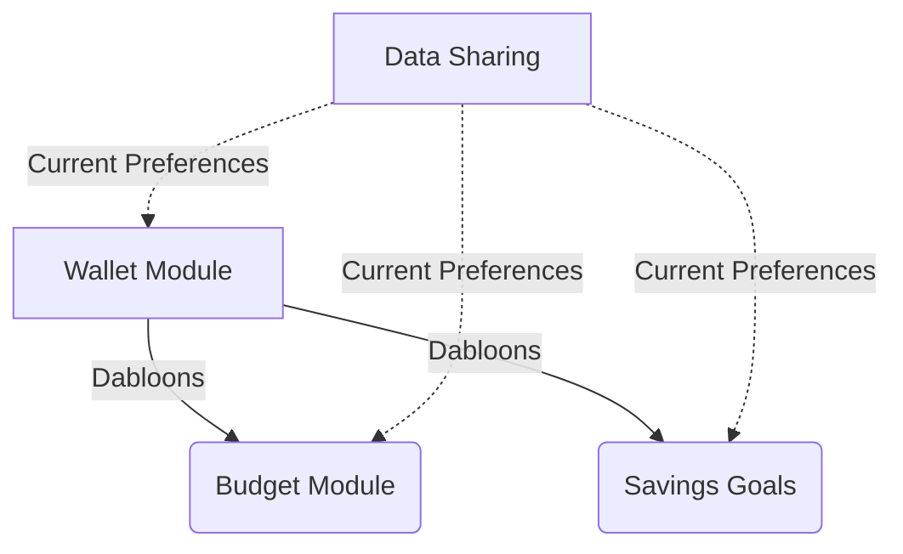
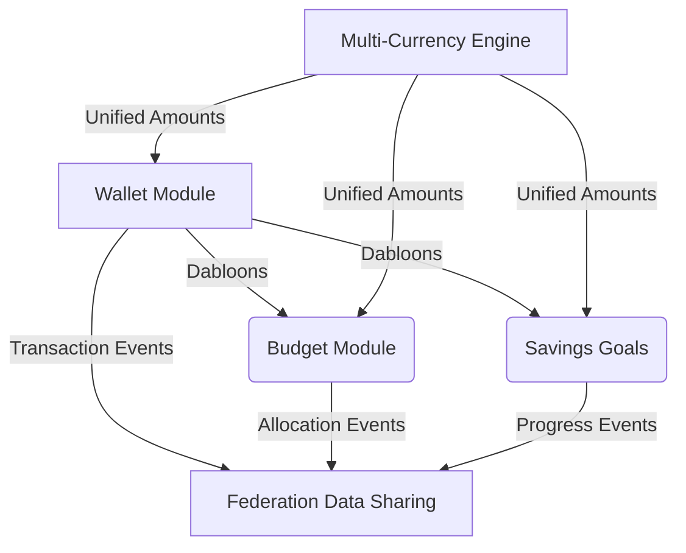
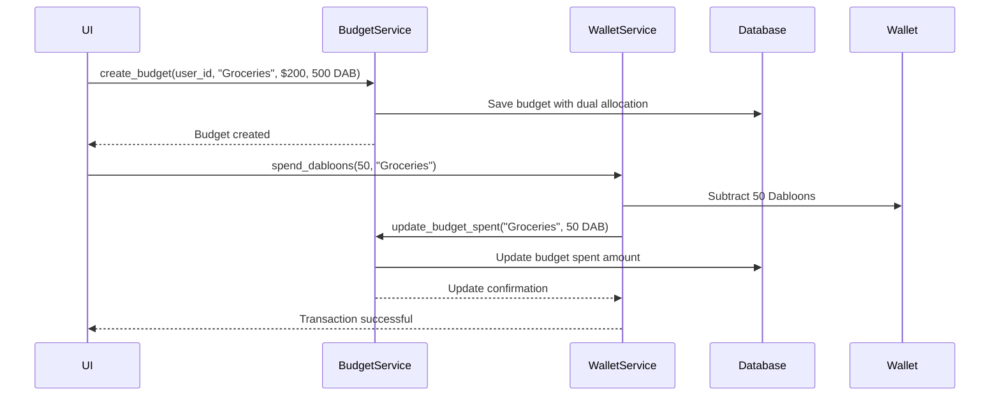

# Wallet Integration Plan: Connecting Dabloons with Financial Systems

## Executive Summary
This document outlines the integration strategy for connecting our newly implemented Dabloons wallet system with existing budgeting and savings functionality. The goal is to create a unified financial experience where users can seamlessly allocate, track, and utilize both traditional currencies and Dabloons within the CPC cooperative economy.

## Architectural Overview

### Current System State


### Target Integrated Architecture


## 1. Budget Module Synergy

### Proposed Changes to Domain Model

**Before:**
```rust
pub struct Budget {
    pub allocated_amount: Money,  // Single currency
    pub spent_amount: Money,      // Single currency
    // ... other fields
}
```

**After:**
```rust
pub struct BudgetAllocation {
    pub primary: Money,           // Traditional currency (USD)
    pub dabloons: Money,          // Dabloons component
}

pub struct Budget {
    pub allocation: BudgetAllocation,
    pub spent: BudgetAllocation,
    pub currency_type: BudgetCurrencyType,
    // ... other fields
}

pub enum BudgetCurrencyType {
    TraditionalOnly,
    DabloonsOnly,
    Mixed,
}
```

### Key Integration Points

1. **Allocation Strategy**
   - Users can now specify allocation in both traditional currency and Dabloons
   - Example: "Allocate $200 USD + 500 Dabloons to groceries budget"
   - Implementation: New UI components for dual-currency input

2. **Spending Tracking**
   - Transactions will deduct from appropriate currency component
   - When spending Dabloons on budgeted items:
     ```rust
     fn update_spent_with_dabloons(&mut self, amount: Money) -> Result<(), FinanceError> {
         if amount.currency == Currency::Dabloons {
             self.spent.dabloons = self.spent.dabloons.add(&amount)?;
         } else {
             // Traditional currency handling
         }
         Ok(())
     }
     ```

3. **Budget Utilization Metrics**
   - New calculation methods for mixed-currency budgets:
     ```rust
     pub fn utilization_percentage(&self) -> Decimal {
         let total_allocated = self.allocation.primary.amount + 
             self.allocation.dabloons.amount * DABLOON_CONVERSION_RATE;
         let total_spent = self.spent.primary.amount + 
             self.spent.dabloons.amount * DABLOON_CONVERSION_RATE;
         
         if total_allocated.is_zero() {
             Decimal::ZERO
         } else {
             (total_spent / total_allocated) * Decimal::from(100)
         }
     }
     ```

### Sequence Diagram: Budget Allocation with Dabloons


## 2. Savings Goals Enhancement

### Proposed Changes to Domain Model

**Before:**
```rust
pub struct SavingsGoal {
    pub target_amount: Money,    // Single currency
    pub current_amount: Money,   // Single currency
    // ... other fields
}
```

**After:**
```rust
pub struct DualCurrencyTarget {
    pub primary: Money,         // Traditional currency
    pub dabloons: Money,        // Dabloons component
}

pub struct SavingsGoal {
    pub target: DualCurrencyTarget,
    pub current: DualCurrencyTarget,
    pub currency_type: SavingsCurrencyType,
    // ... other fields
}

pub enum SavingsCurrencyType {
    TraditionalOnly,
    DabloonsOnly,
    Mixed,
}
```

### Key Integration Points

1. **Dual-Currency Goal Setting**
   - Users can create goals with combined currency targets
   - Example: "Save $100 USD + 500 Dabloons for vacation"

2. **Progress Visualization**
   - Enhanced visualization showing progress for both currency types
   - New Bevy visualization component:
     ```rust
     fn render_savings_progress(goal: &SavingsGoal) -> BevyBundle {
         // Creates dual-ring visualization showing both currency progress
         // Primary currency as outer ring, Dabloons as inner ring
     }
     ```

3. **Contribution Logic**
   - Contributions can be made in either currency
   - Automatic conversion visualization when contributing in one currency type:
     ```rust
     pub fn add_contribution(&mut self, amount: Money) -> Result<(), FinanceError> {
         match amount.currency {
             Currency::USD => self.current.primary = self.current.primary.add(&amount)?,
             Currency::Dabloons => self.current.dabloons = self.current.dabloons.add(&amount)?,
             _ => return Err(FinanceError::InvalidCurrency),
         }
         Ok(())
     }
     ```

## 3. Data Sharing Implications

### Federation Integration Strategy

1. **New Data Sharing Preferences**
   ```rust
   pub struct WalletDataSharingPreference {
       pub share_transactions: bool,
       pub share_balance: bool,
       pub share_budget_impact: bool,
       pub anonymize_amounts: bool,
       // Inherits from base DataSharingPreference
   }
   ```

2. **Transaction Event Propagation**
   - Wallet transactions that affect budgets/savings will trigger federated events
   - Event structure:
     ```json
     {
       "event_type": "wallet_budget_update",
       "user_id": "uuid",
       "budget_category": "groceries",
       "dabloon_amount": 50,
       "timestamp": "iso8601"
     }
     ```

3. **Privacy Considerations**
   - Even with our "connectivity over privacy" focus, implement:
     - Granular sharing controls per currency type
     - Automatic anonymization for small transaction amounts
     - Federation-wide opt-out registry

## 4. Error Handling Standardization

### Unified Error Structure

| Current Wallet Error | Unified Error | API Mapping |
|----------------------|---------------|-------------|
| `InsufficientWalletBalance` | `FinanceError::InsufficientFunds(Currency)` | `402 Payment Required` |
| `CurrencyMismatch` | `FinanceError::CurrencyMismatch { expected, actual }` | `400 Bad Request` |
| - | `FinanceError::BudgetExceeded { category }` | `409 Conflict` |
| - | `FinanceError::SavingsGoalNotFound` | `404 Not Found` |

### Error Mapping Implementation
```rust
impl From<WalletError> for FinanceError {
    fn from(err: WalletError) -> Self {
        match err {
            WalletError::InsufficientBalance => 
                FinanceError::InsufficientFunds(Currency::Dabloons),
            WalletError::CurrencyMismatch { expected, actual } => 
                FinanceError::CurrencyMismatch { expected, actual },
            // ... other mappings
        }
    }
}
```

## 5. Security Considerations

### Critical Security Enhancements

1. **Transfer Operation Safety**
   - Implement database-level pessimistic locking for wallet transfers:
     ```sql
     BEGIN;
     SELECT * FROM wallets WHERE user_id = $1 FOR UPDATE;
     -- Perform balance check and update
     COMMIT;
     ```
   - Use transaction IDs to prevent replay attacks

2. **Double-Spending Prevention**
   - Implement blockchain-style transaction chaining for wallet operations
   - Each transaction references previous transaction ID
   - Lightweight Merkle tree for transaction verification

3. **P2P-Specific Protections**
   - Signature validation for all wallet transactions between nodes
   - Rate limiting for wallet operations per peer
   - Reputation system for nodes handling wallet operations

## Risk Assessment

| Risk | Severity | Mitigation Strategy |
|------|----------|---------------------|
| Currency conversion inconsistencies | High | Implement fixed conversion rate system with community governance |
| Race conditions in multi-currency operations | Critical | Database transactions with appropriate isolation levels |
| Federation-wide data leakage | Medium | Granular sharing preferences with default conservative settings |
| Budget miscalculations in mixed currency | High | Comprehensive unit tests with edge cases |

## Implementation Strategy

### Minimum Viable Integration (Phase 1)

1. **Budget Module Integration**
   - Add Dabloons support to budget allocation
   - Implement basic spending tracking
   - Create migration adding `dabloons_allocated` and `dabloons_spent` columns

2. **Wallet-Budget Connection**
   - Add wallet service method: `link_to_budget(category, amount)`
   - Implement automatic deduction when spending Dabloons on budgeted categories

3. **Basic Visualization**
   - Simple text-based progress indicators for dual-currency budgets

### Future Expansion Points

1. **Marketplace Integration**
   - Convert Dabloons to traditional currency via cooperative labor
   - Implement escrow service for Dabloons transactions

2. **Social Gifting**
   - Send Dabloons as gifts with custom messages
   - Track gift impact on recipient's budget/savings

3. **Advanced Analytics**
   - Cross-user spending pattern analysis (with consent)
   - Cooperative-wide Dabloons circulation metrics

## Backward Compatibility Strategy

1. **Database Migrations**
   - New columns for Dabloons with default 0 values
   - Automatic conversion of existing budgets to "TraditionalOnly" type

2. **API Versioning**
   - `/v1/budgets` - Original single-currency API
   - `/v2/budgets` - New dual-currency API
   - Automatic client-side redirection for older clients

3. **Gradual Rollout**
   - Feature flags for new functionality
   - Canary deployment to 10% of users initially

## Proof of Concept: Dual-Currency Budget Tracking

### Domain Model Example
```rust
// Create a mixed-currency budget
let groceries_budget = Budget::new_mixed(
    user_id,
    "Groceries".to_string(),
    Money::new(dec!(200), Currency::USD),
    Money::new(dec!(500), Currency::Dabloons),
    BudgetPeriod::Monthly,
    start_date,
    end_date
);

// User spends 50 Dabloons on groceries
let updated_budget = budget_service
    .update_spent_with_dabloons(user_id, "Groceries", Money::new(dec!(50), Currency::Dabloons))
    .await?;

// Verify budget state
assert_eq!(updated_budget.spent.dabloons.amount, dec!(50));
assert_eq!(updated_budget.allocation.dabloons.amount, dec!(500));
```

### Database Schema Changes
```sql
-- Add to budgets table
ALTER TABLE budgets 
ADD COLUMN dabloons_allocated DECIMAL(20, 0) DEFAULT 0,
ADD COLUMN dabloons_spent DECIMAL(20, 0) DEFAULT 0,
ADD COLUMN currency_type VARCHAR(20) DEFAULT 'TraditionalOnly';
```

### Visualization Component
```rust
// Bevy financial visualization for dual-currency budget
fn render_budget_progress(
    budget: &Budget, 
    theme: &FinanceTheme
) -> BudgetProgressBundle {
    // Creates side-by-side bar charts showing both currency types
    // Traditional currency in primary color, Dabloons in special "dabloon yellow"
}
```

## Conclusion
This integration plan creates a seamless experience where Dabloons function as a first-class financial component alongside traditional currencies. By implementing these changes with our principles of screaming architecture and vertical slices, we'll create a foundation for the cooperative economy that can scale to millions of users while maintaining clear domain boundaries and federation compatibility.