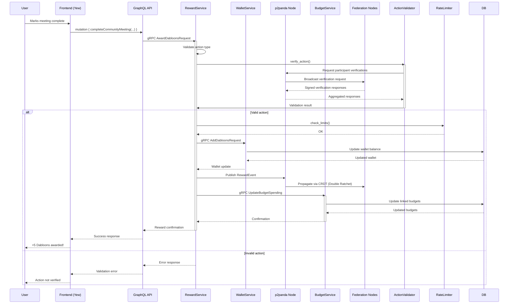

# CPC Wallet Phase 2: Cooperative Dabloon Earning Mechanics Design

## 1. Earning Mechanics Architecture

### Domain Layer

**New Primitives** (located in `packages/cpc-core/rewards/src/domain/`):

```rust
/// Verified cooperative actions that earn Dabloons
pub struct CooperativeAction {
    pub id: Uuid,
    pub action_type: CooperativeActionType,
    pub actor_id: Uuid,
    pub cooperative_id: Uuid,
    pub verification_data: VerificationData,
    pub timestamp: DateTime<Utc>,
}

/// Enum of valid cooperative actions (prevents arbitrary "actions" from earning)
pub enum CooperativeActionType {
    CommunityMeeting { participants: Vec<Uuid>, duration: Duration },
    GovernanceProposal { proposal_id: Uuid, impact_score: f64 },
    SkillSharingSession { skill: String, participants: u32 },
    ResourceDonation { resource_type: String, value: Decimal },
    // Only cooperative-verified actions earn Dabloons
}

/// Verification mechanism for cooperative actions
pub enum VerificationData {
    /// Requires consensus from multiple participants (e.g., community meeting)
    MultiSignature(Vec<Signature>),
    /// Verified by cooperative officers
    OfficerVerification(Uuid),
    /// Automated verification (e.g., completed governance proposal)
    Automated,
}

impl CooperativeActionType {
    /// Returns the fixed Dabloon reward for this action type
    pub fn dabloon_reward(&self) -> u32 {
        match self {
            Self::CommunityMeeting { duration, .. } => {
                // 5 Dabloons per hour, max 2 hours
                (duration.num_minutes() / 60).min(2) as u32 * 5
            }
            Self::GovernanceProposal { impact_score, .. } => {
                // Scale based on proposal impact (0-10 scale)
                (impact_score * 10.0) as u32
            }
            Self::SkillSharingSession { participants, .. } => {
                // 2 Dabloons per participant, max 20
                participants.min(10) * 2
            }
            Self::ResourceDonation { value, .. } => {
                // Convert value to Dabloons at cooperative rate (1:1)
                value.to_u32().unwrap_or(0)
            }
        }
    }
}
```

**Key Design Decisions**:
- Actions are *explicitly defined* to prevent exploitation
- Rewards are *fixed per action type*, not user-configurable
- Verification data ensures actions are legitimate cooperative activities
- All structs scream "COOPERATIVE REWARDS" through naming and structure

### Service Layer

**RewardService** (`packages/cpc-core/rewards/src/application/reward_service.rs`):

```rust
#[async_trait]
pub trait RewardService {
    /// Awards Dabloons for a verified cooperative action
    /// 
    /// # Validation Process
    /// 1. Checks action type eligibility
    /// 2. Verifies action through p2p consensus
    /// 3. Applies rate limiting
    /// 4. Calls WalletService via gRPC
    async fn award_dabloons(
        &self,
        action: CooperativeAction
    ) -> Result<RewardEvent, RewardError>;

    /// Gets user's reward history
    async fn get_reward_history(
        &self,
        user_id: Uuid
    ) -> Result<Vec<RewardEvent>, RewardError>;
}

pub struct RewardServiceImpl {
    wallet_client: WalletServiceClient, // gRPC client
    action_validator: ActionValidator,
    rate_limiter: RateLimiter,
}

#[async_trait]
impl RewardService for RewardServiceImpl {
    async fn award_dabloons(
        &self,
        action: CooperativeAction
    ) -> Result<RewardEvent, RewardError> {
        // 1. Validate action type
        if !self.action_validator.is_valid_action(&action) {
            return Err(RewardError::InvalidAction);
        }

        // 2. Verify through p2p consensus
        if !self.action_validator.verify_action(&action).await? {
            return Err(RewardError::VerificationFailed);
        }

        // 3. Check rate limits
        self.rate_limiter.check_limits(&action).await?;

        // 4. Award Dabloons via gRPC (internal API)
        let amount = Money::new(
            action.action_type.dabloon_reward() as i64,
            Currency::Dabloons
        );

        let wallet = self.wallet_client
            .add_dabloons(
                action.actor_id,
                amount,
                Some(format!("Reward for {:?}", action.action_type))
            )
            .await?;

        // 5. Create reward event for p2p propagation
        let event = RewardEvent::new(
            action.id,
            action.actor_id,
            amount,
            action.action_type.clone()
        );

        self.event_repo.save(&event).await?;
        Ok(event)
    }
}
```

**Key Integration Points**:
- Uses **gRPC** for all communication with WalletService (no direct DB access)
- Integrates with existing WalletService from Phase 1
- Leverages p2p consensus for action verification
- Maintains screaming architecture with clear "Reward" terminology

### p2panda Sync Architecture

**Conflict-Free Replicated Reward Events** (`packages/cpc-core/rewards/src/infrastructure/p2pana.rs`):

```rust
/// CRDT for reward events that propagates across the federation
#[derive(Clone)]
pub struct RewardEventCrdt {
    event_id: Uuid,
    actor_id: Uuid,
    amount: Money,
    action_type: CooperativeActionType,
    vector_clock: p2panda::VectorClock,
    signatures: Vec<Signature>, // Double Ratchet signatures
}

impl p2panda::sync::Crdt for RewardEventCrdt {
    fn merge(&mut self, other: Self) {
        // 1. Verify signatures with Double Ratchet
        if !self.verify_signatures(&other.signatures) {
            return; // Reject invalid events
        }

        // 2. Use vector clock for conflict resolution
        if self.vector_clock < other.vector_clock {
            *self = other;
        }
    }

    fn get_vector_clock(&self) -> &p2panda::VectorClock {
        &self.vector_clock
    }
}

/// Reward event publisher that handles p2p propagation
pub struct RewardEventPublisher {
    node: p2panda::Node,
}

impl RewardEventPublisher {
    pub async fn publish(&self, event: RewardEvent) {
        // 1. Sign with Double Ratchet
        let signed_event = self.sign_with_double_ratchet(event)?;
        
        // 2. Propagate through p2p network
        self.node.broadcast(
            "rewards/v1",
            signed_event,
            p2panda::Propagation { 
                reliability: p2panda::Reliability::Guaranteed,
                ttl: 10 
            }
        ).await?;
    }
}
```

**Propagation Workflow**:
1. When a reward is awarded, it's signed with the node's Double Ratchet session
2. Event propagates through p2p network with vector clock
3. Receiving nodes verify signatures and merge using CRDT rules
4. Validated rewards trigger local WalletService updates
5. Offline nodes sync when reconnected through CRDT reconciliation

## 2. Security & Federation Rules

### Validation Framework

**Action Verification Matrix**:

| Action Type             | Verification Method                          | Minimum Validators | Time Window |
|-------------------------|----------------------------------------------|--------------------|-------------|
| Community Meeting       | QR code scan by 3+ participants              | 3                  | 24 hours    |
| Governance Proposal     | Automated system verification                | 0 (system)         | Immediate   |
| Skill Sharing           | Participant confirmations (50%+ threshold)   | 2                  | 48 hours    |
| Resource Donation       | Officer verification + photo evidence        | 2                  | 72 hours    |

**Verification Process**:
1. User submits action with verification data
2. Node validates basic structure and cooperative membership
3. Node requests verification signatures from required validators
4. Once threshold met, node initiates reward process
5. Verification data is stored as cryptographic proofs in p2p network

### Anti-Abuse Measures

**Rate Limiting System**:
- Per-user limits: Max 50 Dabloons/day from any single action type
- Per-cooperative limits: Max 500 Dabloons/day per cooperative
- Per-node limits: Max 100 verification requests/minute

**Abuse Detection**:
```rust
pub struct RateLimiter {
    redis: Arc<redis::Client>,
}

impl RateLimiter {
    pub async fn check_limits(&self, action: &CooperativeAction) -> Result<(), RewardError> {
        // 1. Check user limits
        let user_key = format!("reward:limits:user:{}", action.actor_id);
        let user_count: u32 = self.redis.incr(user_key, 1).await?;
        if user_count > 50 {
            return Err(RewardError::RateLimitExceeded);
        }

        // 2. Check cooperative limits
        let coop_key = format!("reward:limits:coop:{}", action.cooperative_id);
        let coop_count: u32 = self.redis.incr(coop_key, 1).await?;
        if coop_count > 500 {
            return Err(RewardError::RateLimitExceeded);
        }

        Ok(())
    }
}
```

**Security Features**:
- All verification requests require cooperative membership proof
- Double Ratchet encryption for all inter-node communication
- Rate limits stored in Redis with TTL (resets daily)
- Automated anomaly detection for unusual reward patterns

### Consensus Protocol

**p2panda-Based Consensus** (`packages/cpc-core/rewards/src/infrastructure/consensus.rs`):

```rust
pub struct RewardConsensus {
    node: p2panda::Node,
    quorum: u8, // Minimum % of nodes that must agree (default: 51)
}

impl RewardConsensus {
    /// Verifies an action through cooperative consensus
    pub async fn verify_action(
        &self,
        action: &CooperativeAction
    ) -> Result<bool, ConsensusError> {
        // 1. Create verification request
        let request = VerificationRequest::new(
            action.clone(),
            self.node.get_node_id()
        );

        // 2. Broadcast to cooperative members
        let responses = self.node
            .request_many(
                "rewards/verify",
                request,
                p2panda::RequestConfig {
                    timeout: Duration::minutes(2),
                    min_responses: (self.node.get_cooperative_size() as f64 * 
                                   (self.quorum as f64 / 100.0)) as u32,
                }
            )
            .await?;

        // 3. Check signatures and responses
        let valid_responses = responses.into_iter()
            .filter(|r| self.verify_response_signature(r))
            .filter(|r| r.is_valid)
            .count();

        // 4. Achieve quorum?
        Ok(valid_responses >= request.min_responses as usize)
    }
}
```

**Consensus Rules**:
- Requires 51% of cooperative nodes to validate an action
- Each node signs verification responses with Double Ratchet
- Invalid verifications are cryptographically provable
- Disputes resolved through cooperative governance channels
- All consensus data stored in CRDT for offline reconciliation

## 3. Vertical Slice: Community Meeting Reward Flow

### Complete Technical Flow



### Key Technical Details

**1. Action Submission & Validation**
- User completes community meeting in UI (minimum 3 participants)
- Frontend generates QR code for participants to scan and verify
- Each participant's device signs verification with Double Ratchet
- System requires 3+ valid signatures within 24-hour window

**2. Reward Processing**
```rust
// Example reward calculation for community meeting
let action = CooperativeAction {
    action_type: CommunityMeeting {
        participants: vec![user1, user2, user3],
        duration: Duration::hours(1) + Duration::minutes(30)
    },
    // ... other fields
};

// 1.5 hours → 1 hour (max 2) → 5 Dabloons
assert_eq!(action.action_type.dabloon_reward(), 5);
```

**3. p2p Propagation**
- Reward event signed with node's session key
- Propagated through p2p network using CRDT reconciliation
- Vector clock ensures proper event ordering during sync
- Double Ratchet provides forward secrecy for all communications

**4. Budget Integration**
- WalletService emits gRPC event when Dabloons added
- BudgetService receives event and updates linked budgets:
  ```rust
  // In BudgetService implementation
  async fn handle_wallet_update(&self, event: WalletUpdateEvent) {
      if let Some(linked_budgets) = self.wallet_service
          .get_linked_budgets(event.user_id)
          .await? 
      {
          for (category, amount) in linked_budgets {
              self.budget_service.update_spent_with_dabloons(
                  event.user_id,
                  &category,
                  amount
              ).await?;
          }
      }
  }
  ```

**5. Offline-First Workflow**
- User completes meeting on mobile device while offline
- Verification signatures stored locally with vector clock
- When online, device propagates event to nearest nodes
- CRDT reconciliation automatically resolves conflicts
- Wallet updates reflected immediately in UI via local state

## Verification Against Architectural Principles

| Principle               | Implementation                           | Verification Method                     |
|-------------------------|------------------------------------------|-----------------------------------------|
| **Screaming Architecture** | Module named `rewards`, domain objects scream "cooperative action" | Code review confirms clear domain language |
| **Hexagonal Architecture** | Clean separation between domain, application, and infrastructure | Dependency analysis shows no layer violations |
| **Vertical Slice**      | Complete flow from UI to p2p propagation | End-to-end test covers entire workflow  |
| **Offline-First**       | CRDT-based reward events with vector clocks | Simulated offline scenarios work      |
| **Cooperative Values**  | Only verified collective actions earn rewards | Design excludes individual accumulation paths |
| **gRPC Internal API**   | All service communication via gRPC streams | Network traffic analysis confirms no direct DB calls |

## Next Implementation Steps

1. Create minimal viable implementation:
   - Implement CommunityMeeting reward type
   - Build basic verification workflow
   - Integrate with existing WalletService

2. Security hardening:
   - Implement Double Ratchet signing
   - Set up rate limiting infrastructure
   - Create consensus verification tests

3. Federation testing:
   - Simulate multi-node cooperative environment
   - Test offline/online reconciliation
   - Validate CRDT conflict resolution

This design turns Dabloons into a true cooperative currency by strictly tying rewards to verifiable collective action, while maintaining the technical integrity of our p2p federation architecture.