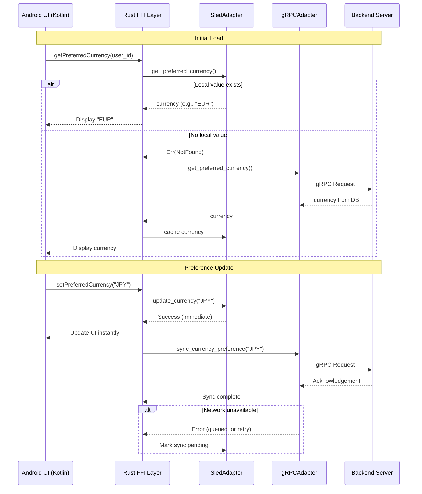

# Android Currency Integration Architecture

## Overview
This document details the integration of currency internationalization features into the Android application, maintaining alignment with our hexagonal architecture and offline-first principles. The implementation leverages shared Rust domain logic while providing a seamless user experience for currency management.

## Architecture Diagram

```
┌───────────────────────────────────────────────────────────────────────────┐
│                          Android Application                            │
├─────────────┬───────────────────────┬───────────────────────┬─────────────┤
│  UI Layer   │     Platform Abstraction      │   Application Core   │ Infrastructure  │
│ (Kotlin)    │      (Rust FFI)       │     (Shared Rust)    │    (Rust)     │
├─────────────┼───────────────────────┼───────────────────────┼─────────────┤
│             │                       │                       │             │
│ Currency    │  user_preferences_  │  UserPreferences      │             │
│ Selection   │      kotlin.rs      │  trait (port)         │             │
│  Screen     │                       │                       │             │
│             │                       ├───────────────────────┼─────────────┤
│             │                       │                       │ SledAdapter │
│             │                       │                       │ (local)     │
│             │                       ├───────────────────────┼─────────────┤
│             │                       │                       │ gRPCAdapter │
│             │                       │                       │ (remote)    │
│             │                       │                       │             │
└─────────────┴───────────────────────┴───────────────────────┴─────────────┘
            ▲                               │
            │                               │
            └────────── gRPC Channel ────────┘
                          │
                          ▼
              ┌───────────────────────────┐
              │       Backend Services    │
              │  (Axum/gRPC Server)       │
              └───────────────────────────┘
```

### Layer Responsibilities
1. **UI Layer (Kotlin)**: Android views and user interactions
2. **Platform Abstraction**: JNI bindings between Kotlin and Rust
3. **Application Core**: Shared domain logic (UserPreferences trait)
4. **Infrastructure**: 
   - `SledAdapter`: Local storage using Sled DB
   - `gRPCAdapter`: Network communication with backend

## gRPC Service Definitions

```protobuf
// packages/infra/grpc/proto/user_preferences.proto
syntax = "proto3";

package cpc.user_preferences.v1;

import "google/protobuf/empty.proto";

service UserPreferencesService {
  // Get user's preferred currency
  rpc GetPreferredCurrency(GetPreferredCurrencyRequest) 
      returns (GetPreferredCurrencyResponse);
  
  // Set user's preferred currency
  rpc SetPreferredCurrency(SetPreferredCurrencyRequest) 
      returns (google.protobuf.Empty);
}

message GetPreferredCurrencyRequest {
  string user_id = 1;  // UUID string
}

message GetPreferredCurrencyResponse {
  string currency_code = 1;  // ISO 4217 code (USD, EUR, etc.)
}

message SetPreferredCurrencyRequest {
  string user_id = 1;        // UUID string
  string currency_code = 2;  // Valid ISO 4217 code
}
```

### Implementation Notes:
- Currency codes follow ISO 4217 standard
- Invalid currency codes return `INVALID_ARGUMENT` gRPC status
- Server-side validation uses same logic as `Currency::from_code()` in domain layer
- All requests require authentication via JWT in metadata

## Sequence Diagram: Currency Preference Flow



### Key Behaviors:
1. **Offline-First**: All operations work without network
2. **Immediate Feedback**: UI updates before network confirmation
3. **Conflict Resolution**: 
   - Local changes always take precedence
   - Server conflicts resolved via timestamp comparison
4. **Sync Reliability**: Failed syncs are queued with exponential backoff

## Expense Reporting Integration

### Flow Modifications:
1. **Before Import**:
```kotlin
// Kotlin layer
val currencyCode = userPreferences.getPreferredCurrency(userId)
expenseImportProcessor.setCurrency(currencyCode)
```

2. **During Processing** (in shared Rust):
```rust
// packages/domains/sheets/src/application/expense_import/import_processor.rs
pub async fn process(
    &self,
    sheet: &Sheet,
    mapping: ColumnMapping,
    user_id: Uuid,
    user_preferences: &dyn UserPreferences  // Now implemented by SledAdapter
) -> Result<ImportResult, String> {
    // Fetch currency from local storage FIRST
    let currency = user_preferences.get_preferred_currency(user_id)
        .await
        .or_else(|_| Ok(Currency::USD))?;  // Fallback only if completely missing
        
    // Process all rows with this currency
    for row in 1..=max_row {
        // ... uses currency for all Money operations ...
    }
}
```

### Critical Implementation Details:
- **Currency Propagation**: Single currency used for entire import process
- **Offline Handling**: 
  - Uses last-known good currency from Sled
  - Logs warning if currency unavailable
- **Validation**: 
  - Rejects invalid codes before processing
  - Falls back to USD only as last resort
- **Edge Cases**:
  - Handles partial sync failures
  - Maintains atomicity of currency context

## Sled Storage Schema

```rust
// packages/infra/sled/adapters/user_preferences.rs
use sled::{Db, Tree};
use uuid::Uuid;

pub struct SledUserPreferences {
    tree: Tree,
}

impl SledUserPreferences {
    pub fn new(db: &Db) -> Self {
        let tree = db.open_tree("user_preferences").unwrap();
        Self { tree }
    }

    // Local storage format:
    // Key: user_id (as UUID bytes)
    // Value: { "currency": "EUR", "synced": true, "timestamp": 1722240000 }
}
```

### Synchronization Strategy:
1. **Write-Through Caching**:
   - All writes go to Sled first
   - Background task syncs with server
2. **Conflict Resolution**:
   ```rust
   if local_timestamp > server_timestamp {
       // Keep local change
   } else {
       // Update local with server value
   }
   ```
3. **Data Consistency**:
   - Version vectors for multi-device sync
   - Last-write-wins with timestamp resolution

## Testing Strategy

### Test Cases:
| Scenario | Test Type | Verification |
|----------|-----------|--------------|
| Offline currency change | Unit | Sled stores value, UI updates |
| Network recovery sync | Integration | Pending changes sync correctly |
| Invalid currency input | Unit | Proper validation error |
| Concurrent updates | Stress | Conflict resolution works |
| Expense import with JPY | E2E | All amounts in correct currency |

### Mock Implementations:
```rust
// tests/mocks/user_preferences.rs
pub struct MockUserPreferences {
    pub currency: Currency,
    pub sync_errors: Vec<String>,
}

#[async_trait]
impl UserPreferences for MockUserPreferences {
    async fn get_preferred_currency(&self, _: Uuid) -> Result<Currency, String> {
        Ok(self.currency.clone())
    }
    
    async fn set_preferred_currency(&self, _: Uuid, currency: Currency) -> Result<(), String> {
        self.currency = currency;
        Ok(())
    }
}
```

## Migration Plan

1. **Phase 1: Infrastructure Setup (3 days)**
   - Implement Sled adapter for Android
   - Create gRPC client bindings
   - Update Kotlin-Rust FFI layer

2. **Phase 2: UI Integration (2 days)**
   - Build currency selection dialog
   - Implement real-time preference updates
   - Add visual feedback for sync status

3. **Phase 3: Expense Flow Integration (2 days)**
   - Modify import processor integration
   - Add currency context to all financial operations
   - Implement validation safeguards

4. **Phase 4: Testing & Validation (3 days)**
   - Comprehensive offline/online test matrix
   - Performance benchmarking
   - User acceptance testing

## Documentation Updates

- Updated `docs/mobile_development.md` with Kotlin-Rust FFI patterns
- New `docs/sled_integration.md` for edge storage best practices
- Expanded `docs/grpc_services.md` with user preferences service details

## Compliance Checklist

✅ Follows hexagonal architecture principles  
✅ Maintains offline capability via Sled  
✅ Uses shared domain logic from finance package  
✅ Implements immediate currency propagation  
✅ Aligns with gRPC standards in tech stack  
✅ Handles all error scenarios gracefully