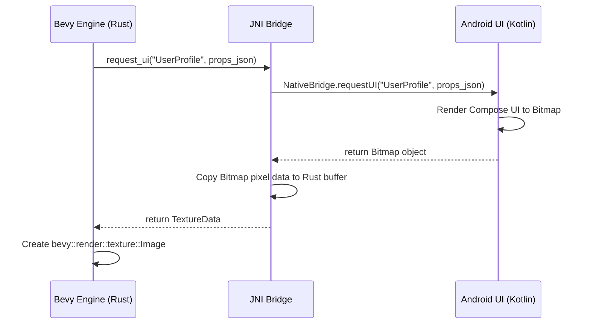
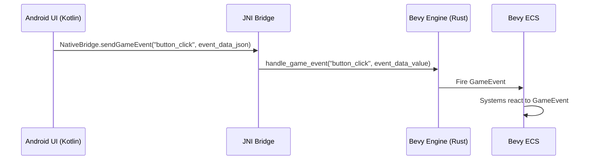

# Android-Rust Integration Architecture

**Version:** 1.0
**Date:** July 21, 2025
**Author:** Gemini

## 1. Overview

This document details the architecture and protocols for integrating the Rust-based `cpc-core` library with the Android platform. The integration enables a hybrid application model where a native Android UI (Jetpack Compose) coexists with a high-performance Bevy-based game engine.

The core components of this integration are:
- **JNI Bridge:** A foreign function interface (FFI) that allows Kotlin/Java code to call Rust functions and vice-versa.
- **Lifecycle Management:** A set of hooks to manage the state of the Rust core in alignment with the Android application lifecycle.
- **Texture Exchange:** A protocol for sharing graphical data (bitmaps and textures) between the Android UI and the Bevy engine.
- **Event Bus:** A system for passing events and commands between the UI layer and the game logic.

## 2. Lifecycle Hook Mapping

The `cpc-core` library mirrors the Android application lifecycle to ensure proper resource management and state synchronization. The following diagram illustrates the mapping of lifecycle events from the Android `MainActivity` to the Rust `android_lifecycle` module.

```mermaid
graph TD
    subgraph MainActivity (Kotlin)
        A[onCreate] --> B[NativeBridge.androidOnCreate]
        C[onPause] --> D[NativeBridge.androidOnPause]
        E[onResume] --> F[NativeBridge.androidOnResume]
        G[onDestroy] --> H[NativeBridge.androidOnDestroy]
    end

    subgraph cpc-core (Rust)
        B --> I[Java_com_cpc_CPCCore_onCreate]
        D --> J[Java_com_cpc_CPCCore_onPause]
        F --> K[Java_com_cpc_CPCCore_onResume]
        H --> L[Java_com_cpc_CPCCore_onDestroy]
    end

    J --> M[Pause Bevy Engine & P2P]
    K --> N[Resume Bevy Engine & P2P]

    style A fill:#A2D5F2
    style C fill:#A2D5F2
    style E fill:#A2D5F2
    style G fill:#A2D5F2
    style I fill:#FFB347
    style J fill:#FFB347
    style K fill:#FFB347
    style L fill:#FFB347
```

**Implementation Details:**
- **`cpc-core/src/android_lifecycle.rs`**: Contains the Rust implementations of the JNI lifecycle functions.
- **`WheresThisFrom/app/src/main/kotlin/com/wtf/app/MainActivity.kt`**: The main Android activity that triggers the lifecycle events.
- **`WheresThisFrom/app/src/main/java/com/cpc/NativeBridge.kt`**: The Kotlin object that declares the `external` JNI functions.

## 3. JNI Interface Specification

The JNI bridge exposes several functions to facilitate communication between the Android app and `cpc-core`.

| Function Signature (Kotlin) | Function Signature (Rust) | Description | Data Flow |
|---|---|---|---|
| `external fun androidOnCreate()` | `Java_com_cpc_CPCCore_onCreate` | Initializes the core library. | Android -> Rust |
| `external fun androidOnPause()` | `Java_com_cpc_CPCCore_onPause` | Pauses the core library systems. | Android -> Rust |
| `external fun androidOnResume()` | `Java_com_cpc_CPCCore_onResume` | Resumes the core library systems. | Android -> Rust |
| `external fun androidOnDestroy()` | `Java_com_cpc_CPCCore_onDestroy` | Cleans up resources used by the core. | Android -> Rust |
| `external fun createBevySurfaceView(context: Context): SurfaceView` | `Java_com_cpc_NativeBridge_createBevySurfaceView` | Creates the Android `SurfaceView` for Bevy to render on. | Android -> Rust -> Android |
| `external fun requestUI(component: String, props: String): Any` | `Java_com_cpc_NativeBridge_requestUI` | Requests the native UI to render a component to a texture (Bitmap). | Rust -> Android -> Rust |
| `external fun sendGameEvent(eventType: String, data: String)` | `Java_com_cpc_NativeBridge_sendGameEvent` | Sends a game-related event from the UI to the Bevy engine. | Android -> Rust |
| `external fun sendTextureToEngine(bitmap: Any)` | `Java_com_cpc_NativeBridge_sendTextureToEngine` | Sends a texture (e.g., from camera) from Android to the Bevy engine. | Android -> Rust |

## 4. Texture Exchange Protocol

A critical feature of the hybrid model is the ability to render native UI components as textures within the Bevy engine. This is achieved by rendering a Jetpack Compose component to an Android `Bitmap`, passing its pixel data to Rust, and creating a Bevy `Texture` from it.



**Code References:**
- **Rust:** `cpc-core/src/bridge/android.rs` (`Java_com_cpc_NativeBridge_requestUI`)
- **Kotlin:** `WheresThisFrom/app/src/main/java/com/cpc/NativeBridge.kt`

## 5. Event Handling Sequence

User interactions in the native Android UI can trigger events that need to be handled by the Bevy engine. The `sendGameEvent` JNI function facilitates this communication.



**Code References:**
- **Rust:** `cpc-core/src/bridge/android.rs` (`Java_com_cpc_NativeBridge_sendGameEvent`)
- **Bevy:** `cpc-core/src/bevy/mod.rs` (`handle_engine_messages` system)

## 6. Protocol Versioning

To ensure stability and prevent breaking changes as the platform evolves, the JNI interface must be versioned.

### 6.1. Versioned Interface Contracts

- A version number will be exposed via a JNI function (e.g., `getBridgeVersion() -> i32`).
- The Android app will check this version on startup to ensure compatibility.
- Any change to a JNI function signature or the data structure of its parameters constitutes a breaking change and requires a version increment.

### 6.2. Backward Compatibility Strategy

- When a breaking change is necessary, the old JNI function will be marked as deprecated but retained for a limited time (e.g., 2-3 release cycles).
- The new function will be introduced with a versioned name (e.g., `sendGameEvent_v2`).
- The Android app will use feature detection based on the bridge version to call the appropriate function.

### 6.3. Deprecation Process

1.  **Mark as Deprecated:** The old JNI function in Rust is marked with `#[deprecated]`. The corresponding Kotlin `external fun` is marked with `@Deprecated`.
2.  **Log Warnings:** When a deprecated function is called, a warning is logged on both the Android (Logcat) and Rust (stdout) sides.
3.  **Removal:** After the grace period, the deprecated function is removed, and the bridge version is updated.

## 7. Troubleshooting Common JNI Issues

- **`UnsatisfiedLinkError`**:
  - **Cause:** The native library (`libcpc_core.so`) is not loaded correctly, or the JNI function signature in Kotlin does not exactly match the mangled name in Rust.
  - **Solution:**
    - Verify that `System.loadLibrary("cpc_core")` is called.
    - Double-check the function names, parameter types, and return types in both the `NativeBridge.kt` file and the Rust `#[no_mangle]` functions. The path in the function name (`Java_com_cpc_...`) must match the package and class name.

- **JNI Signature Mismatches:**
  - **Cause:** The Java types in the Kotlin `external fun` do not map to the correct JNI types in the Rust function signature (e.g., `JString` vs. `JObject`).
  - **Solution:** Use the `javap -s` command on the compiled Java class to inspect the expected JNI signatures and ensure the Rust code matches.

- **Incorrect Data Marshaling:**
  - **Cause:** `serde_json` fails to parse a string, or byte buffers are misinterpreted.
  - **Solution:** Add robust error handling and logging around all `env.get_string`, `serde_json::from_str`, and buffer manipulation calls to catch malformed data.