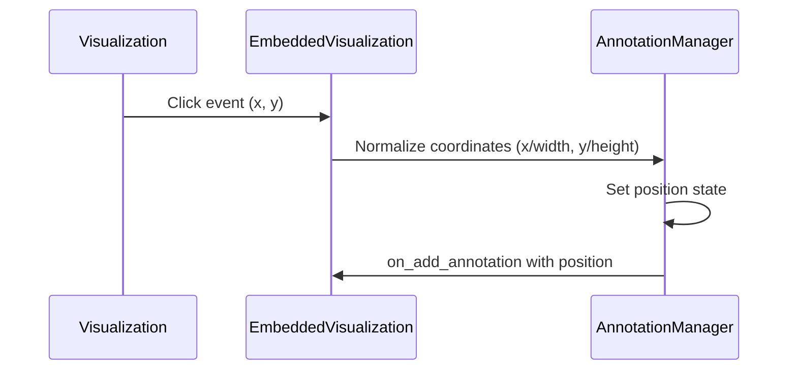

# Annotation Positioning System Architecture

## Overview
Implements coordinate system for annotations relative to visualizations.

## Coordinate System
- (0,0) = Top-left corner of visualization
- (1,1) = Bottom-right corner of visualization
- Coordinates stored as (x: f32, y: f32)

## Component Interaction


## Data Structure Update
```rust
pub struct Annotation {
    // Existing fields...
    pub position: Option<(f32, f32)>, // Normalized coordinates
}
```

## UI Flow
1. User clicks visualization
2. Coordinates captured and normalized
3. Annotation form appears with prefilled position
4. User adds comment and submits