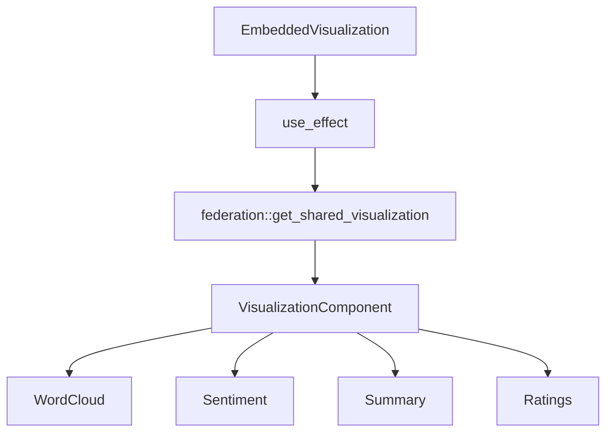

# Embedded Visualization Rendering Architecture

## Overview
Enhances EmbeddedVisualization to render actual visualizations instead of placeholders. Passes visualization data through federation.

## Component Diagram


## Data Flow
1. Component receives share_id prop
2. On mount, fetches visualization data via federation service
3. Renders appropriate visualization based on visualization_type
4. Passes data to visualization component

## Interface Changes
```rust
pub struct EmbeddedVisualizationProps {
    // Existing props...
    pub data: Option<Vec<Review<Product>>>, // Visualization data
    pub loading: bool, // Data loading state
}
```

## Error Handling
- Show loading indicator during data fetch
- Display error message if fetch fails
- Fallback to placeholder on error