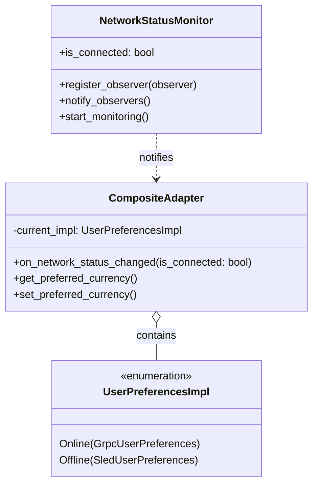
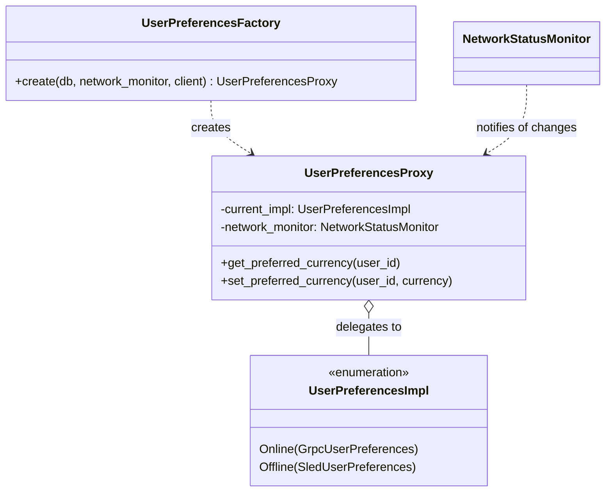
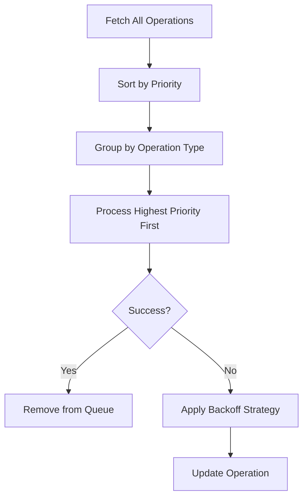

# Composite Adapter & Sync Queue Architectural Improvements

## Executive Summary

This document outlines architectural improvements for our composite adapter pattern and synchronization queue system. These enhancements address critical issues in our offline-first architecture to create a more resilient, maintainable, and user-friendly experience for our CPC platform. The improvements focus on network resilience, error handling, and fault tolerance - essential for our mission of connecting people in areas with unreliable connectivity.

## 1. Composite Adapter Refactor

### Problem Analysis

The current composite adapter implementation has several critical issues:

1. **Network State Handling**: 
   - No automatic response to network status changes
   - Manual intervention required when network connectivity is restored
   - Users experience delays between connectivity restoration and service availability

2. **Error Handling**:
   - Basic fallback mechanism without proper error chaining
   - Original error context is lost during fallback
   - Impossible state handling in `set_offline_preference()` creates confusing code paths

3. **Design Issues**:
   - Dead code paths that handle "should never happen" scenarios
   - Documentation focuses on what the code does rather than why it's designed that way
   - Limited observability into network status transitions

### Proposed Solution

#### Network State Change Handling (Observer Pattern)

We'll implement a robust observer pattern to handle network status changes:



**Key Implementation Details:**
- `NetworkStatusMonitor` will track connectivity state and notify observers
- `CompositeAdapter` will implement `NetworkStatusObserver` trait
- Automatic switching between implementations when network status changes
- Graceful degradation when connection is lost
- Connection restoration triggers immediate switch to online services

#### Error Chaining Improvements

We'll implement proper error chaining using the `thiserror` crate:

```rust
#[derive(Error, Debug)]
pub enum PreferencesError {
    #[error("Online service failure while setting currency")]
    OnlineFailure(#[from] GrpcError),
    
    #[error("Offline storage failure while setting currency")]
    OfflineFailure(#[from] SledError),
    
    #[error("Both services failed: online ({online}), offline ({offline})")]
    DualFailure {
        online: Box<GrpcError>,
        offline: Box<SledError>,
    },
}
```

This approach:
- Preserves original error context through the chain
- Provides clear error semantics for consumers
- Enables better error handling at higher levels
- Supports detailed logging without losing information

#### Code Simplification

Remove the impossible state handling from `set_offline_preference`:

```rust
impl UserPreferencesImpl {
    /// Directly set preference in offline storage
    async fn set_offline_preference(
        &self,
        user_id: Uuid,
        currency: Currency
    ) -> Result<(), String> {
        match self {
            UserPreferencesImpl::Offline(service) => 
                service.set_preferred_currency(user_id, currency).await,
            _ => Err("Cannot set offline preference directly".into()),
        }
    }
}
```

#### Documentation Improvements

Enhanced module documentation will explain:

1. The strategic decision to prioritize network responsiveness over strict consistency
2. How the fallback mechanism ensures user actions aren't lost during connectivity issues
3. Error handling philosophy and expected recovery patterns
4. How this implementation supports our cooperative values by ensuring access for all users

## 2. Factory Pattern Improvements

### Problem Analysis

The current factory implementation has architectural issues:

1. **User ID Dependency**:
   - Factory takes user_id parameter which violates factory pattern principles
   - Creates unnecessary coupling between factory and user context
   - Prevents reuse of factory instances across users

2. **Static Implementation**:
   - Created instance doesn't react to network changes
   - Requires manual recreation when network status changes
   - Leads to stale references in long-running applications

3. **Limited Documentation**:
   - Doesn't explain the factory's role in the larger architecture
   - No guidance on proper usage patterns
   - Missing rationale for design decisions

### Proposed Solution

#### Remove User ID from Factory

Factories should create generic service instances, not user-specific ones. User context belongs at the operation level:

```rust
// BEFORE
let preferences = UserPreferencesFactory::create(db, network_monitor, client, user_id);

// AFTER
let preferences = UserPreferencesFactory::create(db, network_monitor, client);
let result = preferences.set_preferred_currency(user_id, currency).await;
```

#### Reactive Network Handling

Implement a dynamic proxy pattern that automatically switches implementations:



**Key Implementation Details:**
- Factory creates a `UserPreferencesProxy` that handles dynamic switching
- Proxy implements `NetworkStatusObserver` trait
- All operations route through the proxy which delegates to the appropriate implementation
- Network status changes trigger immediate implementation switching

#### Documentation Improvements

Enhanced documentation will clearly explain:

1. The factory's responsibility: creating dynamic service proxies
2. How the proxy pattern enables reactive behavior
3. Proper usage patterns (no need to recreate when network changes)
4. How this supports our cooperative principles by ensuring seamless connectivity

## 3. Sync Queue Enhancements

### Problem Analysis

The current sync queue implementation has several limitations:

1. **No Prioritization**:
   - All operations processed in FIFO order regardless of importance
   - Critical operations (like payments) treated the same as preferences
   - No ability to prioritize user-facing actions over background tasks

2. **Basic Retry Mechanism**:
   - Simple attempt counter without backoff strategy
   - Can overwhelm services with repeated rapid retries
   - No consideration for network recovery patterns

3. **Fragile Processing**:
   - Processing stops on first error
   - Entire queue blocked by single problematic operation
   - No isolation between operations

4. **Limited Conflict Resolution**:
   - Trait exists but no default implementation
   - No guidance on conflict resolution strategies
   - Implementation burden on consumers

5. **Storage Coupling**:
   - Hard dependency on Sled database
   - Impossible to substitute alternative storage
   - Limits deployment options

### Proposed Solution

#### Operation Prioritization System

Add priority levels to operations with configurable rules:

```rust
#[derive(Debug, Clone, Serialize, Deserialize, PartialEq, Eq, PartialOrd, Ord)]
pub enum OperationPriority {
    Critical = 100,  // Payments, security-critical actions
    High = 75,       // User-facing actions
    Medium = 50,     // Background sync
    Low = 25,        // Analytics, non-critical data
}

#[derive(Debug, Clone, Serialize, Deserialize)]
pub enum SyncOperation {
    SetCurrency {
        user_id: Uuid,
        currency: Currency,
        priority: OperationPriority,
        // other fields...
    },
    // other operation types...
}
```

**Processing Strategy:**


#### Exponential Backoff with Jitter

Implement a more sophisticated retry strategy:

```rust
pub trait BackoffStrategy {
    fn next_delay(&self, operation: &SyncOperation) -> Duration;
}

pub struct ExponentialBackoff {
    base_delay: Duration,
    max_delay: Duration,
    jitter_factor: f64,
}

impl BackoffStrategy for ExponentialBackoff {
    fn next_delay(&self, operation: &SyncOperation) -> Duration {
        let attempts = operation.attempts() as f64;
        let base = self.base_delay.as_millis() as f64;
        let max = self.max_delay.as_millis() as f64;
        
        // Exponential growth with jitter
        let delay = base * 2f64.powf(attempts);
        let jitter = rand::random::<f64>() * self.jitter_factor * delay;
        
        Duration::from_millis(
            ((delay + jitter).min(max)) as u64
        )
    }
}
```

#### Fault-Tolerant Processing

Make queue processing resilient to individual operation failures:

```rust
pub async fn process<T>(&self, client: &T) -> Result<ProcessingSummary, String> 
where
    T: UserPreferencesClient,
{
    let mut summary = ProcessingSummary::new();
    
    for result in self.storage.get_all()? {
        let (key, operation) = result;
        
        match self.attempt_sync(&operation, client).await {
            Ok(_) => {
                self.storage.remove(&key)?;
                summary.successful.push(operation);
            }
            Err(e) => {
                if self.should_retry(&operation) {
                    let next_attempt = self.backoff_strategy.next_delay(&operation);
                    self.storage.schedule_for_retry(&key, &operation, next_attempt)?;
                    summary.retried.push((operation, next_attempt));
                } else {
                    self.storage.mark_as_failed(&key, &operation)?;
                    summary.failed.push(operation);
                }
            }
        }
    }
    
    Ok(summary)
}
```

#### Default Conflict Resolution

Provide a sensible default implementation:

```rust
/// Default conflict resolution using timestamp-based "last write wins"
pub struct TimestampConflictResolver;

impl ConflictResolution for TimestampConflictResolver {
    fn resolve_conflict(
        &self, 
        local: &StoredPreference, 
        remote: &StoredPreference
    ) -> ResolutionResult {
        if local.timestamp > remote.timestamp {
            ResolutionResult::UseLocal
        } else if remote.timestamp > local.timestamp {
            ResolutionResult::UseRemote
        } else {
            // Same timestamp, prefer local for user-facing actions
            ResolutionResult::UseLocal
        }
    }
    
    fn resolution_policy(&self) -> ResolutionPolicy {
        ResolutionPolicy::LastWriteWins
    }
}

/// Result of conflict resolution
pub enum ResolutionResult {
    UseLocal,
    UseRemote,
    Merge(Box<dyn Any>), // For complex merge scenarios
}
```

#### Storage Abstraction

Create a clean separation between queue logic and storage:

```rust
pub trait QueueStorage: Send + Sync {
    fn enqueue(&self, operation: SyncOperation) -> Result<QueueKey, QueueError>;
    fn dequeue_ready(&self) -> Result<Vec<(QueueKey, SyncOperation)>, QueueError>;
    fn mark_as_processing(&self, key: &QueueKey) -> Result<(), QueueError>;
    fn complete(&self, key: &QueueKey) -> Result<(), QueueError>;
    fn schedule_retry(&self, key: &QueueKey, operation: &SyncOperation, next_attempt: SystemTime) 
        -> Result<(), QueueError>;
    fn get_failed_operations(&self) -> Result<Vec<(QueueKey, SyncOperation)>, QueueError>;
    fn clear_failed(&self) -> Result<(), QueueError>;
}

// Implement for Sled
pub struct SledQueueStorage {
    db: Db,
}

impl QueueStorage for SledQueueStorage {
    // Implementation details...
}

// Could also implement for other backends
pub struct SqliteQueueStorage { /* ... */ }
pub struct MemoryQueueStorage { /* ... */ }
```

## 4. Testing Strategy

### Problem Analysis

Current testing coverage is insufficient:

1. Only basic enqueue operation tested
2. No simulation of network failure scenarios
3. No tests for conflict resolution logic
4. No verification of retry/backoff behavior
5. No testing of error recovery scenarios

### Proposed Testing Matrix

| Test Category | Test Scenario | Verification Points | Priority |
|---------------|---------------|---------------------|----------|
| **Basic Functionality** | Enqueue operation | Operation appears in queue, correct serialization | P0 |
|  | Dequeue operation | Operation removed after successful processing | P0 |
|  | Multiple operations | All operations processed in correct order | P1 |
| **Error Handling** | Operation fails once | Operation retried, attempt count incremented | P0 |
|  | Operation fails max retries | Marked as failed, not retried again | P0 |
|  | Storage failure | Queue recovers when storage restored | P1 |
| **Network Simulation** | Network disconnects during processing | Queue gracefully handles interruption | P0 |
|  | Intermittent connectivity | Operations processed when connectivity restored | P0 |
|  | Network flapping | Queue doesn't get stuck in retry loops | P1 |
| **Conflict Resolution** | Local & remote changes | Default resolver picks correct version | P1 |
|  | Timestamp conflicts | Resolution based on most recent change | P1 |
|  | Custom resolver implementation | Custom resolver invoked correctly | P2 |
| **Performance** | Large queue processing | Memory usage remains stable | P2 |
|  | High priority processing | Critical operations processed first | P1 |
|  | Backoff strategy | Retry delays follow expected pattern | P1 |

### Mock Implementation Strategy

Create a comprehensive network fault simulation framework:

```rust
/// Mock client that simulates various network conditions
pub struct NetworkFaultMockClient {
    /// Pattern of successes/failures (true = success, false = failure)
    failure_pattern: Vec<bool>,
    current_index: AtomicUsize,
    /// Timestamp of last successful operation
    last_success: Mutex<Option<SystemTime>>,
    /// Record of all operations attempted
    operation_history: Mutex<Vec<OperationRecord>>,
}

impl NetworkFaultMockClient {
    pub fn new(failure_pattern: Vec<bool>) -> Self {
        Self {
            failure_pattern,
            current_index: AtomicUsize::new(0),
            last_success: Mutex::new(None),
            operation_history: Mutex::new(Vec::new()),
        }
    }
    
    /// Create a client that fails randomly with specified probability
    pub fn with_random_failure_rate(failure_probability: f64) -> Self {
        // Generate random pattern
    }
    
    /// Create a client that fails for specified duration
    pub fn with_temporary_failure(duration: Duration) -> Self {
        // Create pattern with initial failures followed by successes
    }
}

#[async_trait]
impl UserPreferencesClient for NetworkFaultMockClient {
    async fn set_preferred_currency(
        &self, 
        user_id: Uuid, 
        currency: Currency
    ) -> Result<(), String> {
        let index = self.current_index.fetch_add(1, Ordering::SeqCst);
        let pattern_index = index % self.failure_pattern.len();
        let success = self.failure_pattern[pattern_index];
        
        // Record operation
        self.operation_history.lock().unwrap().push(OperationRecord {
            timestamp: SystemTime::now(),
            user_id,
            currency,
            success,
        });
        
        if success {
            *self.last_success.lock().unwrap() = Some(SystemTime::now());
            Ok(())
        } else {
            Err("Network error".to_string())
        }
    }
}
```

### Test Cases Implementation

**Test Case: Retry with Backoff Strategy**

```rust
#[tokio::test]
async fn test_retry_with_backoff() {
    // Setup
    let temp_dir = TempDir::new().unwrap();
    let db = sled::open(temp_dir.path()).unwrap();
    let storage = SledQueueStorage::new(&db).unwrap();
    let backoff = ExponentialBackoff::new(
        Duration::from_millis(100),
        Duration::from_secs(5),
        0.25
    );
    
    // Create operation that fails 3 times then succeeds
    let client = NetworkFaultMockClient::new(vec![false, false, false, true]);
    let queue = SyncQueue::new(
        Box::new(storage),
        Arc::new(TimestampConflictResolver),
        Box::new(backoff)
    );
    
    // Enqueue operation
    let user_id = Uuid::new_v4();
    queue.enqueue(SyncOperation::SetCurrency {
        user_id,
        currency: Currency::USD,
        priority: OperationPriority::High,
        attempts: 0,
        scheduled_at: SystemTime::now(),
    }).unwrap();
    
    // Process queue
    let summary = queue.process(&client).await.unwrap();
    
    // Verify
    assert_eq!(summary.successful.len(), 1);
    assert_eq!(summary.retried.len(), 3);
    
    // Check backoff timing
    let history = client.get_operation_history();
    assert!(history[1].timestamp.duration_since(history[0].timestamp).unwrap() > 
           Duration::from_millis(100));
    assert!(history[2].timestamp.duration_since(history[1].timestamp).unwrap() > 
           Duration::from_millis(200));
}
```

**Test Case: Priority-Based Processing**

```rust
#[tokio::test]
async fn test_priority_processing() {
    // Setup
    let temp_dir = TempDir::new().unwrap();
    let db = sled::open(temp_dir.path()).unwrap();
    let storage = SledQueueStorage::new(&db).unwrap();
    
    // Create client that always succeeds
    let client = NetworkFaultMockClient::new(vec![true]);
    let queue = SyncQueue::new(
        Box::new(storage),
        Arc::new(TimestampConflictResolver),
        Box::new(ExponentialBackoff::default())
    );
    
    // Enqueue mixed priority operations
    let user_id = Uuid::new_v4();
    
    // Critical priority
    queue.enqueue(SyncOperation::SetCurrency {
        user_id,
        currency: Currency::BTC,
        priority: OperationPriority::Critical,
        // other fields...
    }).unwrap();
    
    // Low priority
    queue.enqueue(SyncOperation::SetCurrency {
        user_id,
        currency: Currency::USD,
        priority: OperationPriority::Low,
        // other fields...
    }).unwrap();
    
    // Process queue
    let summary = queue.process(&client).await.unwrap();
    
    // Verify critical operations processed first
    assert_eq!(summary.successful[0].operation_type(), "SetCurrency(BTC)");
    assert_eq!(summary.successful[1].operation_type(), "SetCurrency(USD)");
}
```

## Implementation Plan

### Phase 1: Core Infrastructure (Week 1)
1. Implement NetworkStatusMonitor and observer pattern
2. Create QueueStorage trait and Sled implementation
3. Design and implement BackoffStrategy trait
4. Develop NetworkFaultMockClient framework

### Phase 2: Composite Adapter Refactor (Week 2)
1. Remove dead code from composite adapter
2. Implement proper error chaining
3. Add network state observation
4. Update documentation

### Phase 3: Sync Queue Enhancements (Week 3)
1. Implement operation prioritization
2. Add exponential backoff with jitter
3. Make processing fault-tolerant
4. Create default conflict resolution

### Phase 4: Testing & Validation (Week 4)
1. Implement comprehensive test suite
2. Verify all edge cases
3. Performance testing
4. Documentation updates

## Conclusion

These architectural improvements will transform our offline synchronization capabilities from a basic fallback mechanism to a robust, resilient system that aligns with our cooperative values. By prioritizing network resilience and user experience, we're building infrastructure that works for everyone - especially those in areas with unreliable connectivity. The proposed changes maintain our commitment to open collaboration while delivering practical value to our users through reliable service even in challenging network conditions.

These enhancements directly support our mission of creating software that strengthens communities through connectivity, utility, and collaboration - ensuring that our platform remains accessible to all users regardless of their network conditions.