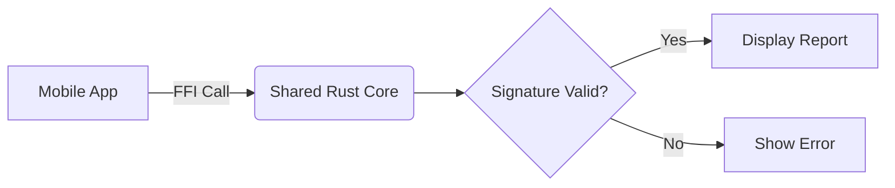

# 5. Cryptographic Signature for Impact Reports

## Status
Proposed

## Context
Impact reports contain critical data about user activities and their measured impacts. To ensure:
1. Data integrity - reports haven't been altered
2. Authenticity - reports originate from our system
3. Non-repudiation - prevent denial of report creation

We need a cryptographic signature system that:
- Signs reports upon creation
- Allows verification by any party
- Works with our existing infrastructure

## Decision
### Cryptographic Algorithm
Use Ed25519 for digital signatures because:
- High performance (fast signing/verification)
- Small signature size (64 bytes)
- Built-in resistance to side-channel attacks
- Supported by Rust's `ed25519-dalek` crate (MIT licensed)

### Key Management
- **Server Keypair**: Single Ed25519 keypair per deployment
- **Storage**: Private key in environment variable (`IMPACT_SIGNING_KEY`)
- **Rotation**: Quarterly key rotation with grace period for verification

### Signature Generation
1. When: During report creation in `ImpactCalculator::calculate_impact`
2. What to sign: Canonical JSON representation of:
   ```json
   {
     "id": "report_uuid",
     "user_id": "user_uuid",
     "period_start": "ISO8601",
     "period_end": "ISO8601",
     "overall_score": 123.45,
     "category_distribution": {
       "Environmental": 40.0,
       "Social": 50.0,
       "Economic": 33.45
     }
   }
   ```
3. Process:
   - Serialize report (excluding signature field) with sorted keys
   - Sign with server private key
   - Store base64-encoded signature in report

### Signature Verification
1. When: 
   - Before serving reports via gRPC
   - On client side when reports are displayed
2. Process:
   - Recreate canonical JSON from report fields
   - Verify signature using server public key
   - Handle invalid signatures as security events

### Mobile Client Verification
To enable verification on mobile devices:
- Implement Foreign Function Interface (FFI) in shared Rust core
- Mobile apps call `verify_impact_report_signature` via FFI
- Public key is fetched from GraphQL endpoint (`impactPublicKey`)
- Verification occurs locally on device for zero-trust validation



### Integration Points
1. Add `sign_report` method to `ImpactCalculator`
2. Add signature verification middleware to gRPC handlers
3. Create public key GraphQL query (`impactPublicKey`)
4. Implement FFI for verification in shared Rust core
5. Create mobile-native wrappers for FFI functions

## Consequences
### Benefits
- End-to-end data integrity verification
- Tamper-evident reports
- Compatible with regulatory requirements

### Risks
- Key compromise requires rotation and re-signing
- Added computational overhead for signing
- Signature bloat (64 bytes per report)
- Added mobile development effort for FFI integration

### Security Considerations
- Private key must be properly secured
- Implement key rotation procedure
- Monitor verification failures