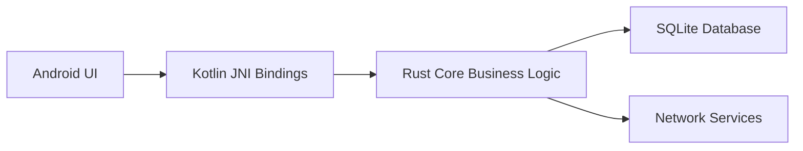

# ADR-001: Android-Rust Data Flow

## Context
The Android app requires efficient data exchange with Rust core business logic while maintaining privacy and performance. Current implementation in `apps/cpc-platform/src-tauri` demonstrates Rust-native data handling that needs adaptation for Android.

## Decision
1. Use Protocol Buffers for serialization between Android and Rust layers
2. Implement async channels using p2panda for inter-process communication
3. Apply zero-copy techniques for large data transfers (images, media)
4. Use SQLx with SQLite for local data persistence, sharing schema with desktop version

## Consequences
- ✅ Type-safe interface via Protobuf
- ✅ Efficient binary serialization
- ✅ Shared database schema across platforms
- ⚠️ Adds protobuf dependency to build chain
- ⚠️ Requires careful memory management at JNI boundary