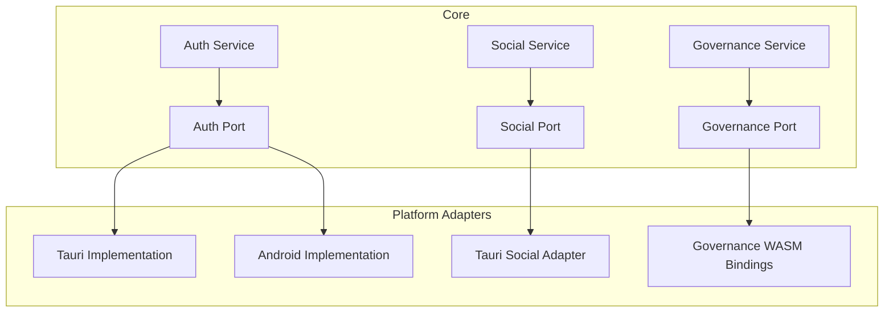

# ADR-002: Shared Business Logic

## Context
Business logic for authentication, social features, and governance is duplicated across platforms. The `cpc-core` package needs to encapsulate reusable business logic following hexagonal architecture principles.

## Decision
1. Create domain-centric modules in `packages/cpc-core`:
   - `auth`: Authentication and permissions
   - `social`: Social graph and activity feeds
   - `governance`: Cooperative decision-making
2. Implement ports and adapters pattern:
   - Define traits for external services (Database, Network)
   - Provide platform-specific implementations (Tauri, Android)
3. Use async Rust with tokio for concurrent operations
4. Share data structures via `cpc-protos` gRPC definitions

## Consequences
- ✅ Single source of truth for business rules
- ✅ Easier cross-platform consistency
- ✅ Decoupled from UI frameworks
- ⚠️ Requires careful abstraction design
- ⚠️ Initial development overhead