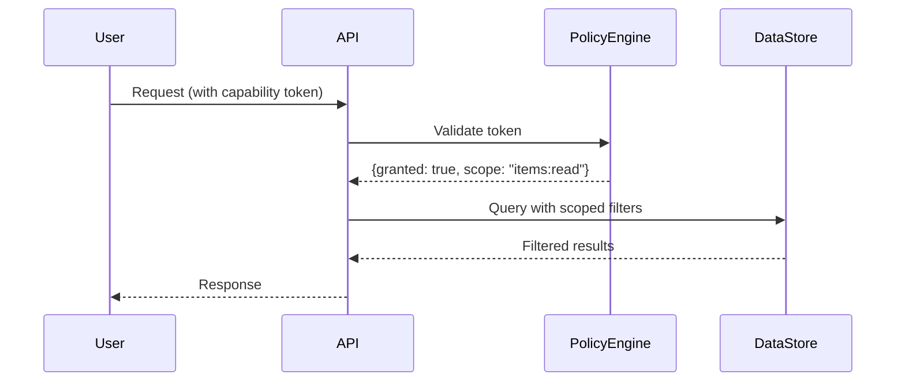

# ADR-003: Permissioned Data Access

## Context
User data must be protected with fine-grained access controls while enabling cooperative workflows. Existing implementations in `auth.rs` and `governance.rs` provide role-based controls that need enhancement for enterprise use.

## Decision
1. Implement capability-based access control (CapBAC) with:
   - JWT-based capability tokens
   - Resource-centric permissions (view, edit, share)
   - Expiring tokens for sensitive operations
2. Extend SQLx queries with row-level security:
   ```rust
   // Example from governance.rs
   async fn get_visible_items(user: &User) -> Result<Vec<Item>> {
       sqlx::query_as!(
           Item,
           "SELECT * FROM items WHERE visibility <= ?",
           user.clearance_level
       )
       .fetch_all(&pool)
       .await
   }
   ```
3. Use Bevy's ECS for real-time permission checks in game environments
4. Store capability tokens in secure enclaves on mobile devices



## Consequences
- ✅ Fine-grained access control
- ✅ Decentralized permission management
- ✅ Audit trails via token signatures
- ⚠️ Complex token revocation mechanism
- ⚠️ Requires secure storage on devices