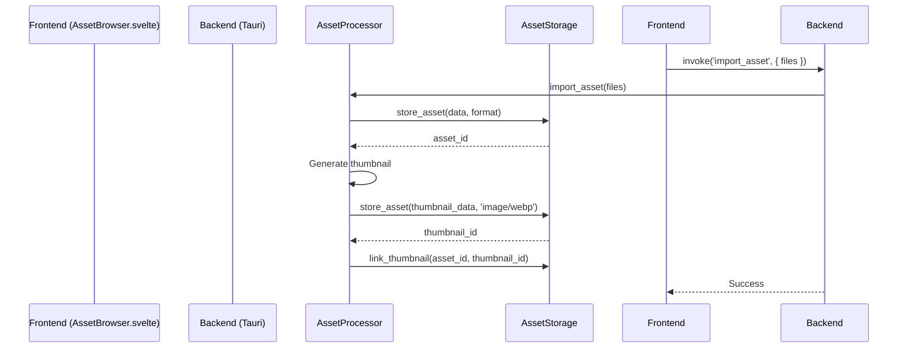
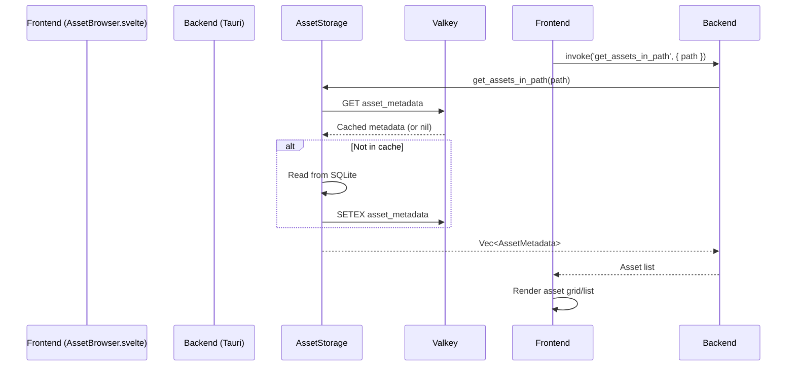
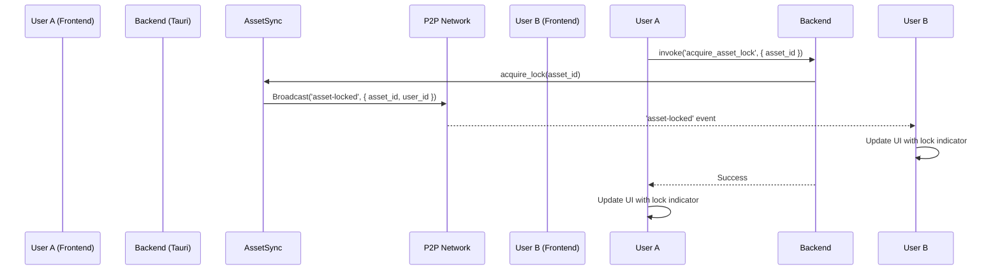

# Asset Management UI Integration Architecture

This document outlines the architectural design for the advanced asset management features in the CPC Studio editor. It covers the frontend-backend integration for thumbnail display, version history, and collaborative locking, reflecting the current implementation.

## 1. Overview

The architecture leverages Tauri-based communication between the Svelte frontend and the Rust backend. The backend's asset management system is built on Bevy, SQLite for metadata, and Valkey for caching. The system is designed to be extensible and robust, supporting real-time collaboration.

## 2. System Components

The asset management system is composed of several key components, each with a specific responsibility.

### 2.1. Backend (Rust)

*   **`AssetManager` (`asset_manager/mod.rs`):** The main entry point for asset management, coordinating the other backend components.
*   **`AssetProcessor` (`asset_manager/asset_processor.rs`):** Handles asset processing, including thumbnail generation and metadata extraction. It uses an async queue to manage long-running tasks.
*   **`AssetStorage` (`asset_manager/asset_storage.rs`):** A content-addressable storage system that uses SQLite for metadata and a local directory for asset files. It also integrates with Valkey for caching.
*   **`BevyAssetBridge` (`asset_manager/bevy_asset_bridge.rs`):** Integrates our custom asset management system with Bevy's asset server, allowing assets to be loaded and used within the Bevy environment.
*   **`AssetSync` (`asset_manager/asset_sync.rs`):** Manages real-time synchronization of asset metadata and lock states between peers using our P2P network.
*   **Tauri Commands:** A set of Rust functions exposed to the frontend for performing asset-related operations (e.g., `get_assets_in_path`, `import_asset`, `acquire_asset_lock`).

### 2.2. Frontend (Svelte)

*   **`AssetBrowser.svelte`:** The primary UI for browsing, searching, and managing assets. It displays assets in a grid or list view and provides controls for importing, creating folders, and locking/unlocking.
*   **`InspectorPanel.svelte`:** Displays detailed metadata for a selected asset and allows for editing properties. It also handles conflict resolution when concurrent edits occur.
*   **`VersionHistoryViewer.svelte`:** A dedicated component for viewing the version history of an asset, allowing users to preview, restore, and compare different versions.
*   **`AssetPreview.svelte`:** Renders a preview of the selected asset, with support for images, 3D models (via Three.js), and audio.

## 3. Data Flow and Sequence Diagrams

The following diagrams illustrate the data flow for key asset management operations.

### 3.1. Asset Upload and Processing



### 3.2. Asset Retrieval and Display



### 3.3. Asset Locking



## 4. Svelte Component Structure

```
src/
└── svelte/
    └── src/
        └── editor/
            ├── components/
            │   ├── AssetBrowser.svelte
            │   ├── InspectorPanel.svelte
            │   ├── CollaboratorCursor.svelte
            │   ├── VersionHistoryViewer.svelte
            │   └── AssetPreview.svelte
            └── +page.svelte
```

## 5. State Management

*   **`assetStore.js`:**
    *   `currentPath`: A writable store for the current path in the asset browser.
    *   `assets`: A writable store holding the list of assets (`AssetMetadata`) for the `currentPath`. This is the reactive source for the asset grid/list.
    *   `selectedAsset`: A writable store for the currently selected asset.
*   **Event Handling:**
    *   A central event handler listens for Tauri events (`asset-locked`, `asset-unlocked`, `asset-updated`) and updates the `assets` store accordingly. This ensures the UI is always in sync with the backend state.

This architecture provides a robust and scalable foundation for the new asset management features. It builds upon the existing systems while introducing new capabilities in a structured manner.