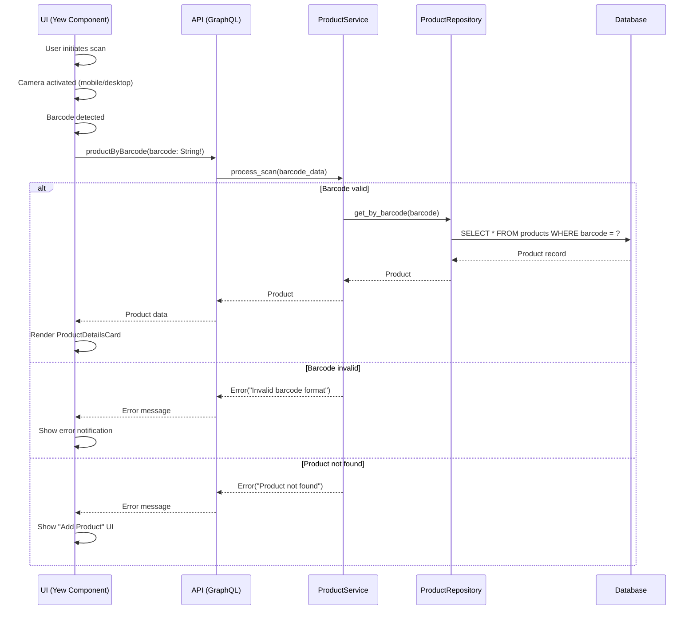

# Barcode Processing Flow

## Overview
This document details the workflow from barcode scanning to product information display, including error handling scenarios and data flow between UI, API, and services.

## Workflow Sequence

## Step-by-Step Description

1. **Scan Initiation**:
   - User launches product scanner in mobile/desktop app
   - Camera component activates using platform-specific APIs (Tauri for desktop, Capacitor for mobile)

2. **Barcode Detection**:
   - Camera feed processed by ZBar or similar library
   - Valid formats: EAN-13, UPC-A, QR codes
   - On detection, barcode value captured with format metadata

3. **API Request**:
   - UI sends GraphQL query: `productByBarcode(barcode: String!)`
   - Query includes scanned barcode value
   - Request authenticated via JWT in header

4. **Service Processing**:
   - ProductService validates barcode format
   - Queries ProductRepository for matching product
   - If no match, returns "Product not found" error
   - If invalid format, returns "Invalid barcode" error

5. **Database Lookup**:
   - Repository executes SQL query: `SELECT * FROM products WHERE barcode = ?`
   - Includes cache check (Redis) for recently scanned items

6. **Response Handling**:
   - Success: Returns product data with 200 status
   - Error: Returns 4xx status with error code and message

7. **UI Rendering**:
   - On success: Renders ProductDetailsCard with product info
   - On "not found": Shows "Add Product" form
   - On error: Displays toast notification with error details

## Error Handling Scenarios

| Scenario | Cause | UI Response | System Action |
|----------|-------|-------------|---------------|
| Invalid barcode | Unsupported format or corrupt data | "Invalid barcode format" toast | Log error with barcode value |
| Product not found | No matching product in database | "Product not found" with "Add Product" option | Create new product draft if user chooses |
| Network failure | API unreachable | "Connection error" with retry button | Queue request for retry |
| Camera error | Permission denied or hardware issue | "Camera unavailable" message | Fallback to manual barcode entry |
| Rate limit exceeded | Too many scan requests | "Scan limit exceeded" message | Disable scanning temporarily |

## Data Flow

1. UI Layer (Yew):
   - Captures barcode data
   - Manages camera lifecycle
   - Handles user interactions

2. API Layer (Axum/GraphQL):
   - Routes requests to ProductService
   - Handles authentication
   - Formats responses

3. Service Layer (ProductService):
   - Business logic for scan processing
   - Error handling
   - Coordinates with repositories

4. Repository Layer:
   - Database operations
   - Cache management
   - Data mapping

5. Database:
   - Persistent storage of product data
   - Indexed queries on barcode field