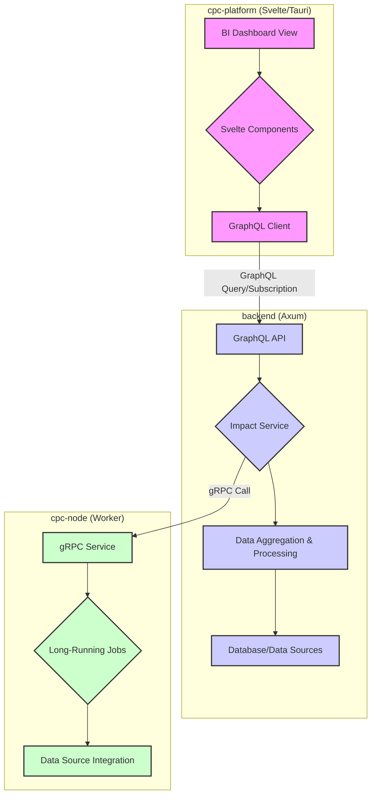

# Business Intelligence (BI) Toolkit Architectural Design

**Author:** Elias Petrova
**Date:** 2025-07-23
**Status:** Proposed

## 1. Overview

This document outlines the architectural design for a new Business Intelligence (BI) toolkit within the `cpc-platform` desktop application. The initial focus of this toolkit will be the implementation of an "Impact Report" feature, which will serve as a foundational element for future BI and data visualization capabilities.

Our design adheres to the core architectural principles of the project: Hexagonal Architecture, Screaming Architecture, and Vertical Slices. The implementation will leverage our existing tech stack, including Rust, Svelte, Tauri, and GraphQL.

## 2. Architectural Goals

-   **Modularity:** BI components should be modular and reusable across different contexts within the application.
-   **Scalability:** The architecture must support the future addition of new data sources, visualizations, and BI features with minimal friction.
-   **Performance:** The data pipeline and rendering process must be efficient to ensure a responsive user experience, even with large datasets.
-   **Maintainability:** The design should be easy to understand, maintain, and extend over time.

## 3. System Architecture Diagram



## 4. Frontend Component Structure (Svelte)

The BI toolkit's frontend will be built as a set of modular Svelte components, organized in a hierarchical structure. These components will reside within `apps/cpc-platform/src/lib/bi/`.

### 4.1. Component Hierarchy

-   `BIDashboard.svelte`: The top-level container for a BI view. It will manage the overall layout and orchestrate data fetching for its child components.
    -   `WidgetGrid.svelte`: A layout component that arranges BI widgets in a grid.
        -   `ChartWidget.svelte`: A generic widget for displaying charts. It will accept a chart type and data as props.
            -   `PieChart.svelte`: A specific chart component for pie charts.
            -   `BarChart.svelte`: A specific chart component for bar charts.
            -   `LineChart.svelte`: A specific chart component for line charts.
        -   `KpiWidget.svelte`: A widget for displaying a single Key Performance Indicator (KPI).
        -   `DataTableWidget.svelte`: A widget for displaying tabular data.

### 4.2. State Management

We will use Svelte's built-in stores to manage the state of the BI dashboard. A context-based store will be provided by `BIDashboard.svelte` to make data and loading states available to all child widgets.

## 5. Backend Integration (Rust/Axum/GraphQL)

The backend will expose BI data via its existing GraphQL API. This ensures a consistent and well-defined interface for the frontend.

### 5.1. GraphQL Schema

We will extend the GraphQL schema with types and queries for BI data. For the Impact Report, this will look something like:

```graphql
type ImpactReport {
    userId: ID!
    totalImpact: Float!
    breakdown: [ImpactBreakdown!]!
    distribution: [ImpactDistribution!]!
    timeline: [ImpactTimelinePoint!]!
}

type ImpactBreakdown {
    category: String!
    amount: Float!
    itemName: String!
    contribution: Float!
    impactScore: Float!
}

type Query {
    getImpactReport(userId: ID!): ImpactReport
}

type Subscription {
    impactReportUpdated(userId: ID!): ImpactReport
}
```

### 5.2. Data Services

The `apps/pds/src/impact.rs` will be refactored into a more generic `apps/backend/src/bi/` service module. The existing logic will be adapted to fit into a more generalized BI data retrieval pattern. The `ImpactService` will be responsible for:

1.  Receiving requests from the GraphQL layer.
2.  Aggregating data from various sources (e.g., our primary database, `cpc-node` workers).
3.  Performing any necessary calculations or transformations.
4.  Returning the data in the format defined by the GraphQL schema.

For long-running data processing tasks, the backend will delegate to `cpc-node` workers via gRPC.

## 6. Charting Library Selection

For data visualization, we need a library that is:

-   Compatible with Svelte and Tauri.
-   Permissively licensed (MIT or Apache 2.0).
-   Performant and feature-rich.

**Recommendation:** **ECharts** (via a Svelte wrapper like `svelte-echarts`).

-   **License:** Apache 2.0.
-   **Features:** A comprehensive set of chart types, extensive customization options, and good performance.
-   **Compatibility:** It renders to SVG or Canvas, making it fully compatible with Tauri's webview.

## 7. Real-time Data Pipeline

To support real-time updates on the BI dashboard, we will leverage GraphQL Subscriptions.

### 7.1. Data Flow

1.  The Svelte frontend subscribes to the `impactReportUpdated` subscription via its GraphQL client (using WebSockets).
2.  When a relevant event occurs in the backend (e.g., new data is processed), a message is published to the subscription.
3.  The frontend receives the updated data and automatically re-renders the relevant components.

### 7.2. Triggering Updates

Updates can be triggered by various events:

-   A `cpc-node` worker completes a data processing job.
-   A user action in the application generates new data.
-   A scheduled background task runs and updates aggregated data.

## 8. Implementation Plan

1.  **Phase 1: Scaffolding & Backend Setup**
    -   Create the new `apps/backend/src/bi/` module.
    -   Refactor `apps/pds/src/impact.rs` into the new BI service structure.
    -   Define the initial GraphQL schema for the Impact Report.
    -   Implement the `getImpactReport` query resolver.

2.  **Phase 2: Frontend Component Development**
    -   Create the Svelte component hierarchy under `apps/cpc-platform/src/lib/bi/`.
    -   Integrate the chosen charting library (`svelte-echarts`).
    -   Develop the `BIDashboard.svelte` and basic chart widgets.

3.  **Phase 3: Integration & Real-time**
    -   Connect the Svelte components to the GraphQL backend.
    -   Implement the GraphQL Subscription for real-time updates.
    -   Connect the backend's update mechanism to the subscription publisher.

4.  **Phase 4: Refinement & Expansion**
    -   Refine the UI/UX of the Impact Report.
    -   Add more chart types and widget options.
    -   Begin planning for the next BI feature to be integrated into the toolkit.

This architectural design provides a solid foundation for building a powerful and extensible Business Intelligence toolkit within our application.