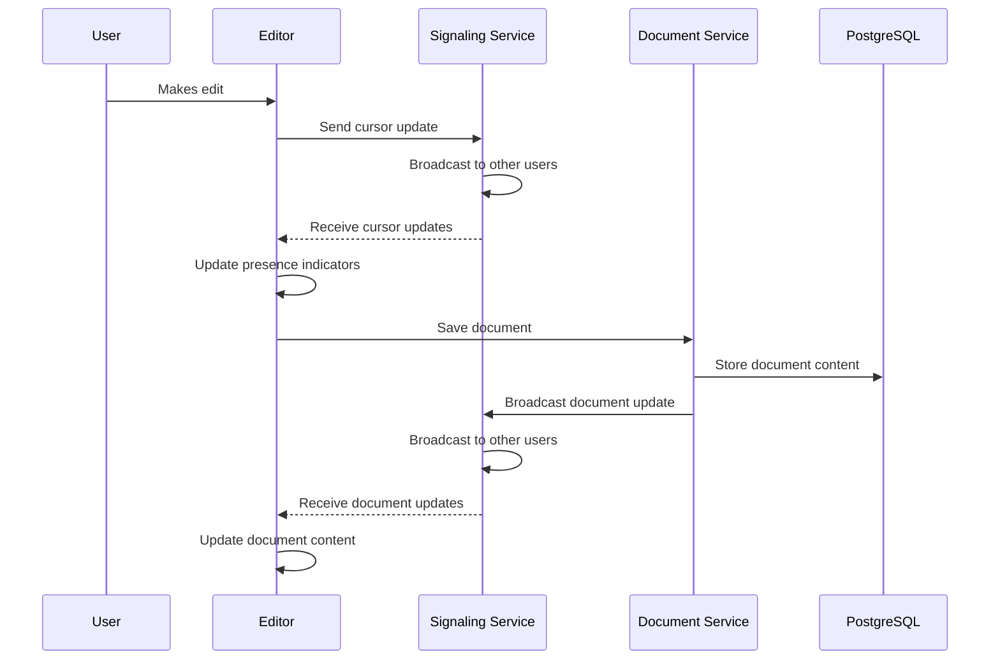
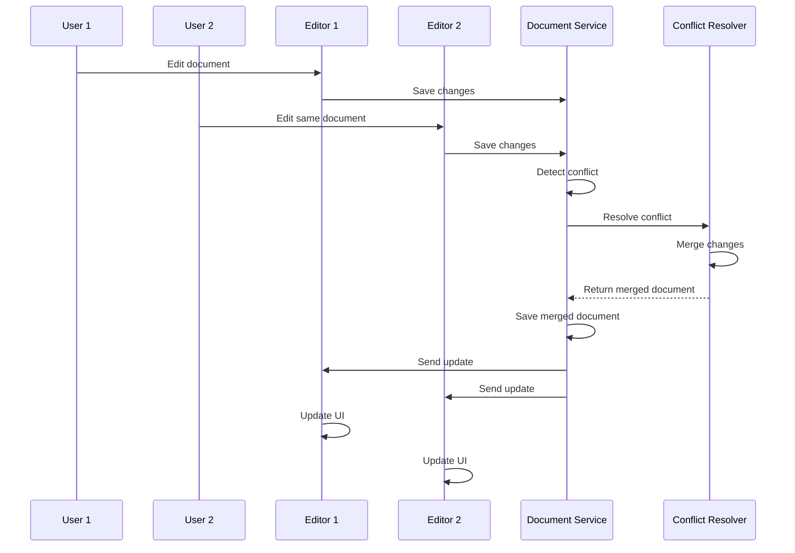
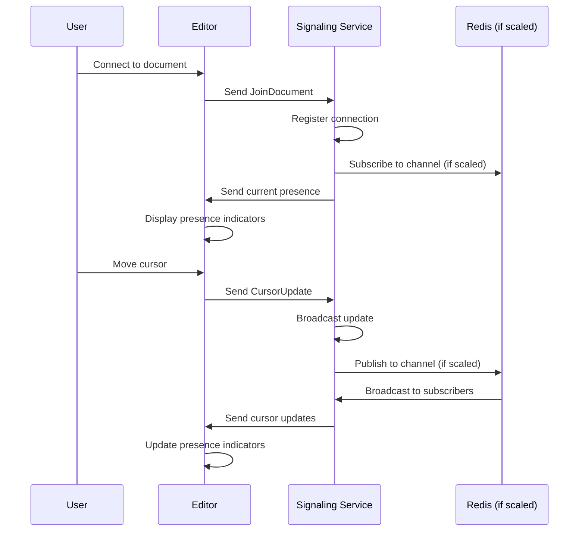

# Collaboration Flow Architecture

## Overview

This document describes the collaboration flow architecture for CPC applications, including document editing, conflict resolution, and real-time communication.

## Components

### 1. Document Editor
The document editor is the primary user interface for collaborative editing. It consists of:
- Text editor component
- Presence indicators
- Conflict resolution UI
- Real-time update handling

### 2. Collaborative Document Service
The collaborative document service handles:
- Document creation and management
- CRDT-based conflict resolution
- Version control
- Access control

### 3. Real-time Signaling Service
The signaling service manages:
- WebSocket connections
- Presence tracking
- Message broadcasting
- Horizontal scaling with Redis

### 4. Storage Layer
The storage layer includes:
- PostgreSQL for document metadata and content
- Sled for local caching
- Redis for signaling coordination

## Flow Diagrams

### Document Editing Flow



### Conflict Resolution Flow



### Presence Tracking Flow



## Data Models

### Document Metadata
```rust
struct DocumentMetadata {
    id: Uuid,
    title: String,
    owner_id: Uuid,
    created_at: DateTime<Utc>,
    updated_at: DateTime<Utc>,
    content_type: String,
    tags: Vec<String>,
    version: u64,
    visibility: Visibility,
}
```

### Document Content
```rust
struct DocumentContent {
    data: serde_json::Value,
    format: String, // e.g., "json", "markdown", "html", "crdt"
}
```

### Presence Update
```rust
struct PresenceUpdate {
    document_id: Uuid,
    user_id: Uuid,
    cursor: Option<Position>,
    selection: Option<SelectionRange>,
    is_typing: bool,
    timestamp: DateTime<Utc>,
}
```

## Conflict Resolution

### CRDT Approach
The system uses Conflict-free Replicated Data Types (CRDTs) for automatic conflict resolution:
1. Each edit is represented as an operation
2. Operations are commutative, associative, and idempotent
3. Conflicts are resolved by merging operations
4. No coordination is needed between replicas

### Manual Resolution
When automatic resolution isn't appropriate:
1. Conflict detected by document service
2. Conflict resolution UI presented to user
3. User selects resolution strategy
4. Resolved document saved

## Scalability Considerations

### Horizontal Scaling
1. Multiple signaling server instances
2. Redis pub/sub for message coordination
3. Load balancer for connection distribution
4. Shared PostgreSQL database

### Performance Optimization
1. Local caching with Sled
2. Efficient WebSocket message handling
3. Batched updates where appropriate
4. Presence update throttling

## Security Considerations

### Access Control
1. Document-level permissions
2. User authentication and authorization
3. Audit logging
4. Data encryption at rest and in transit

### Privacy
1. User presence controls
2. Document visibility settings
3. Consent-based data sharing
4. GDPR compliance