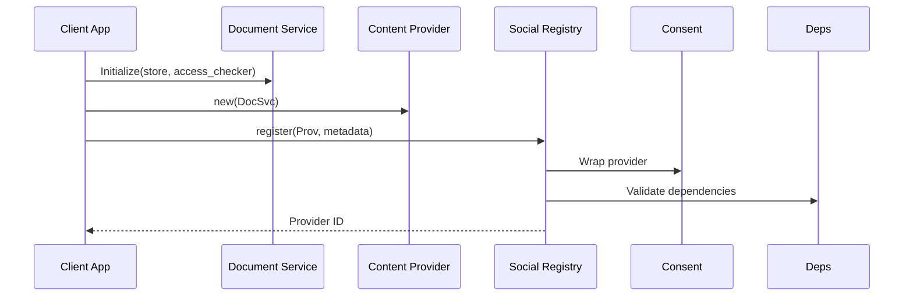
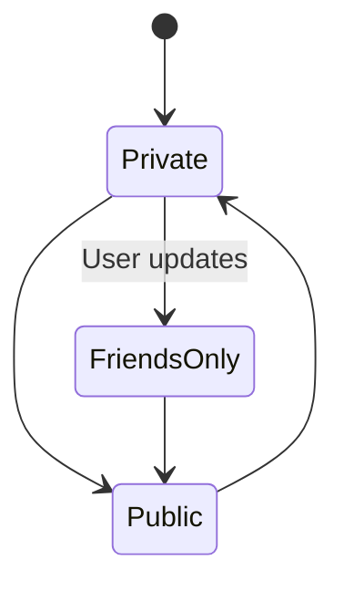
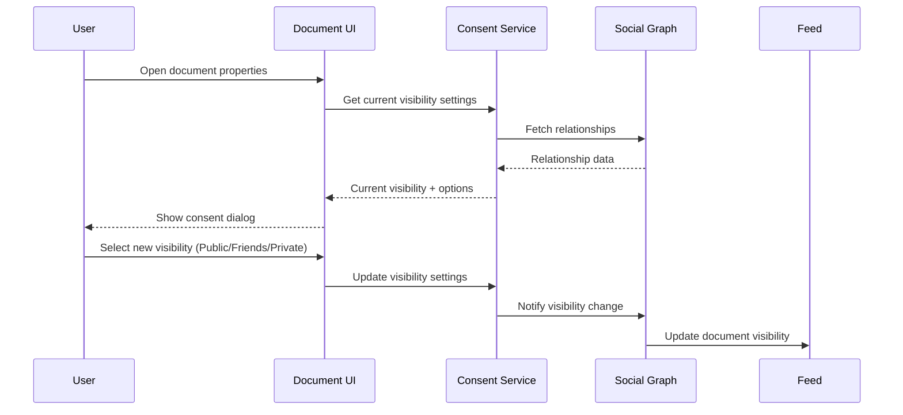
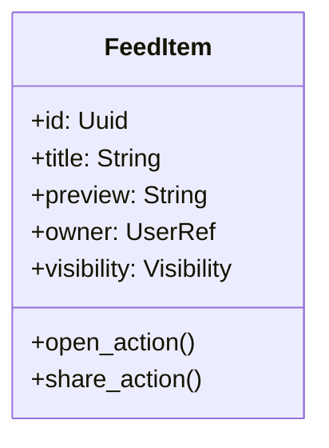
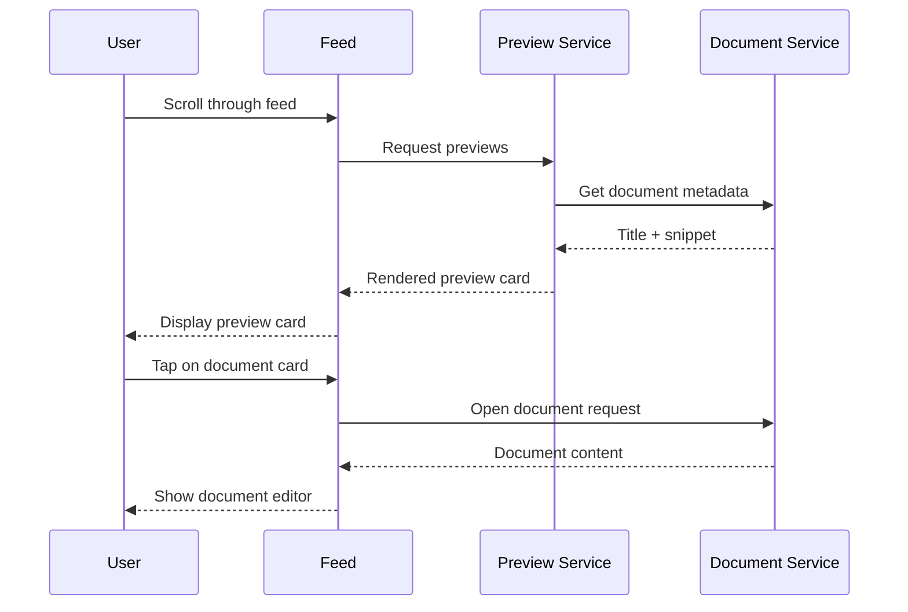
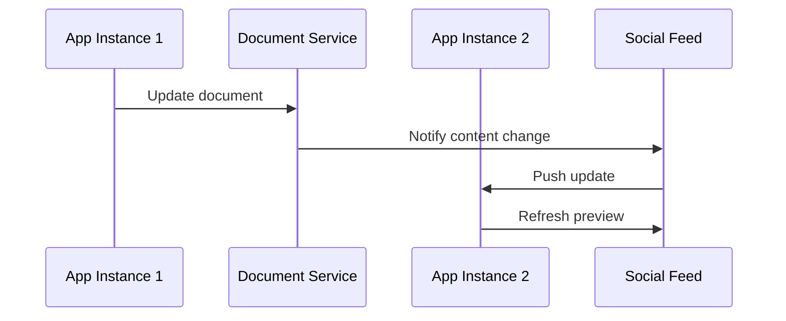
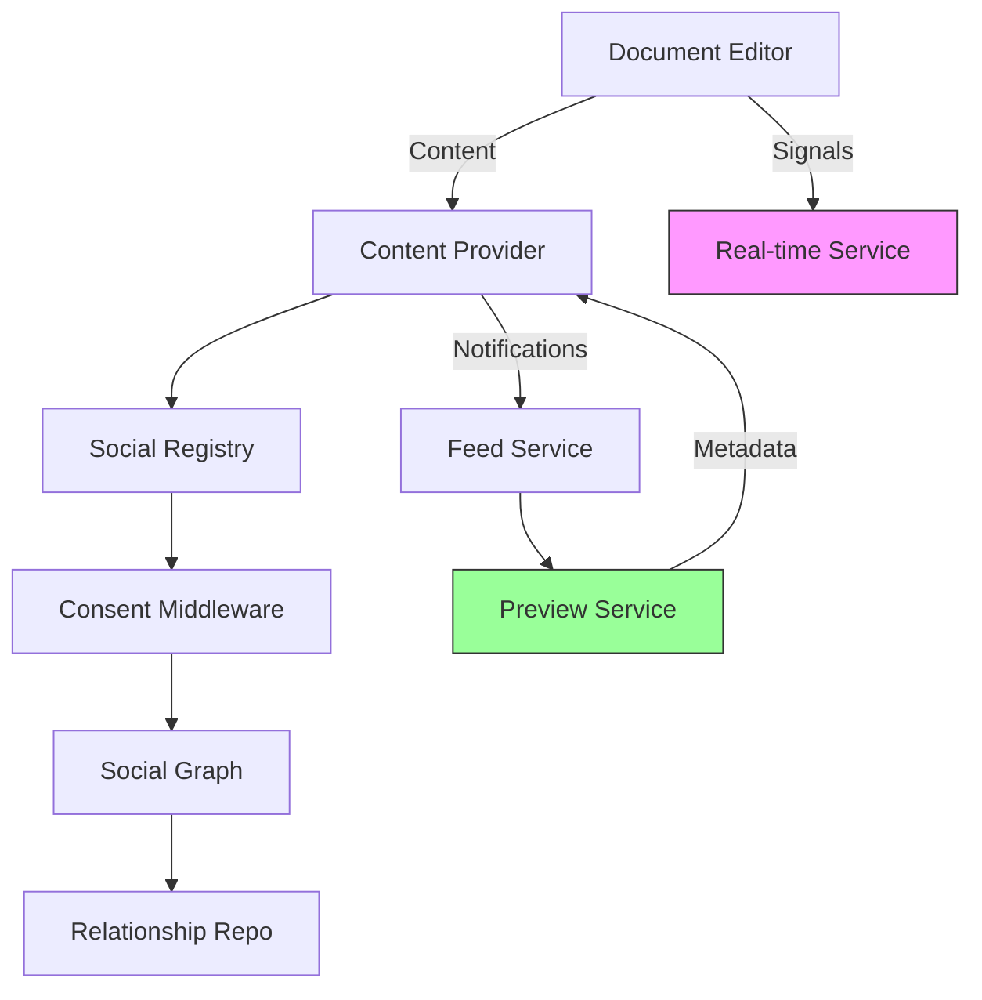

# Collaborative Documents Integration Architecture

## 1. App Integration Points

### Initialization Sequence


### Registration Locations
- **Desktop Apps**: During main window initialization
- **Web Apps**: In application bootstrapping
- **Mobile**: In app startup sequence

## 2. Consent Flow Extension

### Visibility Settings


### UI Integration Points
- Document properties panel
- Share dialog
- New document creation flow

### Consent Management Flow


### Consent UI Wireframe
```
+-------------------------------+
| Document Visibility Settings  |
|                               |
| [●] Private                   |
| [ ] Friends Only              |
| [ ] Public                    |
|                               |
| [ ] Allow comments            |
| [✓] Allow editing             |
|                               |
| [Save]      [Cancel]          |
+-------------------------------+
```

### Consent Enforcement
```rust
fn enforce_consent(item: &ContentItem, user: &User) -> bool {
    match item.visibility {
        Visibility::Public => true,
        Visibility::FriendsOnly => social_graph.are_friends(user, item.owner),
        Visibility::Private => user.id == item.owner_id,
    }
}
```

## 3. Feed Integration

### Document Previews


### Interaction Patterns
1. Feed renders document card with:
   - Title
   - First 100 characters of content
   - Owner avatar
   - Visibility indicator
2. Tap/click opens document in editor
3. Long-press shows sharing options

### Document Preview Flow


### Document Preview Wireframe
```
+-------------------------------+
| Planning Meeting Notes        |
|                               |
| Let's discuss Q3 goals...     |
| We need to finalize the...    |
|                               |
| [👤] Sarah Chen               |
| 🔒 Friends Only   📅 2h ago   |
+-------------------------------+
```

## 4. Cross-App Coordination

### Change Propagation


### Conflict Resolution
- CRDT-based merging for content
- Last-write-wins for metadata
- UI shows conflict resolution dialog when:
  - Simultaneous edits detected
  - Version mismatch occurs

### Real-time Signaling
```rust
enum CollaborationSignal {
    CursorPosition { user: Uuid, position: usize },
    SelectionRange { start: usize, end: usize },
    PresenceUpdate { user: Uuid, active: bool },
}
```

## Component Integration


### Integration Points
1. **Real-time Service (RTC)**: Handles collaboration signals between app instances
2. **Preview Service**: Generates document previews for social feeds
3. **Consent Middleware**: Enforces visibility rules for all document access
4. **Feed Service**: Distributes document updates to user feeds

## Next Steps
1. Implement UI components for consent management
2. Add feed preview rendering logic
3. Integrate real-time signaling service
4. Update documentation with examples