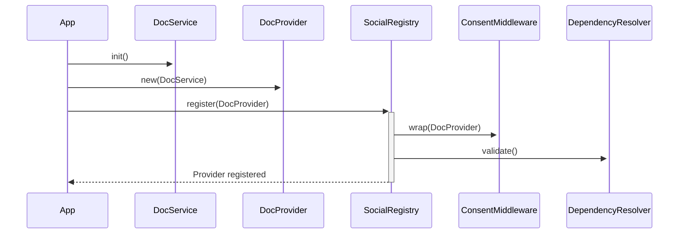

# Content Provider Integration: Collaborative Documents

## Registration Process
1. Initialize `CollaborativeDocService`
2. Create provider instance:
   ```rust
   let doc_provider = Arc::new(CollaborativeDocProvider::new(doc_service));
   ```
3. Prepare provider metadata:
   ```rust
   let metadata = CollaborativeDocProviderMetadata {
       provider_id: Uuid::new_v4(),
       name: "Collaborative Document Provider".to_string(),
       version: "1.0.0".to_string(),
       description: "Provider for collaborative documents with CRDT support".to_string(),
   };
   ```
4. Register with social graph using the convenience method:
   ```rust
   let provider_id = doc_provider.register_provider(&social_registry, metadata)?;
   ```
   Or manually with the registry:
   ```rust
   let provider_metadata: ProviderMetadata = metadata.into();
   let provider_id = social_registry.register_provider(doc_provider, provider_metadata)?;
   ```

## Consent Handling
- Documents use `Visibility::Private` by default
- Consent middleware automatically filters content based on:
  - User relationships
  - Group memberships
  - Document visibility settings
- Apps can customize visibility per document

## Initialization Sequence


## Configuration Requirements
Apps must:
1. Include both `collaborative_docs` and `social_graph` crates
2. Initialize registry early in app startup
3. Handle provider registration errors
4. Manage provider lifecycle with app state

## Example Usage
See `examples/provider_registration.rs` for a complete example of provider registration.

## Integration Guide
For detailed integration with the app ecosystem, including:
- Consent management flows
- Feed integration patterns
- Cross-app coordination
- UI wireframes

Refer to the [Collaborative Documents Integration Guide](../collaborative_docs_integration.md)